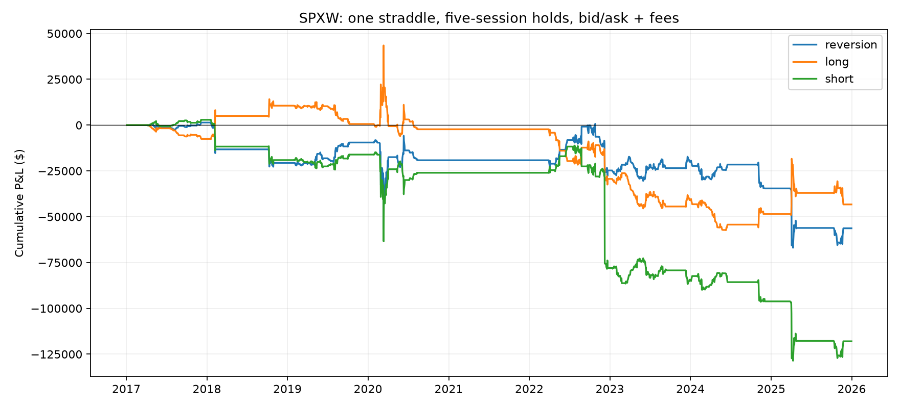

# SPXW IV mean reversion: a fresh baseline

Sample: 2017-01-03–2025-12-31. Baseline rules fixed before the first run; no parameter search. A two-sided-exit sensitivity was added after inspecting an anomalous quote.

The bid/ask scenario produced **$-56,301** across 119 trades, versus $24,315 before costs. Maximum daily marked dollar drawdown was $68,393.

**Preliminary: quote availability materially limits this result.** In 2021, 244 sessions have no eligible signal straddle and no trades occur. One 2022 exit has a zero-bid put with an exceptionally wide ask. This is not a clean nine-year test of an investable strategy.

## Rules

- Instrument: one SPXW call plus one put at the same strike and expiration; $100 multiplier.
- Select the expiry closest to 30 calendar days within 25–35, then the strike closest to spot within 1%. Deterministic ties prefer earlier expiry/lower strike.
- Signal IV is the average of the two vendor IVs. Z-score uses the preceding 60 sessions (sample standard deviation), excluding the current observation; 60 valid values required.
- Buy when z ≤ −1; sell when z ≥ +1. Freeze the selected contracts and enter at the following session’s EOD quote.
- Hold five trading-session intervals; one position at a time; no same-session reopening. Skip entries too close to sample end.
- At selection require both legs to trade that day, positive bids, uncrossed finite quotes, relative spread ≤10%, IV 1–300%, and absolute vendor IV residual ≤0.01. At entry recheck quote/volume/spread eligibility, without reselection or a new IV signal.
- No delta hedge, stop, early profit-taking, compounding, or position-size optimization.

## Execution and accounting

Gross P&L uses mids. Net buys at ask and sells at bid on each leg, plus an assumed $1 per contract per side ($4 per round trip). This is an EOD quote simulation: the data cannot prove executable fills or synchronized live quotes. Entry costs are booked on entry day. Fees are illustrative, not a broker/exchange quote.

Held contracts are marked from the loose quote universe, regardless of entry filters. A missing or invalid mark is carried forward and counted; an unavailable exit is delayed. Unresolved positions fail the run. The mark-to-market curve includes entry/exit costs and flat days.

Dollar P&L is for a fixed one-straddle position. No account return, CAGR, or return Sharpe is claimed: collateral, broker margin, financing, and interest are not modeled. Short straddles have uncapped upside loss. Changing delta, gamma, and theta affect these unhedged trades, so profit is not a clean measurement of IV mean reversion.

## Cost and direction comparisons

Long-only and short-only controls use exactly the same extreme-IV entry dates/contracts as the strategy, changing only direction. They are timing-matched controls, not continuously invested benchmarks.

| Scenario | Trades | Gross $ | Net $ | Win rate | Max drawdown $ |
|---|---:|---:|---:|---:|---:|
| reversion | 119 | 24,315 | -56,301 | 43.7% | 68,393 |
| long | 119 | 37,335 | -43,281 | 34.5% | 100,820 |
| short | 119 | -37,335 | -117,951 | 55.5% | 131,563 |
| midpoint-fees | 119 | 24,315 | 23,839 | 49.6% | 50,854 |
| half-crossing | 119 | 24,315 | -16,231 | 47.9% | 54,573 |
| two-sided-exit | 119 | 7,040 | -41,511 | 44.5% | 59,198 |

Midpoint-fees still charges commission. Half-crossing pays half the quoted distance from mid to bid/ask.

The two-sided-exit sensitivity keeps holding when either bid is zero and exits on the next usable session. It retains all interim marks and losses; it does not delete the affected trade. This is a different exit rule, added as a data-handling diagnostic, not a tuned strategy.

## Annual daily-marked results

| Year | Gross $ | Net $ |
|---|---:|---:|
| 2017 | 3,705 | 1,396 |
| 2018 | -20,070 | -21,999 |
| 2019 | 14,610 | 11,110 |
| 2020 | -3,275 | -9,676 |
| 2021 | 0 | 0 |
| 2022 | 33,950 | -5,578 |
| 2023 | 13,715 | 4,744 |
| 2024 | -4,815 | -14,540 |
| 2025 | -13,505 | -21,758 |

## Direction breakdown

| Side | Trades | Net $ | Win rate | Mean IV change (points) |
|---|---:|---:|---:|---:|
| Long | 65 | -20,980 | 32.3% | 0.82 |
| Short | 54 | -35,321 | 57.4% | -0.72 |

## Data audit and limitations

- 2262 observed sessions; 320 sessions without an eligible signal straddle; 1176 valid rolling z-scores.
- 51 unavailable/illiquid next-session entries; 4 carried held-position marks.
- Zero-bid exits are flagged in each trade ledger. On 2022-12-09 the held 4075-strike put expiring 2022-12-30 quotes 0 / 643.9, versus 137.2 / 141.5 the day before and 126.2 / 129.2 the next session. This one exit accounts for $32,267 of modeled exit costs. Its midpoint is also suspect; gross P&L is not immune to this issue.
- In the 2021 25–35 DTE, ±1% moneyness SPXW slice, only 0.2824% of 26,204 contract-days have positive bids. Most have zero bid/ask and IV residual 100. No valid 60-session signal window survives in 2021. See coverage.csv for all years.
- Nine calendar years are historical evidence, not independent trials. This is not an untouched holdout and no statistical significance is asserted.
- Approximate 30-day IV changes expiry and strike over time; it is not interpolated constant-maturity IV. Contract IV changes during the hold also mix tenor and moneyness changes.
- The calendar comes from observed SPXW sessions; any wholly missing market session would be invisible. The audit compares against stored universe sessions.
- Missing SPXW sessions relative to stored universe calendar: 0.
- Daily snapshots cannot validate intraday stops, fill availability, or quote staleness. Selection uses vendor IV rather than independently reinverting prices.

Contract mechanics: [Cboe SPX product specifications](https://www.cboe.com/tradable-products/sp-500/spx-options/).

Reproduce: `uv run python -m research.iv_mean_reversion.analysis`.
