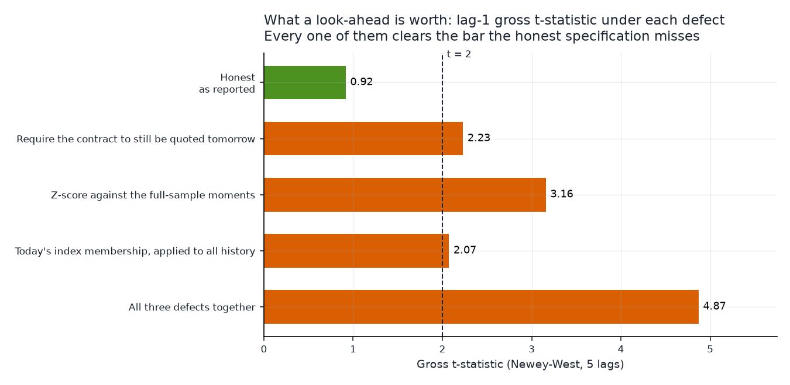

# Cross-sectional implied-vol mean reversion in single-name straddles

**2017-03-29 to 2025-12-30 · 2,202 formation dates · 649 S&P 500 names ·
884,952 tradable straddle-days**

## Summary

Rank S&P 500 names each day by how cheap their ~30-dte ATM straddle's implied
vol is against its own 60-session history, buy the cheapest decile and sell the
richest, size to equal dollar vega on both sides, delta hedge, hold one
session.

**It does not work, and it fails twice independently.**

*There is no signal.* Once the trade is entered at a close the signal did not
read, the strategy earns **$224 a day on $10,000 of vega per side — a gross
Sharpe of 0.31, t = 0.92.** The decile gradient is flat: all ten buckets sit
between +0.04 and +0.08 vol points with no ordering. Across twelve
window-and-cut specifications the gross Sharpe runs from −0.36 to +0.69 and
**not one clears t = 2.** Four of the nine calendar years are negative.

*And the costs are not close.* The book crosses **$199,000 of quoted spread a
day**, because a one-day hold pays the median 11.1%-of-mid straddle spread
twice. Against that it can pay **0.03% of the quoted spread and break even**,
where a real crossing costs about 50%. Net of a quarter of the spread it loses
**$49,804 a day**.

### What makes this worth writing up

Run as literally specified — signal and entry from the same closing print — the
strategy shows a **gross Sharpe of 10.1 (t = 19.6)**, positive on 84% of days,
with a perfectly monotone decile gradient from +0.48 to −0.39 vol points and a
maximum drawdown of 0.7%. That number is entirely artefact, and it comes from
two separable sources that this study had to remove one at a time.

**1. The bid-ask bounce (worth ~97% of the apparent P&L).** The z-score is
computed from a closing mid and the trade is filled at that same closing mid, so
a name that looks cheap partly *because* its quote printed low that afternoon is
bought at the low print and marked at an unbiased one the next day. Delaying
entry by one session takes the gross Sharpe from **10.10 to 0.31**. The
confirming test is that the same-close edge scales with the width of the quote
it is measured in — **0.24 vol points per day in the tightest-quoted quintile
against 2.31 in the widest**, a 9.7x gradient — while the lagged version is flat
noise across the same buckets (figure 5).

**2. A look-ahead screen worth more than everything left over.** The first
version of this study required a name's straddle to still be two-sided-quoted
*the next day* before admitting it to *today's* cross-section — a screen on
information not available at the formation close. It touched only **0.18% of
rows** and it more than doubled the result, from t = 0.92 to t = 2.23. The rows
it removed are not noise: they are Red Hat the day IBM bid for it, Kraft Heinz
on the writedown, LUMN in January 2021, FITB in the COVID crash. A straddle goes
one-sided precisely when the underlying gaps, and the short leg of this book is
systematically on the wrong side of those days. Screening them out deleted the
short leg's worst days.

Because a defect that small moved the headline that much, section 7 prices three
plausible look-aheads against the honest baseline. Each one alone lifts t = 0.92
past 2; together they reach **4.87**.

---

## 1. Economic intuition

The trade rests on two claims, and it is worth separating them because the data
treats them very differently.

**Implied volatility is mean-reverting in its own level.** Volatility is not a
price; it is a rate, bounded below by zero and mean-reverting by construction in
every model anyone fits to it. A name whose 30-day implied vol has been running
at 25% and prints 32% today has, on the evidence of its own history, either
absorbed news that will decay out of the option or been repriced by a temporary
supply imbalance — a large hedger buying downside, an index rebalance, a market
maker widening into inventory. In either case the level should pull back toward
its recent mean. Rank names by a z-score of implied vol against a rolling
window, buy the low tail and sell the high tail, and you are betting on that
pull-back.

**Cross-sectional ranking neutralises the market factor.** Single-name implied
vol is dominated by a common component — when VIX moves, everything moves — and
that component is not what the strategy is trying to forecast. Ranking within
the day removes it: a market-wide vol spike lifts every name's IV, leaves the
cross-sectional ordering roughly intact, and so does not move the book. Sizing
the two sides to equal dollar vega makes this exact rather than approximate. The
book's net vega is zero to machine precision on every one of the 2,202 days, so
the level of the variance risk premium cancels and only the relative bet
remains.

Delta hedging removes the second unwanted exposure. An ATM straddle is
delta-light but not delta-free, and over a one-day hold an unhedged book is
substantially a directional equity bet. Hedging with the underlying at the same
close leaves gamma, theta and vega — and over one day, for a 30-day option,
gamma and theta very nearly cancel. The check confirms it: the first-order vega
term (vega × change in implied vol) tracks **65% of the variance** of the daily
gross P&L and accounts for 111% of its level. This is a pure implied-vol trade,
not a realized-versus-implied trade.

**What the intuition does not say** is where the mean reversion comes from, and
that gap is the whole problem. If implied vol reverts because the *market's*
price of vol reverts, the strategy is real and someone must be paid to provide
that liquidity. If it reverts because the *measurement* of vol reverts — a mid
computed from a wide, stale or one-sided quote — the strategy is measuring noise
and earns nothing. Both hypotheses predict a monotone decile gradient. They
differ on one thing: whether the edge survives being unable to trade at the
price that generated the signal. Section 6 is that test, and the answer is that
it does not.

There is also a mechanism the intuition does not mention but the data insists
on. Implied vol is *supposed* to rise into an earnings announcement and collapse
after it — a scheduled event premium, not a mispricing. A z-score against a
60-session window cannot tell the two apart, so it ranks pre-earnings names as
expensive and just-reported names as cheap: days to the next report falls
monotonically across the deciles, from 74.9 in the cheapest to 36.8 in the
richest. The short leg is therefore systematically short pre-earnings vol. That
does not rescue the strategy — excluding names reporting within a week takes the
lag-1 Sharpe from 0.31 to 0.01 — but it is why the ranking is not measuring what
it appears to measure.

## 2. Data

Everything comes from the repo's option-greeks store, read through
`data_access_layer` — no path under `data_store/` is touched directly.

| | |
| --- | --- |
| **Source** | ThetaData EOD option greeks (`/v3/option/history/greeks/eod`), Options STANDARD tier |
| **Loader** | `load_option_greeks`, plus `load_universe`, `load_corporate_actions`, `load_earnings`, `usable_symbol_years` |
| **Coverage** | 2017-2025, 675 option roots, ~60 GB, ~4,600 symbol-years |
| **Underlying price** | `underlying_price`, the spot print struck at the same 17:15 ET instant as the option quote |

Three properties of this store shape the study.

**The spot price rides on every option row.** The stock feed on this account is
FREE tier and refuses anything before 2023-06-01, so a delta hedge built on
`load_underlying` would silently truncate a nine-year backtest to two and a half
years. `underlying_price` is on every greeks row, struck with the quote, so the
hedge and the option are the same snapshot and the whole window is usable.

**Implied vol is only as good as `iv_error`.** About 3% of contract-days fail to
invert and come back pinned near 0.5 with an error of ±100. Since the straddle's
IV *is* the signal, a leg with `|iv_error| > 0.02` cannot be *selected* — but it
can still mark a position opened the day before, which needs a price and not an
implied vol. That distinction turns out to matter (section 7).

**53% of contract-days never trade, and their OHLC is 0.0, not null.** The study
uses quotes throughout — mid for marking, bid-ask for costs — and requires a live
two-sided quote on both legs *to open*. Trade prices are never used.

### Coverage


The cross-section carries **440 names on the median day** (mean 402) and never
falls below 100, the study's minimum.

The regular sawtooth in the top panel is the expiration cycle, not a data
defect. Selection requires an expiry inside [20, 45] dte, and around each month
turn the next monthly expiration sits at ~15-20 days and the one after it at
~45-50, so a name that lists only monthlies has nothing in the band. Every day
carrying fewer than 300 names falls between the 27th and the 4th. **The
cross-section therefore shrinks and tilts toward weekly-listed — larger, more
liquid — names on about 15% of formation dates.** That biases those days
*against* the finding below, since weekly-listed names are the tightest quoted.

The thinnest days combine that cycle with a stress episode: 2020-03-30 (106
names, mean spread 27.7%), 2021-03-29 (149) and 2025-12-30 (153). The bottom
panel's level shifts — elevated through 2020-2021, tightest in late 2023, rising
again through 2025 — are the quoted spread itself. The median tradable straddle
quotes at **11.1% of its own mid** (75th percentile 18.0%), which is the number
that settles the strategy.

### Known data limitations

- **Spinoffs are an unhandled corporate action** in this repo. A spinoff ex-date
  looks exactly like an unadjusted split in the underlying series, and
  `split_adjusted_return()` does not catch it because there is no split row.
  Splits *are* handled — any symbol-day whose hold spans a split ex-date is
  dropped, because the contract is re-struck — but a handful of spinoff days
  (FTV 2025-06-30, HON 2025-10-30, GE Vernova, Solventum, Amentum in 2024)
  inject a fictional one-day delta-hedge loss. At ~5 names a year against 440 a
  day this cannot move a headline, but it is not zero.
- **`thin_overlap` names are kept.** `usable_symbol_years()` excludes only
  `wrong_instrument`. Excluding `thin_overlap` would be a survivorship filter,
  since it falls disproportionately on names Yahoo stopped serving after they
  were delisted or acquired. The cost is that their split adjustment is
  unverified.
- **EOD only.** The central finding is about the difference between a signal
  price and an execution price. With one quote per day, the finest instrument
  available is a one-session lag.

## 3. Methodology

### Contract selection (`panel.py`)

For each symbol and session:

1. Read the chain slice with `dte` in [10, 60] and `|moneyness| ≤ 0.40`, **and
   nothing else** — no quote requirement, no IV-error requirement.
2. Inner-join calls to puts on (expiration, strike). A strike quoted on one side
   only is not a straddle.
3. Restrict to *selectable* straddles: both legs two-sided (`bid > 0`), both
   legs' IV actually inverted (`|iv_error| ≤ 0.02`). Every condition is
   observable at the formation close.
4. **Expiration first**: the expiry closest to 30 dte within [20, 45]. Choosing
   the globally closest-to-spot strike first would hop between expirations day
   to day and turn a term-structure move into signal.
5. **Then strike**: closest to spot, requiring `|moneyness| ≤ 0.05`.
6. Attach the quote of *those same two contracts* at the next session, drawn
   from the **unfiltered** frame of step 1.

Step 6 is the part that has to be got right. Looking for tomorrow's mark inside
the same strict filter used for selection deletes a position whenever its IV
inversion degraded, its quote went one-sided, or spot drifted out of the
moneyness band overnight — none of which is knowable at the formation close, and
all of which correlate with the outcome being measured. Reading loosely drops
the unmarkable rate from **1.4% to 0.057%**.

The resulting panel is 1,051,967 symbol-days. Median dte is 30, median
|moneyness| 0.51%, median straddle IV 27.4%.

### What is decidable at the formation close

This is the discipline the study is organised around, so it is worth stating
explicitly.

| Screen | Uses | Verdict |
| --- | --- | --- |
| Two-sided quote, IV inverted, spread, price, mid floor | quantities at *t* | fine |
| Rolling 60-session z-score | trailing window ending at *t* | fine |
| Point-in-time S&P 500 membership | `universe_history` at *t* | fine |
| Split ex-date inside the hold | announced weeks in advance, public at *t* | fine |
| `usable_symbol_years()` (instrument identity) | full sample | acceptable — data integrity, not performance; see below |
| Earnings distance | scheduled, typically confirmed 2-4 weeks out | diagnostic only, not a headline screen |
| ~~Contract still quoted at *t+1*~~ | **the next session** | **look-ahead — removed** |

`usable_symbol_years()` is a full-sample check and so is not strictly
point-in-time. It excludes only `wrong_instrument` — cases where a different
company's chain is filed under a ticker, like `FI` in 2019 returning a $5.92
company while Fiserv traded as FISV at $82.68. That is a data-integrity filter
rather than a performance filter, and keeping the bad rows would inject
fictional P&L rather than remove real P&L. It is flagged here because it is the
one remaining screen that could not have been run in 2017.

The **earnings** exclusion in section 6 is a diagnostic, not part of the
strategy. Announcement dates are usually confirmed two to four weeks ahead, so
excluding names reporting within 35 days uses a little information that was not
public at every formation close. It is reported as a decomposition of a result
that is already zero, so nothing turns on it.

### Screens (`portfolio.py`)

| stage | screen |
| --- | --- |
| **Before the signal** | `usable_symbol_years()`; point-in-time membership; no split ex-date inside the hold |
| **Signal** | rolling 60-observation z-score of `straddle_iv` per symbol, requiring a full window and rejecting one whose 60 rows span more than 2x their length in calendar days |
| **After the signal** | quoted spread ≤ 50% of mid; straddle mid ≥ $0.20; underlying ≥ $5 |

The liquidity screens run *after* the z-score, not before. A name quoted too
wide to trade today should not be traded today, but its implied vol is still a
legitimate observation in tomorrow's rolling window; screening first would
censor the history the signal is measured against. Conversely the membership and
instrument screens run *before* the ranking, so a name about to be dropped never
pushes the decile boundary around.

1,051,967 panel rows → 1,015,366 after the pre-signal screens → **884,952
tradable straddle-days** across 649 symbols.

### Portfolio construction

Each day, among the names with a valid signal (minimum 100, median 440):

- Rank on the z-score. **Long** the bottom decile (cheapest vol), **short** the
  top decile — ~41 names per side.
- **Equal vega within a leg**: `contracts_i = (V / n_leg) / straddle_vega_i` with
  `V = $10,000` of vega per side.
- **Equal vega across legs**: both sides target the same `V`, so net vega is zero
  by construction. Measured net vega is ~1e-15 dollars against a $10,000 scale.
- **Delta hedge**: short `side × contracts_i × 100 × straddle_delta_i` shares of
  the underlying at the same close, unwound at the next close.

ThetaData's `vega` is per-share sensitivity to a 1.00 move in vol, so a
100-share contract moves `vega` dollars per **vol point** — the column is already
in the sizing units.

`V` is a scale choice, not a risk choice. The book is a self-financing
vega-neutral spread with no capital base, so every Sharpe, t-statistic and
break-even is invariant to `V`; only the dollar axes move. For scale, $10,000 of
vega per side puts up **$660,000 of gross option premium per day**.

### P&L, unmarkable positions and costs

```
option P&L  = (straddle_mid[t+1] - straddle_mid[t]) × 100
hedge P&L   = -straddle_delta[t] × 100 × (spot[t+1] - spot[t])
```

A position that is chosen and then turns out to have no usable mark — the
contract stops printing, or the hold spans a gap in the symbol's chain — is
**carried flat, not deleted**. Deleting it would reintroduce, one stage later,
the same look-ahead screen removed from the ranking universe. It is 0.08% of
positions. A hold is also required to span exactly one session of the market
calendar the panel spans, so a gap in one symbol's chain cannot silently cover
two days of P&L.

A further 0.31% of positions are marked against a one-sided quote at *t+1*.
These are kept at mid. That is coherent with the cost model rather than
generous: a one-sided quote makes `straddle_spread` enormous, so the cost model
charges those positions heavily, and mid-minus-half-the-spread is approximately
the bid — the price a long could actually sell at.

Costs are charged on **both** crossings — entry on the formation date and exit
the next day — at a configurable fraction of the quoted straddle spread, plus 1
bp of hedge notional per side for the stock leg. Charging only the exit would
halve every cost figure and double every break-even. The stock leg is negligible
($168 a day against $199,000 of option spread).

The **break-even spread fraction** is the share of the quoted spread the strategy
could pay and still return zero: `(gross − hedge cost) / (full round-trip quoted
spread)`.

### Statistics

Daily portfolio P&L is tested with Newey-West errors at 5 lags. Where a
*per-contract* quantity is averaged (the decile and spread-quintile tables), the
cross-section is collapsed to a daily mean first and that time series is tested —
~400 names share every date and every market shock, so pooling contracts and
taking a naive standard error would overstate significance by a large factor.
Collapsing first prices that cross-sectional dependence the way a Driscoll-Kraay
correction does.

## 4. Result


| | **lag 1 — honest** | lag 0 — same close |
| --- | ---: | ---: |
| Formation dates | 2,202 | 2,203 |
| Gross P&L per day | **$224** | $8,669 |
| Gross total | $0.49m | $19.10m |
| Gross Sharpe (annualised) | **0.31** | 10.10 |
| Gross t (Newey-West, 5 lags) | **0.92** | 19.56 |
| Days positive | 53.6% | 83.7% |
| Gross return on premium deployed | 3.4 bp/day | 131 bp/day |
| Vega R² of daily P&L | 0.59 | 0.65 |
| Round-trip quoted spread | $199,441/day | $199,726/day |
| **Break-even spread fraction** | **0.03%** | 4.25% |
| Net P&L at 25% of spread | −$49,804/day | −$41,434/day |
| Net Sharpe at 25% of spread | −23.35 | −23.28 |
| Net Sharpe at 50% of spread | −24.29 | −24.99 |

The honest gross curve is the flat green line in the top panel: $0.49m
accumulated over nine years against a $611k drawdown, which is not a strategy.
The bottom panel is the same conclusion reached without reference to the signal
at all — **the book crosses $199,000 of quoted spread a day to chase $224.**


The cost picture is stable across the whole sample. Even for the same-close
book, the break-even fraction ranges from 1.8% (2017) to 6.2% (2025) and never
approaches the ~50% a real crossing costs. This is not a strategy that is
marginally too expensive; it is short by more than an order of magnitude in its
best year.

## 5. There is no cross-sectional signal


At lag 1 the decile gradient does not exist. All ten buckets sit between
**+0.043 and +0.079 vol points per day**, the cheapest decile (+0.072, t = 1.83)
is statistically indistinguishable from the richest (+0.048, t = 1.07), and the
ordering in between is not monotone. There is a small positive level common to
every bucket, which is the variance risk premium showing up as a long-straddle
carry — but it is common to all deciles, so the long-short book captures none of
it.

That flatness is not for want of mean reversion in the underlying quantity:


Measured on closing mids, cheap vol rises **+0.52 points** the next day and rich
vol falls **−0.44**, monotone across all ten deciles, t = 17.5 and −10.5. The
reversion is enormous and the P&L from trading it is zero, which is the whole
point: the reversion is in the *measurement*, and it reverses inside the spread.


| lag (sessions) | 0 | 1 | 2 | 3 | 4 | 5 |
| --- | ---: | ---: | ---: | ---: | ---: | ---: |
| Gross Sharpe | 10.10 | 0.31 | 0.20 | −0.13 | −0.62 | −0.01 |
| Gross t | 19.56 | 0.92 | 0.61 | −0.41 | −1.67 | −0.03 |
| Break-even fraction | 4.25% | 0.03% | −0.01% | −0.13% | −0.31% | −0.09% |

One session removes 97% of the mean daily P&L; from there the series is noise
around zero, with no decay structure at all. A weak real signal would decay;
this one has already gone.

## 6. Why the same-close number is 10.1

The signal is a z-score of a mid and the entry price is that same mid. A name
whose closing quote printed low that afternoon is scored as cheap *and* bought at
the low print, then marked the next day at a quote with no such error. That
mechanism produces a positive P&L from pure noise, and its size should scale
with the width of the quote — because the spread is the size of the error.


| relative-spread quintile | 0 (tightest) | 1 | 2 | 3 | 4 (widest) |
| --- | ---: | ---: | ---: | ---: | ---: |
| Lag 0, long−short (vol pts/day) | 0.238 | 0.266 | 0.470 | 0.808 | **2.311** |
| Lag 0, t | 5.83 | 4.94 | 9.38 | 15.68 | 39.33 |
| Lag 1, long−short | 0.075 | 0.012 | 0.023 | −0.006 | 0.041 |
| Lag 1, t | 1.85 | 0.28 | 0.52 | −0.10 | 0.71 |

**A 9.7x monotone gradient at lag 0; unordered noise at lag 1.** The same-close
edge is the width of the quote, essentially exactly. Note that no subset escapes
it — even the tightest quintile shows 0.238 at lag 0 against 0.075 at lag 1.

The earnings channel is the other half of what the ranking is picking up:


Days to the next announcement falls monotonically from **74.9 in the cheapest
decile to 36.8 in the richest** — implied vol rises into a scheduled report, so a
name three weeks from reporting looks expensive against its own history
*because* it is three weeks from reporting. Excluding those names removes what
little is left:

| lag-1 specification | gross Sharpe | gross t |
| --- | ---: | ---: |
| All names | 0.31 | 0.92 |
| No report within 7 days | **0.01** | **0.02** |
| No report within 35 days | −0.11 | −0.36 |

## 7. What a look-ahead is worth here

The first version of this study carried one defect: it required a name's
straddle to still be two-sided-quoted at *t+1* before admitting the name to the
cross-section at *t*. It looked like a data-quality screen. It is a screen on the
future.

It touched **1,605 of 884,952 rows — 0.18%** — and it took the headline from
t = 0.92 to **t = 2.23**. The reason it mattered so much is that the rows are not
random. A straddle goes one-sided precisely when the underlying gaps, and the
largest are RHT on 2018-10-29 (IBM's bid, spot 116.68 → 169.63, the straddle
9.10 → 53.88), KHC on 2019-02-22 (the writedown, 48.18 → 34.95), LUMN in January
2021 and FITB in the COVID crash. The book is systematically short the names
that gap — they are the ones whose implied vol is high — so the screen was
deleting the short leg's worst days.

Because a 0.18% screen moved the result that far, it is worth pricing the other
look-aheads this design invites:



| lag-1 specification | gross Sharpe | gross t |
| --- | ---: | ---: |
| **Honest — as reported** | **0.31** | **0.92** |
| Require the contract to still be quoted tomorrow | 0.75 | 2.23 |
| Z-score against the full-sample moments | 1.10 | 3.16 |
| Today's index membership, applied to all history | 0.70 | 2.07 |
| All three together | 1.74 | 4.87 |

Each defect *on its own* converts a result that fails at t = 0.92 into one that
passes at conventional significance. The full-sample z-score — using the
symbol's whole 2017-2025 mean and standard deviation to score a day in 2018 — is
the most obvious of the three and worth t = 3.16. The survivorship universe —
applying today's S&P 500 membership to all nine years — is worth t = 2.07 while
also shrinking the cross-section from 402 names to 356, which should have been
the tell.

**None of these are exotic.** Two are screens that look like hygiene, and the
third is a one-line difference between `rolling_mean` and `mean`. The
generalisable lesson is that in a study with a genuine effect size near zero, the
significance of the result is a measurement of the researcher's carefulness
rather than of the market.

## 8. Robustness and stability


| year | 2017 | 2018 | 2019 | 2020 | 2021 | 2022 | 2023 | 2024 | 2025 |
| --- | ---: | ---: | ---: | ---: | ---: | ---: | ---: | ---: | ---: |
| Lag-1 gross Sharpe | 0.52 | 2.82 | 0.19 | −0.27 | 1.08 | 0.03 | 0.49 | −0.75 | −0.06 |
| Lag-1 gross t | 0.45 | 2.75 | 0.17 | −0.25 | 1.22 | 0.03 | 0.63 | −0.73 | −0.07 |

**Four of nine years are negative and only 2018 clears t = 2**, which is what one
significant year out of nine looks like when nothing is there. The lag-0 book, by
contrast, returns a gross Sharpe between 6.1 and 20.6 in *every* year including
2020 and 2022 — stability that is itself evidence the P&L is not driven by
anything happening in the market.


Across twelve specifications — windows of 20, 60, 120 and 252 sessions crossed
with 5%, 10% and 20% cuts — the lag-1 gross Sharpe runs from **−0.36 to +0.69**,
three of twelve are negative, and **the largest t-statistic in the grid is 1.94.**
No specification has a break-even spread fraction above 0.27%. The 60-session,
10% choice reported here is neither the best nor the worst cell, and the
parameter choice does not matter because nothing in the space is tradable.

## 9. What this does and does not establish

**Established.**

- **There is no tradable one-day cross-sectional IV-reversion signal in S&P 500
  single names over 2017-2025.** Entered at a close the signal did not read, the
  book returns a gross Sharpe of 0.31 (t = 0.92) with a flat decile gradient, no
  specification in a twelve-cell grid clears t = 2, and four of nine years are
  negative.
- **The costs settle it independently of the signal.** Break-even is 0.03% of the
  quoted spread against ~50% for a real crossing, because a one-day hold pays the
  median 11.1%-of-mid straddle spread twice — $199,000 a day against $660,000 of
  premium deployed.
- **Implied vol measured on closing mids does mean-revert strongly** (+0.52 /
  −0.44 vol points, monotone across deciles) — and none of it is capturable,
  because the reversion happens inside the spread.
- **The same-close specification's Sharpe of 10.1 is the bid-ask bounce**, shown
  by a 9.7x monotone scaling with quoted width that disappears entirely under
  one session of lag.
- **A 0.18% look-ahead screen was worth more than the entire remaining effect**,
  and two other ordinary look-aheads are each worth more still. In a study with a
  true effect near zero, ordinary carelessness is sufficient to manufacture
  significance.
- The book is a pure implied-vol trade: the first-order vega term tracks 59-65%
  of daily P&L variance, with gamma and theta cancelling over a one-day hold.

**Not established.**

- **Whether a faster version works.** The sample is one quote per day, so the
  finest lag this data can express is one session. The bounce is a quote-level
  phenomenon; a book that could trade at or inside the touch is a different
  question EOD data cannot answer. The prior from section 6 is that a market
  maker's version of this trade is the other side of what is measured here —
  this study identifies a liquidity-provision opportunity and shows a liquidity
  *taker* cannot have it.
- **Anything about longer holds.** Every number here is a one-session hold. The
  cost arithmetic implies the largest available improvement is to hold longer:
  the round-trip spread is fixed per rebalance, so a 20-day hold amortises it
  over 20 days of edge. That does not rescue this signal, which has no edge to
  amortise at any lag, but it is why a strategy of this shape should be specified
  with a hold measured in weeks.
- **Whether the earnings channel is tradable on its own.** The ranking finds
  pre-earnings names incidentally and the exclusion test shows the residual runs
  through them, but a study targeting the earnings trade directly — with a hold
  that spans the announcement — would be a different design and is not answered
  here.

---

## Reproducing

```bash
uv run python -m research.iv_zscore_reversion.panel      # ~30s
uv run python -m research.iv_zscore_reversion.analysis   # ~2 min
```

Every figure and every number above is regenerated by those two commands. Tables
are in `results/`: `headline_stats.csv`, `lookahead_audit.csv`, `lag_sweep.csv`,
`annual_stats.csv`, `decile_pnl.csv`, `decile_iv_reversion.csv`,
`decile_earnings_distance.csv`, `spread_quintiles.csv`,
`earnings_exclusion.csv`, `robustness_grid.csv`, and the daily P&L series
`daily_pnl_lag0.csv` / `daily_pnl_lag1.csv`.
