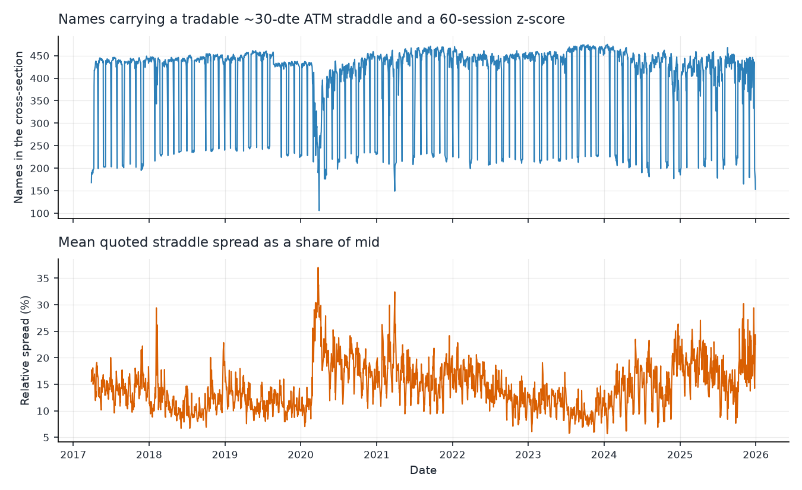
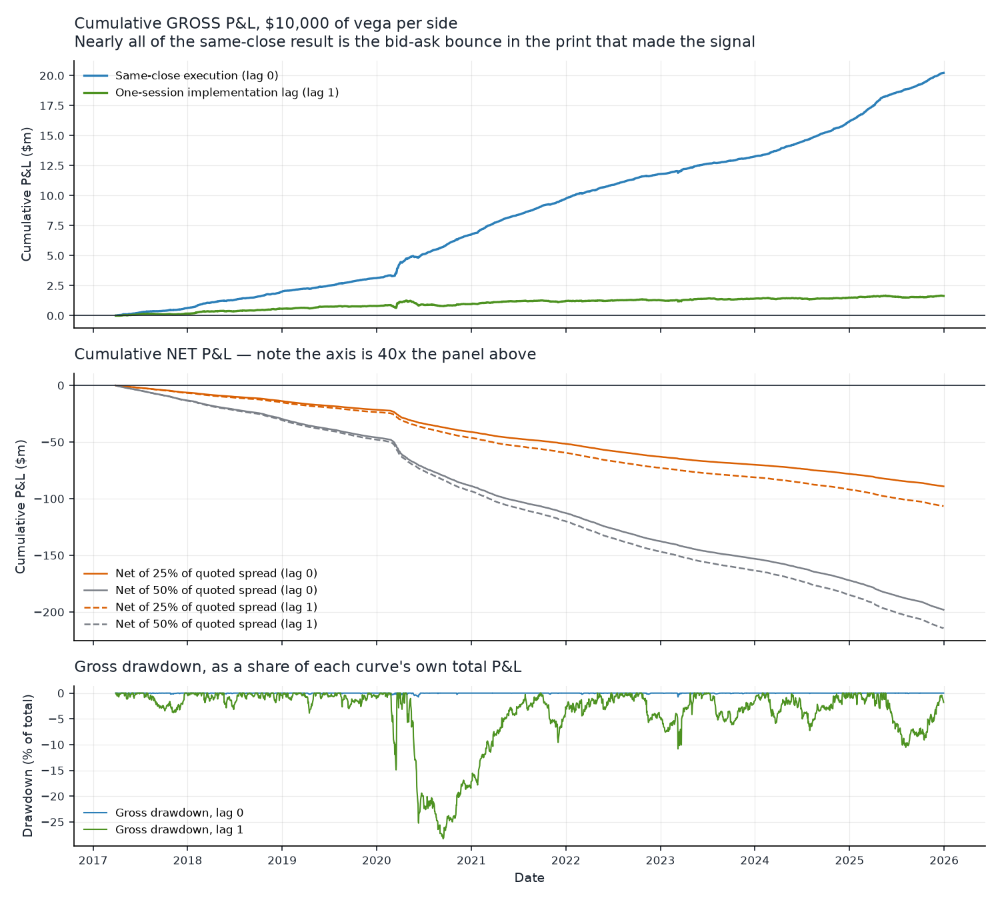
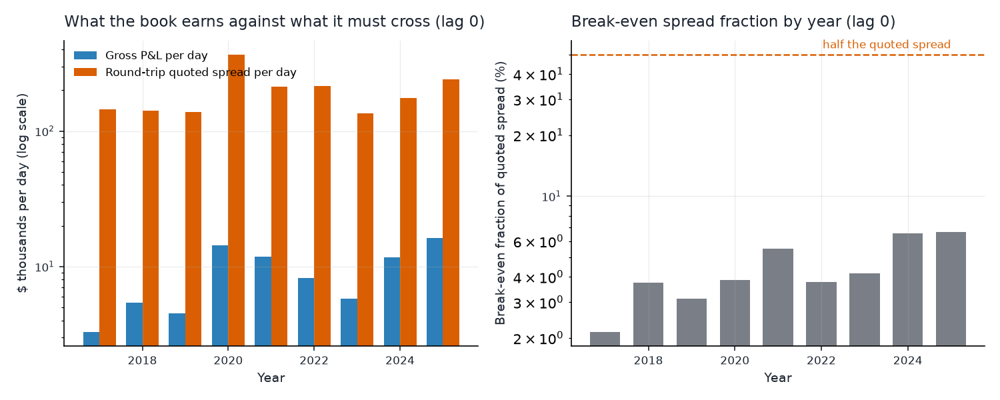
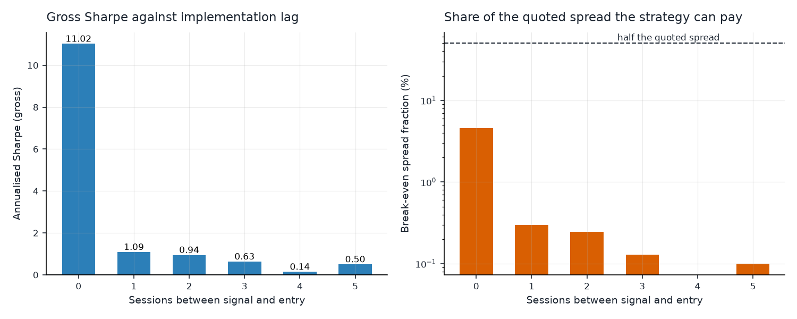
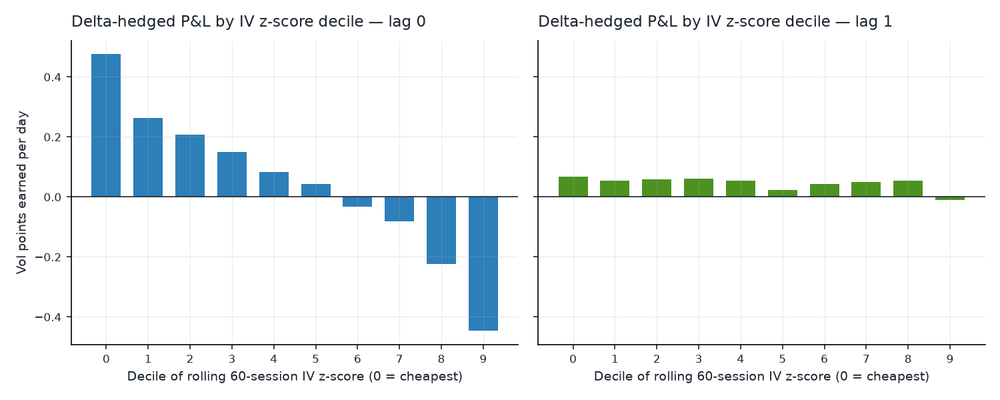
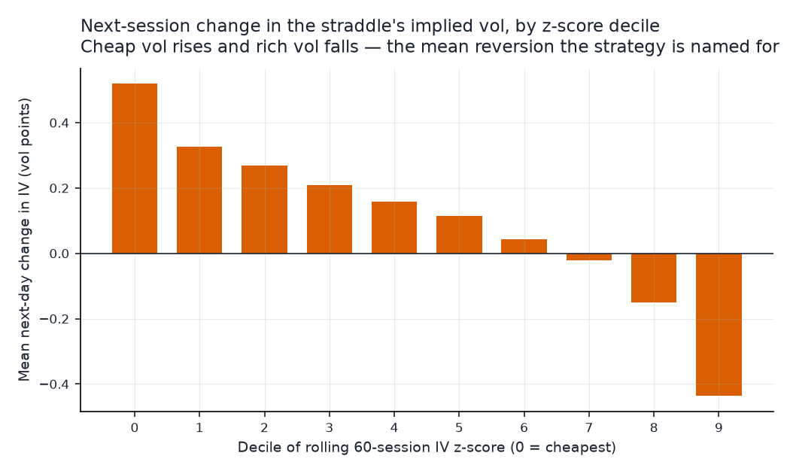
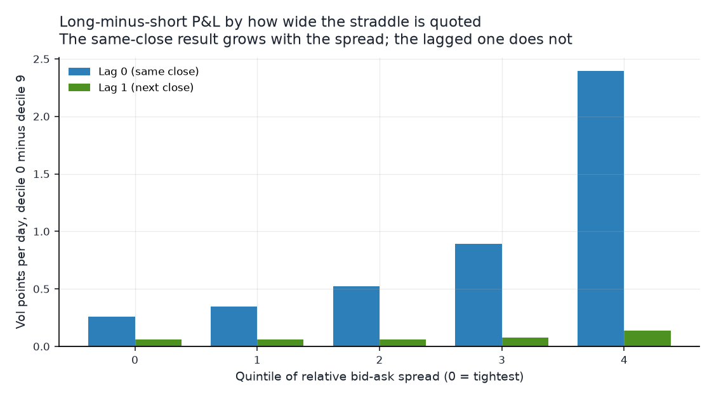
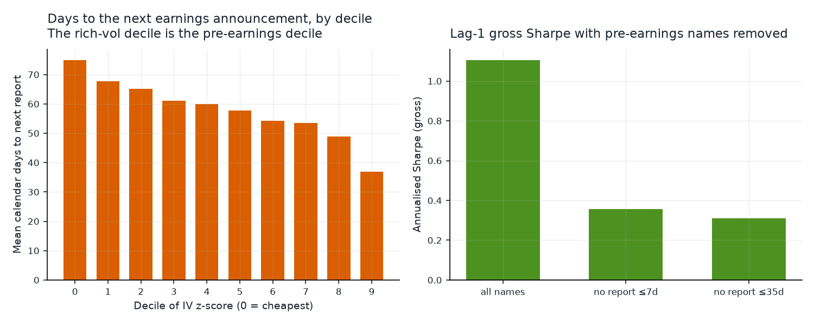
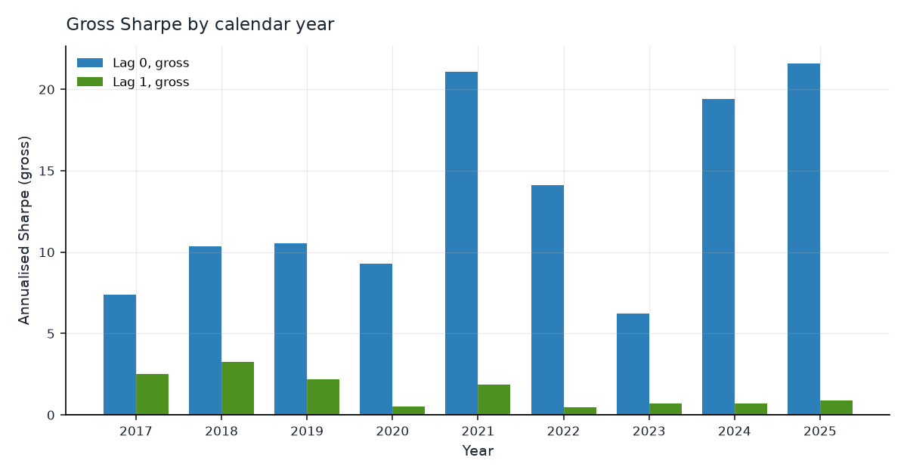
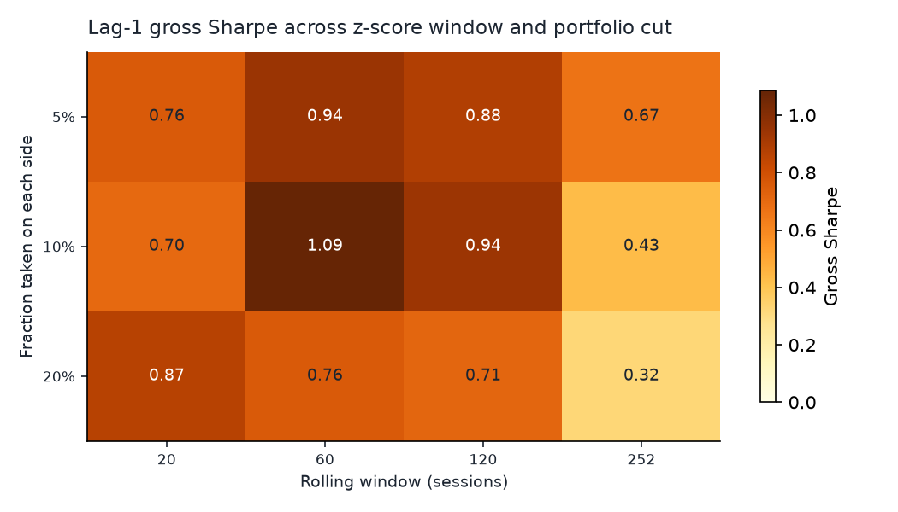

# Cross-sectional implied-vol mean reversion in single-name straddles

**2017-03-29 to 2025-12-30 · 2,202 formation dates · 649 S&P 500 names ·
894,767 tradable straddle-days**

## Summary

Rank S&P 500 names each day by how cheap their ~30-dte ATM straddle's implied
vol is against its own 60-session history, buy the cheapest decile and sell the
richest, size to equal dollar vega on both sides, delta hedge, hold one
session. Over nine years this earns **$9,184 per day on $10,000 of vega per
side — an annualised gross Sharpe of 11.0 (t = 21.3), positive on 85% of
days, with a decile gradient that is monotone across all ten buckets.**

That result is an artefact, and identifying it is the substance of this study.
Delaying execution by a single session — forming the signal at Monday's close
and entering at Tuesday's close rather than Monday's — collapses the gross
Sharpe from **11.02 to 1.09** and the mean daily P&L from $9,184 to $747. The
signal and the entry price are read off the same closing quote, so a name that
looks cheap partly because its mid printed low that afternoon is bought at that
same low mid and marked at an unbiased one the next day. The strategy is
harvesting the bid-ask bounce in its own measurement.

Three pieces of evidence say so rather than merely suggest it:

- The same-close edge scales with the width of the quote it is measured in —
  **0.26 vol points per day in the tightest-quoted quintile against 2.39 in the
  widest, a 9.3x gradient.** With one session of lag the same gradient is 0.06
  to 0.14 (figure 5).
- The decile gradient, perfectly monotone at lag 0 (+0.48 to -0.45 vol points),
  **disappears entirely at lag 1**: deciles 0 through 8 all sit at
  +0.02 to +0.07 and only the richest decile differs (figure 3).
- What survives at lag 1 is not vol mean reversion but earnings timing.
  The rich-vol decile is the pre-earnings decile (36.8 days to the next report
  against 74.9 for the cheap decile), and **removing names reporting within a
  week takes the lag-1 Sharpe from 1.11 to 0.36 (t = 2.84 to 0.94)** — the
  residual edge is no longer distinguishable from zero.

Even the artefact is not tradable. The book crosses the quoted spread twice a
day, which costs **$198,000 per day against a gross edge of $9,184**. The
strategy can pay **4.6% of the quoted spread and break even; it needs to pay
about 50%.** At one session of lag the break-even is **0.30%**. Net of a quarter
of the quoted spread, the same-close book loses $40,464 a day.

---

## 1. Economic intuition

The trade rests on two claims, and it is worth separating them because the data
treats them very differently.

**Implied volatility is mean-reverting in its own level.** Volatility is not a
price; it is a rate, bounded below by zero and mean-reverting by construction
in every model anyone fits to it. A name whose 30-day implied vol has been
running at 25% and prints 32% today has, on the evidence of its own history,
either absorbed news that will decay out of the option or been repriced by a
temporary supply imbalance — a large hedger buying downside, an index
rebalance, a market maker widening into inventory. In either case the level
should pull back toward its recent mean. Rank names by a z-score of implied vol
against a rolling window, buy the low tail and sell the high tail, and you are
betting on that pull-back.

**Cross-sectional ranking neutralises the market factor.** Single-name implied
vol is dominated by a common component — when VIX moves, everything moves — and
that component is not what the strategy is trying to forecast. Ranking within
the day removes it: a market-wide vol spike lifts every name's IV, leaves the
cross-sectional ordering roughly intact, and so does not move the book. Sizing
the two sides to equal dollar vega makes this exact rather than approximate.
The book's net vega is zero to machine precision on every one of the 2,202
days, so the level of the variance risk premium cancels and only the relative
bet remains.

Delta hedging removes the second unwanted exposure. An ATM straddle is
delta-light but not delta-free, and over a one-day hold an unhedged book is
substantially a directional equity bet. Hedging with the underlying at the same
close leaves gamma, theta and vega — and over one day, for a 30-day option,
gamma and theta very nearly cancel. The check confirms it: **103% of the
same-close gross P&L is accounted for by the first-order vega term** (vega ×
change in implied vol). This is a pure implied-vol trade, not a
realized-versus-implied trade.

**What the intuition does not say** is where the mean reversion comes from, and
that gap is the whole problem. If implied vol reverts because the *market's*
price of vol reverts, the strategy is real and someone must be paid to provide
that liquidity. If it reverts because the *measurement* of vol reverts — a mid
computed from a wide, stale, or one-sided quote — the strategy is measuring
noise and earns nothing. Both hypotheses predict a monotone decile gradient.
They differ on one thing: whether the edge survives being unable to trade at
the price that generated the signal. Section 5 is that test.

There is also a mechanism the intuition does not mention but the data insists
on. Implied vol is *supposed* to rise into an earnings announcement and
collapse after it — that is a scheduled event premium, not a mispricing. A
z-score against a 60-session window cannot tell the two apart, so it will
systematically rank pre-earnings names as expensive and just-reported names as
cheap. Section 6 shows this is exactly what happens.

## 2. Data

Everything comes from the repo's option-greeks store, read through
`data_access_layer` — no path under `data_store/` is touched directly.

| | |
| --- | --- |
| **Source** | ThetaData EOD option greeks (`/v3/option/history/greeks/eod`), Options STANDARD tier |
| **Loader** | `load_option_greeks`, plus `load_universe`, `load_corporate_actions`, `load_earnings`, `usable_symbol_years` |
| **Coverage** | 2017-2025, 675 option roots, ~60 GB, ~4,600 symbol-years |
| **Underlying price** | `underlying_price`, the spot print struck at the same 17:15 ET instant as the option quote |

Three properties of this store shape the study.

**The spot price rides on every option row.** The stock feed on this account is
FREE tier and refuses anything before 2023-06-01, so a delta hedge built on
`load_underlying` would silently truncate a nine-year backtest to two and a
half years. `underlying_price` is on every greeks row, struck with the quote, so
the hedge and the option are the same snapshot and the whole window is usable.

**Implied vol is only as good as `iv_error`.** About 3% of contract-days fail to
invert and come back pinned near 0.5 with an error of ±100. Since the straddle's
IV *is* the signal, contracts with `|iv_error| > 0.02` are dropped at read time.

**53% of contract-days never trade, and their OHLC is 0.0, not null.** The study
uses quotes throughout — mid for marking, bid-ask for costs — and requires a
live two-sided quote (`bid > 0`) on both legs. Trade prices are never used.

### Coverage



The cross-section carries **439 names on the median day** (mean 406) and never
falls below 100, the study's minimum.

The regular sawtooth in the top panel is the expiration cycle, not a data
defect. Selection requires an expiry inside [20, 45] dte, and around each month
turn the next monthly expiration sits at ~15-20 days and the one after it at
~45-50, so a name that lists only monthlies has nothing in the band. All 327 of
the days carrying fewer than 300 names fall between the 27th and the 4th. **The
cross-section therefore shrinks and tilts toward weekly-listed — larger, more
liquid — names on about 15% of formation dates.** That biases those days
*against* the finding below, since weekly-listed names are the tightest quoted.

The thinnest days combine that cycle with a stress episode: 2020-03-30 (106
names, mean spread 27.7%), 2021-03-29 (149) and 2025-12-30 (153). The bottom
panel's level shifts — elevated through 2020-2021, tightest in late 2023, rising
again through 2025 — are the quoted spread itself. The median tradable straddle
quotes at **11.1% of its own mid** (75th percentile 17.9%), which is the number
that eventually kills the strategy.

### Known data limitations

- **Spinoffs are an unhandled corporate action** in this repo. A spinoff
  ex-date looks exactly like an unadjusted split in the underlying series, and
  `split_adjusted_return()` does not catch it because there is no split row.
  Splits *are* handled — any symbol-day whose hold spans a split ex-date is
  dropped, because the contract is re-struck and the strike match at t+1 would
  be a different instrument — but a handful of spinoff days (FTV 2025-06-30,
  HON 2025-10-30, GE Vernova, Solventum, Amentum in 2024) inject a fictional
  one-day delta-hedge loss. At ~5 names a year against 406 a day this cannot
  move a headline, but it is not zero.
- **`thin_overlap` names are kept.** `usable_symbol_years()` excludes only
  `wrong_instrument`. Excluding `thin_overlap` would be a survivorship filter,
  since it falls disproportionately on names Yahoo stopped serving after they
  were delisted or acquired. The cost is that their split adjustment is
  unverified.
- **EOD only.** The central finding of this study is about the difference
  between a signal price and an execution price. With one quote per day, the
  finest instrument available is a one-session lag. Intraday data would let the
  same question be asked at a scale where the strategy might actually live.

## 3. Methodology

### Contract selection (`panel.py`)

For each symbol and session:

1. Read the chain slice with `dte` in [15, 55], `|moneyness| ≤ 0.30`,
   `|iv_error| ≤ 0.02`, both sides quoted. The read is deliberately wider than
   the selection so that a contract chosen at *t* is still in the frame at *t+1*
   after a day of spot drift — otherwise a large move would delete exactly the
   observations that matter most.
2. Inner-join calls to puts on (expiration, strike). A strike quoted on one side
   only is not a straddle.
3. **Expiration first**: take the expiry closest to 30 dte within [20, 45].
   Choosing the globally closest-to-spot strike first would hop between
   expirations day to day and turn a term-structure move into signal.
4. **Then strike**: the strike closest to spot, requiring `|moneyness| ≤ 0.05`.
5. Attach the quote of *those same two contracts* at the symbol's next session.
   The next session is the next date the symbol's own chain prints, so a
   holiday shortens nothing.

The resulting panel is 1,051,969 symbol-days. Median dte is 30, median
|moneyness| 0.52%, median straddle IV 27.4%. The next-day match fails on ~1.4%
of rows (the contract stops being quoted); those rows are dropped.

Straddle quantities are leg sums: `straddle_vega = c_vega + p_vega`,
`straddle_delta = c_delta + p_delta`, and `straddle_iv` is the average of the
two legs' implied vols at the same strike (put-call parity makes them nearly
identical). ThetaData's `vega` is per-share sensitivity to a 1.00 move in vol,
so a 100-share contract moves `vega` dollars per **vol point** — the column is
already in the units the sizing uses.

### Screens (`portfolio.py`)

Applied in this order, and the order matters:

| stage | screen |
| --- | --- |
| **Before the signal** | `usable_symbol_years()` (drop `wrong_instrument`); point-in-time S&P 500 membership via `load_universe(with_history=True)`; next-day quote present; no split ex-date inside the hold |
| **Signal** | rolling 60-observation z-score of `straddle_iv` per symbol, requiring a full window and rejecting one whose 60 rows span more than 120 calendar days |
| **After the signal** | quoted spread ≤ 50% of mid; straddle mid ≥ $0.20; underlying ≥ $5 |

The liquidity screens run *after* the z-score, not before. A name quoted too
wide to trade today should not be traded today, but its implied vol is still a
legitimate observation in tomorrow's rolling window; screening first would
censor the history the signal is measured against. Conversely the membership
and instrument screens run *before* the ranking, so a name about to be dropped
never pushes the decile boundary around.

1,051,969 panel rows → 1,000,203 after the pre-signal screens → **894,767
tradable straddle-days** across 649 symbols.

### Portfolio construction

Each day, among the names with a valid signal (minimum 100, median 406):

- Rank on the z-score. **Long** the bottom decile (cheapest vol), **short** the
  top decile. That is ~41 names per side.
- **Equal vega within a leg**: `contracts_i = (V / n_leg) / straddle_vega_i`
  with `V = $10,000` of vega per side. Every name in a leg carries the same
  dollar vega.
- **Equal vega across legs**: both sides target the same `V`, so the book's net
  vega is zero by construction. Measured net vega is ~1e-15 dollars on every
  day, against a $10,000 per-side scale.
- **Delta hedge**: short `side × contracts_i × 100 × straddle_delta_i` shares of
  the underlying at the same close, unwound at the next close.

`V` is a scale choice, not a risk choice. The book is a self-financing
vega-neutral spread with no capital base of its own, so every Sharpe,
t-statistic and break-even below is invariant to `V`; only the dollar axes move.
For a sense of scale, $10,000 of vega per side puts up **$664,000 of gross
option premium per day**.

### P&L and costs

Per contract, over one session:

```
option P&L  = (straddle_mid[t+1] - straddle_mid[t]) × 100
hedge P&L   = -straddle_delta[t] × 100 × (spot[t+1] - spot[t])
```

Costs are charged on **both** crossings — the entry on the formation date and
the exit the next day — at a configurable fraction of the quoted straddle
spread, plus 1 bp of hedge notional on each side for the stock leg. Charging
only the exit would halve every cost figure and double every break-even. The
stock leg is negligible ($167 a day against $198,000 of option spread); it is
included so the number is not zero, not because it binds.

The reported **break-even spread fraction** is the share of the quoted spread
the strategy could pay and still return zero: `(gross − hedge cost) / (full
round-trip quoted spread)`.

### Statistics

Daily portfolio P&L is tested with Newey-West errors at 5 lags. Where a
*per-contract* quantity is averaged (the decile and spread-quintile tables),
the cross-section is collapsed to a daily mean first and the resulting time
series is tested — ~400 names share every date and every market shock, so
pooling contracts and taking a naive standard error would overstate
significance by a large factor. Collapsing first prices that cross-sectional
dependence the way a Driscoll-Kraay correction does.

## 4. The headline backtest



| | lag 0 (as specified) | lag 1 (one session) |
| --- | ---: | ---: |
| Formation dates | 2,202 | 2,200 |
| Gross P&L per day | **$9,184** | **$747** |
| Gross total | $20.22m | $1.64m |
| Gross Sharpe (annualised) | **11.02** | **1.09** |
| Gross t (Newey-West, 5 lags) | 21.32 | 2.81 |
| Days positive | 85.3% | 55.3% |
| Gross return on premium deployed | 138 bp/day | 11 bp/day |
| Vega share of gross P&L | 103% | 144% |
| Round-trip quoted spread | $197,920/day | $197,900/day |
| **Break-even spread fraction** | **4.56%** | **0.30%** |
| Net Sharpe at 25% of spread | −22.98 | −24.51 |
| Net Sharpe at 50% of spread | −24.75 | −25.36 |

The top panel of figure 1 is what a fitted result looks like: an almost
straight line, a maximum drawdown of 0.75% of terminal P&L (against 28.3% for the lag-1 curve), and a hit rate of
85% over nine years. The bottom two panels are the reason to distrust it. The
book crosses **$198,000 of quoted spread every day to capture $9,184**, and net
of even a quarter of that spread it loses $40,464 a day.



The cost picture is stable across the whole sample — the break-even fraction
ranges from 2.1% (2017) to 6.7% (2025) and never approaches the ~50% a real
crossing costs. This is not a strategy that is marginally too expensive; it is
short by a factor of about eleven at its best year, and about twenty at its
worst.

## 5. The result is the bid-ask bounce

The signal is a z-score of a mid, and the entry price is that same mid. So a
name whose closing quote happened to print low that afternoon is scored as
cheap *and* bought at the low print, then marked the next day at a quote with
no such error. That mechanism would produce a positive P&L from pure noise.

The test is to break the link: form the signal at one close and enter at the
next.



| lag (sessions) | 0 | 1 | 2 | 3 | 4 | 5 |
| --- | ---: | ---: | ---: | ---: | ---: | ---: |
| Gross Sharpe | 11.02 | 1.09 | 0.94 | 0.63 | 0.14 | 0.50 |
| Gross t | 21.32 | 2.81 | 2.61 | 1.75 | 0.37 | 1.47 |
| Break-even fraction | 4.56% | 0.30% | 0.25% | 0.13% | −0.03% | 0.10% |

**One session removes 92% of the mean daily P&L.** Lag 2 through 5 then decay
slowly and noisily toward nothing, which is what a weak real signal with a
short half-life would look like — the cliff is entirely between 0 and 1.

The decile gradient tells the same story more sharply.



At lag 0 the gradient is monotone across all ten buckets, from **+0.476 vol
points per day (t = 10.9)** in the cheapest decile to **−0.446 (t = −9.3)** in
the richest. At lag 1 it is gone: deciles 0 through 8 lie between +0.02 and
+0.07, none individually significant, and the only bucket that stands apart is
the richest at −0.011. A monotone cross-sectional signal has become a flat line
with one slightly negative endpoint.

That the two panels are so different matters because the underlying implied-vol
mean reversion is genuinely there:



Cheap vol rises **+0.52 points** the next day and rich vol falls **−0.44**,
monotone across all ten deciles, with t-statistics of 17.5 and −10.5. This is
measured on the same mids, so it inherits the same bounce — but it is a
faithful mirror of the lag-0 P&L panel, which is what the 103% vega
attribution already said: the P&L *is* the IV reversal, one-for-one.

The decisive evidence is that the effect scales with the width of the quote it
is measured in. If the edge were a real repricing, it should not care how wide
the market is; if it is measurement error, it should scale directly with the
spread, because the spread is the size of the error.



| relative-spread quintile | 0 (tightest) | 1 | 2 | 3 | 4 (widest) |
| --- | ---: | ---: | ---: | ---: | ---: |
| Lag 0, long−short (vol pts/day) | 0.257 | 0.345 | 0.520 | 0.891 | **2.394** |
| Lag 1, long−short | 0.062 | 0.059 | 0.058 | 0.078 | 0.138 |

**A 9.3x gradient at lag 0, essentially flat at lag 1.** The same-close edge is
the width of the quote, almost exactly. Note also that even the tightest
quintile shows 0.257 at lag 0 against 0.062 at lag 1 — no subset of the
cross-section escapes it.

### Why the mechanism is not "stale quotes"

A natural alternative story is that some names' closing quotes are stale rather
than noisy, so the signal is picking up yesterday's vol and the next day's mark
simply catches up. The spread-quintile result argues against it: staleness
would concentrate in illiquid names but need not scale smoothly with quoted
width, and it would not reverse within a single session for the *tight*
quintile, which still shows a 4x lag-0-to-lag-1 ratio. Both mechanisms are
microstructure and both are fatal in the same way; the distinction does not
change the conclusion.

## 6. What survives is earnings timing, not mean reversion

The lag-1 book still shows a gross Sharpe of 1.09 with t = 2.81. That is worth
explaining before it is dismissed, because it is not implied-vol mean reversion.



Days to the next earnings announcement falls monotonically across the deciles,
from **74.9 in the cheapest to 36.8 in the richest**. This is mechanical: implied
vol rises into a scheduled announcement, so a name three weeks from reporting
looks expensive against its own 60-session history precisely *because* it is
three weeks from reporting. The z-score cannot distinguish a scheduled event
premium from a mispricing, so the short leg is systematically a short in
pre-earnings vol.

Removing the names that report soon removes the result:

| lag-1 specification | gross Sharpe | gross t | break-even |
| --- | ---: | ---: | ---: |
| All names | 1.11 | 2.84 | 0.30% |
| No report within 7 days | **0.36** | **0.94** | 0.04% |
| No report within 35 days | 0.31 | 0.90 | 0.05% |

Once pre-earnings names are excluded, **the residual edge is not
distinguishable from zero.** So the honest description of the lag-1 book is
"short single-name straddles into earnings announcements, chosen by a signal
that finds them incidentally" — a known, much-studied trade, arrived at
sideways, and one this cost structure cannot capture either.

## 7. Robustness and stability



The lag-0 result is preposterously stable: gross Sharpe between 6.2 and 21.6 in
every one of nine calendar years, with t-statistics from 5.8 to 15.8. Stability
like that across 2018's February spike, March 2020, 2022's bear market and April
2025 is itself evidence that the P&L is not driven by anything happening in the
market.

The lag-1 result is not stable at all:

| year | 2017 | 2018 | 2019 | 2020 | 2021 | 2022 | 2023 | 2024 | 2025 |
| --- | ---: | ---: | ---: | ---: | ---: | ---: | ---: | ---: | ---: |
| Lag-1 gross Sharpe | 2.53 | 3.27 | 2.19 | 0.50 | 1.87 | 0.46 | 0.69 | 0.72 | 0.88 |
| Lag-1 gross t | 2.20 | 3.32 | 2.01 | 0.37 | 1.85 | 0.54 | 0.76 | 0.76 | 0.98 |

It clears t = 2 in 2017, 2018 and 2019 and in **no year from 2020 onward**.
Whatever residual the lag-1 book has is concentrated in the first third of the
sample, which is also where quoted spreads were widest — consistent with a
residual that is still partly microstructure rather than fully cleaned by one
session of lag.



Across twelve specifications — rolling windows of 20, 60, 120 and 252 sessions
crossed with 5%, 10% and 20% cuts — the lag-1 gross Sharpe ranges from 0.32 to
1.09. The 60-session window reported here is the *best* row, which is a reason
to discount it rather than to prefer it. **No specification has a break-even
spread fraction above 0.37%.** The parameter choice does not matter; nothing in
this space is tradable.

## 8. What this does and does not establish

**Established.**

- Implied vol in S&P 500 single names mean-reverts strongly against its own
  60-session history at a one-day horizon, monotonically across deciles, when
  measured on closing mids (+0.52 to −0.44 vol points, figure 4).
- A one-day equal-vega delta-hedged straddle book ranked on that signal is a
  pure vega trade: 103% of its P&L is first-order vega × ΔIV, with gamma and
  theta cancelling over the hold.
- **Essentially all of the apparent edge requires trading at the same print
  that produced the signal.** One session of implementation lag removes 92% of
  the mean P&L and the entire decile gradient, and the surviving effect scales
  9.3x with the quoted spread — the signature of measurement error, not
  repricing.
- The rich-vol decile is the pre-earnings decile, and the lag-1 residual is an
  earnings-timing effect that vanishes (t = 0.94) once names reporting within a
  week are excluded.
- The cost arithmetic is decisive independently of all of the above: the
  strategy can pay **4.6% of the quoted spread at lag 0 and 0.30% at lag 1**,
  against roughly 50% for a real crossing. Single-name straddles quote at a
  median 11.1% of mid, and a one-day hold pays that twice.

**Not established.**

- **Whether a faster version works.** The sample is one quote per day, so the
  finest lag this data can express is one session. The bounce is a
  quote-level phenomenon; a book that could actually trade at or inside the
  touch is a different question that EOD data cannot answer. The strong prior
  from section 5 is that a market maker's version of this trade is exactly the
  other side of what is measured here — which is to say, this study identifies
  a liquidity provision opportunity and demonstrates that a liquidity *taker*
  cannot have it.
- **Whether the earnings residual is real.** It is significant at t = 2.84
  before exclusion and absent after, but the exclusion test is not a clean
  decomposition — dropping pre-earnings names also drops the widest-quoted
  names. A study that targets the earnings trade directly, with a hold that
  spans the announcement rather than one day, would answer it properly.
- **Anything about longer holds.** Every number here is a one-session hold. The
  cost arithmetic alone implies that holding longer is the single largest
  available improvement: the round-trip spread is fixed per rebalance, so a
  20-day hold amortises it over 20 days of edge. That does not rescue this
  signal — the lag-1 edge has a half-life of about two sessions — but it is why
  a strategy of this shape should be specified with a hold measured in weeks.

**The obstacle is execution, and it is not close.** The gross edge is 11 bp of
deployed premium per day at lag 1 against a round trip that costs about 30% of
premium at full quoted width. Any version of this idea has to be traded
somewhere the spread is an order of magnitude tighter, or held long enough for
the edge to amortise the crossing — and on this evidence, at a one-day horizon
the edge itself is not there to amortise.

---

## Reproducing

```bash
uv run python -m research.iv_zscore_reversion.panel      # ~25s
uv run python -m research.iv_zscore_reversion.analysis   # ~2 min
```

Every figure and every number above is regenerated by those two commands.
Tables are in `results/`: `headline_stats.csv`, `lag_sweep.csv`,
`annual_stats.csv`, `decile_pnl.csv`, `decile_iv_reversion.csv`,
`decile_earnings_distance.csv`, `spread_quintiles.csv`,
`earnings_exclusion.csv`, `robustness_grid.csv`, and the daily P&L series
`daily_pnl_lag0.csv` / `daily_pnl_lag1.csv`.
