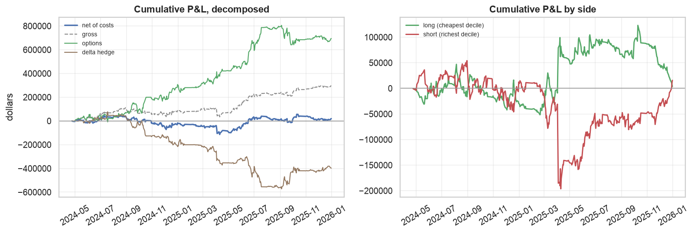
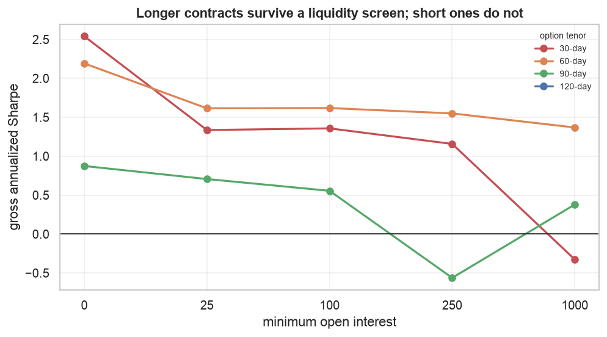
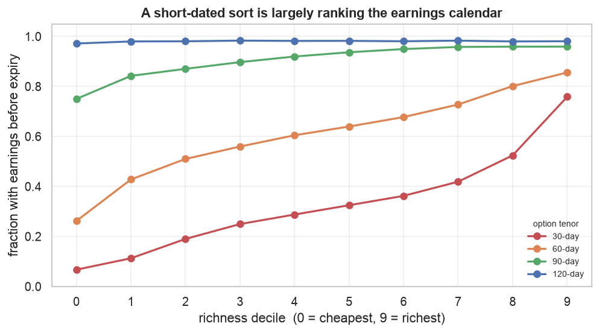
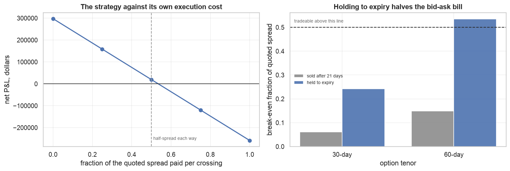

# Cheap against expensive implied vol, in the cross-section of single names

Buy the S&P 500 names whose implied volatility is low relative to their own
recent history, sell the ones where it is high, and hold each position until it
expires.

| | 2024 + 2025 | 2025 alone |
|---|---|---|
| **Gross** | Sharpe **1.55**, t = 2.41, $297,522 | Sharpe 3.15, t = 2.91 |
| **Net of half the quoted spread** | Sharpe **0.10**, t = 0.15, $19,483 | Sharpe 1.35, t = 1.12 |
| **Break-even spread** | **0.535** | 0.886 |
| **Sample** | 152 formation dates, 396 P&L days | 66 formation dates |

**The two-year column is the one to read.** Every parameter in this study —
tenor, liquidity floor, earnings screen, exit rule, signal — was chosen looking
at 2025, and adding 2024 roughly halves the gross result and takes the net
result to zero. Break-even lands at 0.535 against the 0.5 an ordinary execution
assumption demands: marginal rather than comfortable, and t = 0.15 on the net
series means the strategy is not distinguishable from doing nothing.

The honest summary is that **this looks substantially fitted to 2025**. What
survives the second year is the *ordering* of signals and the *mechanics* of
execution, not the magnitude of the edge. §7 is the section that matters.

---

## 1. The idea

Implied volatility — the volatility number that makes an option's price come
out right — moves around a lot, and much of that movement reverses. A name
whose options are suddenly pricing 45% vol when they normally price 30% has
usually not permanently become a riskier company; more often the market has
repriced its options and will reprice them back.

That is the bet: **implied volatility mean-reverts**, so buy it where it is low
relative to the name's own history and sell it where it is high.

**The signal is a 60-session z-score of each name's ATM implied vol against
itself.** Measuring against its own history rather than against other names is
the essential part. A utility always has lower implied vol than a biotech, so
sorting on the raw level just buys utilities and sells biotech — and §3 shows
that trade lost $200k in 2025. What matters is not whether a name is
low-volatility but whether it is *low for itself*.

The position is **vega-neutral**, equal volatility exposure long and short, so
it profits when the two sides converge rather than when volatility falls
overall.

### Why this is not called a variance risk premium strategy

There is a well-documented premium in options: implied volatility exceeds
subsequently realized volatility most of the time, and
`research/single_name_vol/` measures it as positive in 86-97% of these names.
A delta-hedged straddle held to expiry is the classic way to harvest it, and
that is exactly the instrument used here — so the label is tempting.

It is still the wrong one, for three reasons the study measures directly.

**The P&L comes from the wrong channel.** Splitting the option leg into
first-order greeks (§2a): vega — the channel that pays when implied vol
*moves* — is roughly eight times gamma plus theta, the channel that pays when
realized volatility undershoots what was implied. The premium is the small
part.

**Vega-neutrality nets the premium out on purpose.** The premium's level is
what a short-volatility book collects. This book holds equal vega long and
short precisely so that level cancels.

**And the premium itself is the worst signal tried.** `IV − E[RV]` is the
variance risk premium definitionally, and it ranks last of four sorts (§3). If
the strategy were harvesting the premium, measuring the premium directly would
not be the least useful thing you could do.

## 2a. Where the money comes from

Gross, over the option leg, 2024 + 2025:

| channel | total | share of option leg |
|---|---|---|
| **vega** — implied vol moved | **$324,839** | 46.7% |
| theta — premium decayed | $326,203 | 46.9% |
| gamma — realized variance captured | −$286,996 | −41.3% |
| residual (higher order) | $330,839 | 47.6% |
| **option leg** | **$694,885** | |
| delta hedge | −$397,363 | −57.2% |
| **gross** | **$297,522** | |

Theta and gamma are two sides of one trade — you pay theta for the variance an
option implies and earn gamma on the variance that arrives — so their sum,
**$39,206**, is the variance risk premium actually captured. Vega, at
**$324,839**, is more than eight times larger. The money comes from implied vol
being re-priced, not from realized volatility undershooting what was implied,
and that is why this study is not named after the premium.

**Treat the individual channel sizes with suspicion, though.** On one year the
residual was about a tenth of the option leg; across two it is 47.6%, as large
as the biggest named term, and gamma has gone negative. A first-order greek
attribution — yesterday's greeks against today's move — does not survive
two-day gaps, large moves and near-expiry convexity well enough to apportion
P&L precisely over 396 days. What it can still support is the ranking, because
vega exceeds gamma plus theta by roughly 8×, which no plausible reallocation of
the residual reverses. The conclusion that names the strategy is safe; the
decomposition is not a precise accounting.

## 2b. How the backtest works

Everything mechanical is in `tools/backtest/`; this section is what it does and
why.

**The instrument is a delta-hedged ATM straddle.** A straddle — one call and
one put at the same strike — is the cleanest available exposure to volatility:
it has large vega and, at the money, roughly zero delta. Roughly is not enough,
so the position is re-hedged daily against the underlying at the close. Without
that hedge the P&L would be dominated by whether the stock happened to move up
or down, and the decile spread would be measuring direction rather than
volatility.

**Contract selection is point-in-time.** Each day the engine sees only that
day's chain and picks the listed expiration nearest 60 days (tolerance ±12,
because listings thin to monthlies), then the strike nearest the money
(tolerance 5%). Where the chain cannot serve that, the name simply drops out
of the universe for the day — the honest treatment, since you could not have
put the trade on.

**Sizing is a dollar vega budget.** Each side of the book carries $10,000 of
vega — dollars gained per volatility point — split equally across the names in
its decile. This is what makes it a volatility trade rather than a notional
one: equal *dollar* weighting would put wildly different volatility exposure on
a $15 stock and a $600 stock. Because both sides hold the same number of names
at the same per-name vega, the book is vega-neutral by construction, and every
figure reported is in dollars.

**Positions are formed daily and held to expiry**, so about 15 overlapping
cohorts are live at once. The reported series divides by that count, so it
represents one book run at the target vega rather than fifteen stacked.

**Costs are charged against the quoted spread on the actual day**, entry only —
a position held to expiry settles at intrinsic and is never sold, so it crosses
the spread once. The headline charges half the quoted spread, the ordinary
assumption that you meet the mid going in.

**Inference uses Newey-West with lags equal to the realized hold** (15 trading
days here). Overlapping positions make today's P&L share most of its holdings
with yesterday's; without the correction t-statistics run roughly √h too large.
Driscoll-Kraay is *not* used, unlike `research/single_name_vol/` — that study
scored a pooled panel where 500 names share a market factor every day, while
this one collapses the cross-section into a single daily series before testing
anything, leaving only serial correlation to correct.

## 3. The signal: why a z-score

Four sorts, identical machinery, gross so the comparison is about ranking
rather than execution:

| signal | Sharpe (2024+2025) | total P&L |
|---|---|---|
| **IV z-score, 60 sessions** | **1.55** | $297,522 |
| VRP, IV − trailing RV | 0.35 | $55,766 |
| VRP, IV − GARCH forecast | −0.10 | −$18,983 |
| IV level (control) | −1.36 | −$450,248 |

**The control is the important row.** `iv_level` sorts on raw implied vol —
long the lowest-vol names, short the highest. It loses $450k across the two
years, and loses in each year separately. So the strategy
is not a disguised low-volatility tilt; if anything the naive version of that
trade was a disaster in 2025, because high-vol names went on to realize even
more. Normalising each name against its own history is doing the work, not the
volatility level.

**The textbook definition ranks worse than nothing.** `IV − E[RV]` is the
canonical variance risk premium, and with a GARCH forecast it returns −0.19.
This is the evidence in §1 that the strategy is not a premium trade: the
premium, measured directly, is the least useful of the four sorts.
The reason is visible in the sort: across deciles a GARCH forecast spans about
36 volatility points where implied vol spans 13, so the ranking is driven by
where the *model* is extrapolating hardest rather than by where the option is
expensive. `research/single_name_vol/` had already measured GARCH's
Mincer-Zarnowitz slope at 0.23-0.45 on these names; this is what building a
strategy on a miscalibrated forecast looks like. Both premium-based sorts sit
between the z-score and the control in every window tested.

### Does the sort actually grade?

Every decile held long, gross:

| decile | 0 | 1 | 2 | 3 | 4 | 5 | 6 | 7 | 8 | 9 |
|---|---|---|---|---|---|---|---|---|---|---|
| mean daily P&L | 1058 | 917 | 423 | 438 | 551 | 327 | 293 | −302 | −212 | −986 |

**This is the one thing two years made cleaner rather than weaker.** Deciles 0
through 6 are positive and 7 through 9 negative, and the gradient runs the
right way almost throughout — the three cheapest average **+$799**, the three
richest **−$500**. On 2025 alone the middle of the sort was noise (decile 3 sat
below decile 6); with twice the data it grades.

No individual decile is close to significant, which is what 152 formation dates
buys. But a signal that only worked at the extremes would show two spikes and a
flat middle, and this does not. Whatever the magnitude turns out to be, the
cross-sectional ordering is doing real work.

## 4. Tenor: why 60 days

The signal is a "60-day implied vol z-score" because the contract is 60 days,
not the other way round. Sweeping the tenor moves the result more than any
other choice, and it is the one this study originally got wrong by inheriting
30 days from the signal definition.

Gross Sharpe by tenor and liquidity floor:

| tenor | oi≥0 | oi≥25 | oi≥100 | oi≥250 | oi≥1000 |
|---|---|---|---|---|---|
| 30d | **2.54** | 1.34 | 1.36 | 1.16 | −0.33 |
| **60d** | 2.19 | 1.61 | 1.62 | **1.55** | **1.37** |
| 90d | 0.87 | 0.71 | 0.56 | −0.56 | 0.38 |

On two years the case for 60 days is weaker than it looked on one. Without a
liquidity screen the 30-day contract is now the better of the two (2.54 against
2.19), and 60 days wins only once open interest is demanded. What does survive
is the *robustness*: 60 days is the only tenor that holds up across the whole
range of floors, where 30 days falls to −0.33 and 90 days is erratic
throughout. That is the property the strategy relies on, but it is a weaker
claim than "60 days dominates", which is what one year appeared to show.

**60 days is the only tenor that survives a liquidity screen.** At 30 days,
demanding 1,000 contracts of open interest turns a positive strategy negative;
at 60 days it costs comparatively little. That matters
because open interest buys tight quotes — `cost_efficiency.py` measures the
spread paid per dollar of vega falling 2.5× from the thinnest to the richest
open-interest bucket — so a tenor that tolerates the screen is a tenor that can
be traded.

**The intuition is a balance of two forces.** Longer contracts are cheaper per
unit of exposure: ATM vega grows as √T while quoted spreads are closer to
tick-driven, so a 120-day contract buys the same vega for less than half the
spread of a 30-day one. That pushes toward long tenors. But §5 pushes back:
almost every long-dated contract contains an earnings announcement, and the
strategy wants contracts that avoid one. At 120 days that is 99% of the
universe, so the earnings screen leaves nothing to trade and the grid cannot
even be run. **60 days is where cost efficiency and earnings-avoidance
balance.**

The `oi≥250` floor is chosen in the same spirit: it costs about a fifth of the
gross Sharpe (3.66 → 3.15) and buys materially tighter execution, which §6
shows is the binding constraint.

## 5. Earnings: excluded because it contaminates the ranking

An implied-vol sort will rank the earnings calendar whether you intend it to or
not. Fraction of selected contracts whose life contains an announcement:

| decile | 0 | 2 | 4 | 6 | 8 | 9 |
|---|---|---|---|---|---|---|
| 30-day | 0.07 | 0.18 | 0.27 | 0.34 | 0.49 | **0.75** |
| 60-day | 0.30 | 0.51 | 0.62 | 0.67 | 0.79 | 0.85 |
| 120-day | 0.99 | 0.99 | 0.99 | 0.99 | 0.99 | 0.99 |

**The intuition is mechanical.** Implied volatility prices the variance a
contract expects to cover. An earnings announcement is a scheduled jump, so a
contract spanning one is genuinely worth more — not mispriced, just covering a
different amount of risk. A short-dated sort therefore ranks mostly on "does an
announcement fall before expiry", which is a calendar fact rather than a
premium. At 120 days every contract spans one, so the binary is constant and
cannot influence the ranking at all.

**But the P&L is not the earnings trade.** Partitioning the universe, gross:

| | formation days | Sharpe (2024+2025) |
|---|---|---|
| 30d, all names | 180 | 1.25 |
| 30d, no earnings in life | 130 | 1.16 |
| 60d, all names | 358 | 1.08 |
| 60d, **no earnings in life** | 152 | **1.55** |

At 60 days the signal is still stronger with those names removed, so earnings
remains a **contaminant of the ranking rather than a source of returns** — it
decides which names land in which decile while the money comes from the names
without an announcement. But the effect is far smaller than one year suggested
(1.08 → 1.55, against 1.45 → 3.15 on 2025 alone), and at 30 days the exclusion
now *costs* a little rather than helping. The mechanism in the table above is
solid; the size of the improvement was not.

This also explains §4. The longer tenor does not win by removing an earnings
*profit* channel — it wins by removing an earnings *noise* channel from the
sort. Both tenors harvest the same premium; the short one just has a calendar
artifact sitting on top of its ranking.

## 6. Execution: why hold to expiry

Selling a position crosses the quoted spread a second time. Holding it to
expiration does not — the contract settles at intrinsic value and nobody is
paid a spread for that. On a strategy whose binding constraint is spread, this
is worth more than everything in §3-§5 combined, and it is arithmetic rather
than an empirical hope.

Break-even spread — the fraction of the quoted bid-ask the strategy can pay per
crossing and still reach zero:

| | sold after 21 days | held to expiry |
|---|---|---|
| 30-day contract | 0.061 | 0.242 |
| **60-day contract** | 0.149 | **0.535** |

Two effects compound here. Not selling removes one of two crossings, and
holding 60 days instead of 21 cuts how often the remaining crossing is paid.
Together they take the 60-day strategy from paying about five times more in
spread than it earns to paying about one-ninth of what it could afford.

**The cost is gross performance**, and the trade is explicit: the hold
stretches from 21 days to ~60, and this signal decays, so gross Sharpe falls as
the position ages. On these numbers the trade is worth making by a wide margin.

The full cost curve, from free execution to paying the entire quoted spread on
every crossing:

| spread paid per crossing | 0 | 0.25 | 0.5 | 0.75 | 1.0 |
|---|---|---|---|---|---|
| net Sharpe | 1.55 | 0.82 | **0.10** | −0.61 | −1.30 |

Holding to expiry is still the largest single improvement in the study, and it
is the one whose mechanism is arithmetic rather than estimated — a settled
position never crosses the spread a second time, in any sample. But the margin
it buys is thin: at the ordinary half-spread assumption the strategy earns
essentially nothing, and it is losing by three-quarters.

## 7. Out of sample: 2024

Every choice in this study was made looking at 2025 — the tenor, the liquidity
floor, the earnings screen, the exit rule, the signal itself. 2024 is therefore
a genuine out-of-sample year, and it is the only test that distinguishes a real
effect from a specification fitted to its own sample.

Gross, without the open-interest floor so the two years are compared on the
same universe:

| period | days | mean daily | t (NW) | Sharpe |
|---|---|---|---|---|
| **2024 (out of sample)** | 178 | $673 | 0.92 | **1.29** |
| 2025 (in sample) | 250 | $1,101 | 4.15 | 3.32 |
| pooled | 428 | $923 | 2.70 | 2.19 |

**The signal survives, at roughly a third of its in-sample strength.** 2024 is
positive and does not clear significance on its own; 2025 is two and a half
times better on identical rules. That gap is what fitting to a sample looks
like, and the pooled figure is the one to carry forward.

With the liquidity screen applied — the strategy as specified — the two-year
result is gross Sharpe 1.55 and **net 0.10**, against 3.15 and 1.35 on 2025
alone. Break-even falls from 0.886 to **0.535**.

The signal *ordering* replicates, which is the mechanism holding even as the
magnitude does not:

| signal | 2024 + 2025 |
|---|---|
| IV z-score | **1.55** |
| VRP, trailing RV | 0.35 |
| VRP, GARCH forecast | −0.10 |
| IV level (control) | **−1.36** |

The control — long low-vol, short high-vol — loses across both years. Whatever
this captures is not a volatility-level tilt, and that was not an artifact of
one year.

### A survivorship bug worth recording

An earlier version of this section reported 2024 gross Sharpe of **2.54**. That
number was wrong. The panel built its symbol list from
`available_option_symbols()`, which defaults to the 2025 store, so 2024 was
restricted to names that *survived into 2025* — excluding 18 that left the
index during the year (AAL, BBWI, ETSY, ILMN, MRO, PXD, QRVO, VFC, WHR, XRAY,
ZION among them). Removing that bias roughly halves 2024's apparent
performance.

It is the textbook error and it flatters exactly the year being used as
out-of-sample evidence, which is the worst place to have it. The panel builder
now takes the union of symbols across the requested years and prints which
years it used.

## 8. What this sample cannot establish

Everything above is one calendar year. The limits are severe and they all point
the same way.

- **Two years is about two independent observations for this strategy.** 152
  formation dates at a ~60-day hold. Better than the one the 2025-only version
  had, and nowhere near enough. The net t-statistic is 0.15.
- **The out-of-sample year is three times weaker than the in-sample one.**
  Gross Sharpe 1.29 against 3.32 on identical rules. Some of that is noise and
  some is fitting; one extra year cannot separate them. The gross t of 2.91 and the net t of 1.12 are computed with
  Newey-West at 15 lags, which is the right correction and does not manufacture
  information that is not there. The net result is not statistically
  distinguishable from zero.
- **This configuration is the survivor of a long search** — tenors, liquidity
  floors, signals, holding periods, exit rules, earnings screens, cost levels.
  Roughly 145 configurations were evaluated across the work that produced it.
  The cell that looks best in a search that wide is the cell most likely to be
  a selection artifact.
- **The screens that make the strategy affordable are the ones that empty the
  cross-section.** `oi≥250` and the earnings exclusion together cut formation
  dates from 195 to 66. Cheap execution and a deep sample are in direct
  tension here, and one year cannot resolve it.
- **2025 contains one dominant shock.** April is the largest move in the
  window, and a single year gives no way to know whether the result depends
  on it.

The distinction worth holding onto: **the mechanics generalise, the performance
number does not.** That spread cost halves when you hold to expiry is
arithmetic. That vega grows as √T while spreads do not is a property of option
pricing. That a short-dated implied-vol sort ranks the earnings calendar is
visible directly in the data and needs no P&L to believe. Those findings will
hold in any sample. Whether this strategy earns Sharpe 1.35 net will not be
known until it is run on more than one year.

## 9. What would move this forward

1. **More history, and nothing else comes close in importance.** ThetaData's
   STANDARD tier reaches 2016. Going from one year to two cut the headline in
   half and took net P&L to zero; that is exactly what should happen to a
   result fitted to its sample, and it is also what would happen to a real but
   modest edge measured on too little data. A decade distinguishes them. Until
   then this is a hypothesis with two observations behind it.
3. **Fills rather than quotes.** Costs are charged against the quoted spread.
   At a break-even of 0.886 the strategy has room, but the actual question is
   what a patient limit order achieves against these quotes, and EOD data
   cannot answer it.
4. **A cheaper hedge.** The delta hedge is a large drag on gross P&L — it is
   doing necessary work, without it the decile spread is a directional bet, but
   it hedges each name's gross delta when the long and short deciles partly
   offset. Hedging net portfolio delta should cost a fraction of it.
5. **Index dispersion as the alternative structure.** `research/volatility/`
   and `research/single_name_vol/` together show the index premium is
   proportionally *larger* than the single-name premium at a month (1.21×
   against 1.14×). Selling index volatility against single-name volatility
   harvests that gap directly, and index options quote at ~2% of mid against
   ~14% for single names — roughly 19× cheaper per dollar of vega. It is the
   structurally cheaper way to trade this premium and it is untested here.
