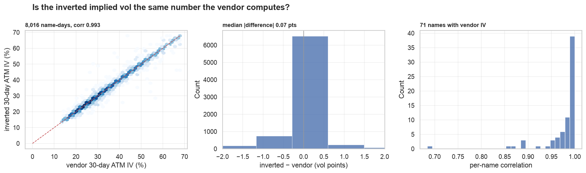
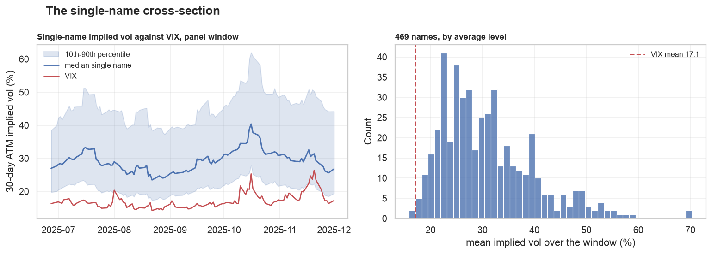
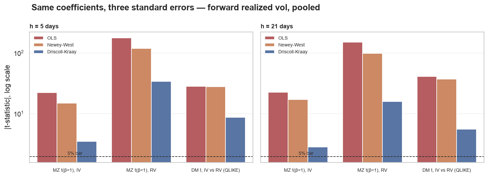
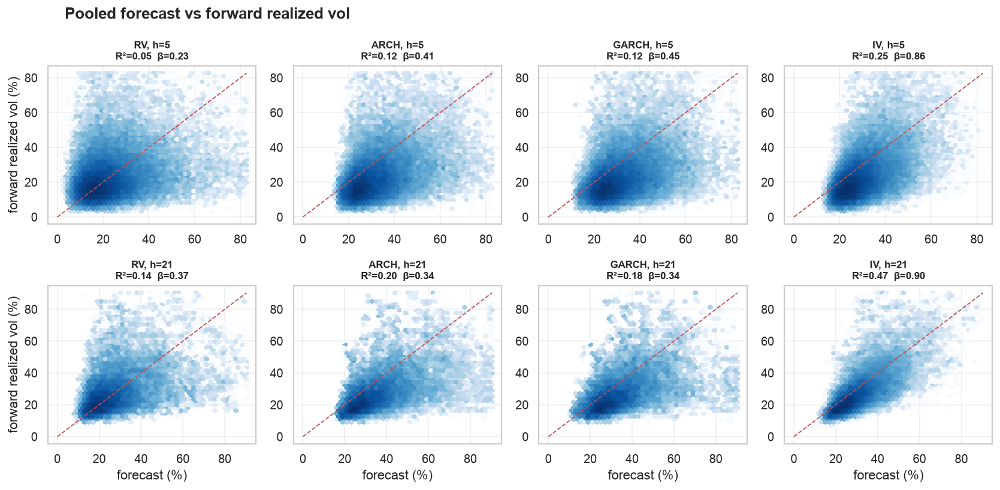
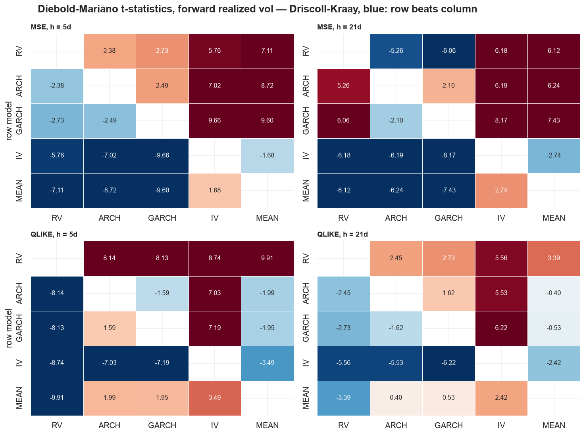
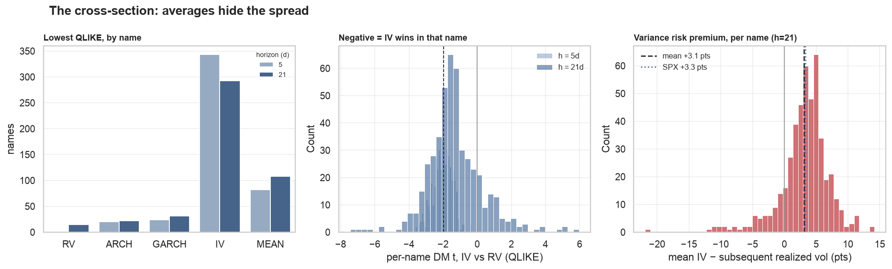

# Forecasting volatility in 500 single names

**Question.** `research/volatility/` asked whether trailing realized vol, ARCH,
GARCH or implied vol best forecasts SPX volatility, and answered "implied, but
the sample is too short to prove it". This runs the same horse race, scored the
same four ways, across the S&P 500 — where there is no VIX to lean on, the
prices are unadjusted, and the cross-section itself becomes the evidence.

**Sample.** Calendar 2025: 469 names, 97,345 forecast origins over 125 dates
(52,025 at h=5, 45,320 at h=21). The options pull covers one year, which forces
a 120-day burn-in rather than the index study's 250 — so ARCH and GARCH are
fitted on half the history they had there, and every forecast is still
out-of-sample. The universe is `trusted_symbols()`, the 507 names whose split
adjustment has been verified against a second source, less those without enough
chain coverage to invert an implied vol.

## Answer in four lines

1. **Implied volatility wins, and this time it is significant.** IV beats every
   rival on both losses, at both horizons, against both targets, and 29 of those
   32 pairwise Diebold-Mariano tests clear 5% with panel-corrected errors. The
   index study's equivalent comparisons produced one rejection in sixteen.
2. **It is close to calibrated, which nothing else is.** Pooled MZ slopes of
   0.86 and 0.90 against 0.23-0.45 for the return-based models, with an
   intercept indistinguishable from zero at both horizons.
3. **It does not win everywhere.** IV has the lowest QLIKE in 343 of 469 names
   at a week and 293 at a month; a per-name level guess wins 82 and 108.
   Per-name DM clears 5% for IV in 246 names at h=5 — and for trailing RV in 17
   names at h=21.
4. **The variance risk premium is a cross-sectional fact, not a constant.**
   Positive in 456 of 469 names at a week, mean +5.3 vol points, ranging from -7
   to +15. Proportionally it is *smaller* than the index's at a month (1.14×
   against SPX's 1.21×).

The caveat that governs everything: six months of usable origins and one shared
market factor.

## Before any forecasting

### Prices are raw, and a size threshold cannot clean them

2025 contains six unadjusted splits and the DD spinoff. A 15-for-1 split books
a -93% return, and a GARCH fitted through one never recovers. It also contains
genuine single-day collapses past -40% — CNC -41%, TTD -38%, WST -38%, ALGN
-37%, SNPS -36% — which are precisely the events a volatility model exists to
learn from. No threshold on return size separates the two.

The repo's answer is a corporate-action calendar rather than a filter, and this
study uses it rather than reinventing one:

```python
prices_df = dal.load_underlying(dal.trusted_symbols(), with_actions=True, in_universe=True)
returns_df = prices_df.with_columns(dal.split_adjusted_return().over("symbol"))
```

Each flag removes a different artefact: `with_actions` supplies the ex-date
split ratio so the six splits and the spinoff stop being -60% to -93% days,
`in_universe` drops the pre-listing stub rows ThetaData returns for a reused
ticker (SOLS's four $0.0001 rows), the loader's default drops the zero rows
that mark a delisting (HES, JNPR, K), and `trusted_symbols()` keeps only the
names whose adjustment agrees with a second source. After all four, the largest
surviving move in the sample is CNC's -41% — real, and kept.

That last filter also silently narrows the sample in a way worth stating: a
name that leaves the index mid-year contributes only its member days, so FMC's
-46% October collapse is outside this study, not misclassified by it.

### There is no VIX per name — and now a way to check the substitute

Implied vol has to be inverted from mids. For each name and day: imply the
forward from put-call parity at the tightest call/put pair, invert Black-76 at
the strike nearest that forward for both sides, average, and interpolate the
two bracketing expirations in total variance to exactly 30 days. Taking the
forward from parity rather than assuming a dividend yield is what makes this
work across 469 different dividend policies.

Whether that number is *right* was the study's largest unmeasured assumption.
`data_pipelines.option_greeks` now pulls ThetaData's own per-contract
`implied_vol` for part of the universe, so it can be measured directly. Running
the identical 30-day interpolation on the vendor's IV instead of the inverted
one, across the 63 names that currently have both:



| | |
|---|---|
| name-days compared | 7,062 across 63 names |
| pooled correlation | **0.9927** |
| mean difference | **-0.03 vol points** |
| median absolute difference | **0.07 vol points** |
| worst per-name correlation | 0.684 (APA) |

Seven hundredths of a vol point is nothing next to the 16-22 point RMSEs below.
The measure is sound where the chain is liquid, and the handful of poor
correlations are thin names (APA 0.68, BAX 0.86, AES 0.87) where quotes are
wide — the same names where every forecast is noisy.

Two limitations survive this check and should not be waved away:

- **Agreement is not proof of correctness.** These are American options and
  Black-76 is a European formula. The vendor's model is an independent
  implementation, not a different asset-pricing assumption, so the check rules
  out an inversion *bug*, not a shared early-exercise bias. At the money and 30
  days, that bias is small; it is not zero.
- **30 days is the only horizon available across the universe.** Half the names
  have no weekly listings: a 7-day measure brackets on 58 of 250 days for a
  monthly-only name against 248 for a weekly-listed one. So h=5 is scored
  against a 30-day IV. The mismatch can only *understate* IV's short-horizon
  performance, which makes the h=5 results a lower bound.

## The cross-section



The median name trades near 29 vol against a VIX of 17, and the 10th-to-90th
percentile band spans roughly 21 to 43. That is not a puzzle — index volatility
is a correlation-weighted average of single-name volatility and correlation is
well below one — but it means everything below concerns a higher-variance
object than the SPX study did.

## What the panel does to standard errors

This is the methodological centre of the study. 469 names on 125 dates is not
97,345 independent observations: every name loads on the same market factor, so
residuals are correlated **across the panel** on any given day. Newey-West
prices the time dimension and is blind to that. Driscoll-Kraay aggregates each
date's cross-section into a single moment first and then applies Newey-West to
the aggregate, which is the correction the data actually needs.



The same three coefficients, priced three ways (forward realized vol, pooled):

| test | horizon | OLS | Newey-West | Driscoll-Kraay |
|---|---|---|---|---|
| MZ t(β=1), IV | 5 | -22.2 | -14.9 | **-3.5** |
| MZ t(β=1), RV | 5 | -178.5 | -118.7 | **-34.3** |
| DM t, IV vs RV (QLIKE) | 5 | -28.1 | -27.8 | **-8.7** |
| MZ t(β=1), IV | 21 | -22.6 | -17.0 | **-2.8** |
| MZ t(β=1), RV | 21 | -150.2 | -98.6 | **-15.8** |
| DM t, IV vs RV (QLIKE) | 21 | -40.9 | -37.3 | **-5.6** |

Newey-West alone overstates every t-statistic by a factor of **3 to 7**. On the
IV calibration test at h=21 it is the difference between t = -17.0 and
t = -2.8 — between "rejected at any conceivable level" and "marginally
rejected", which is a different sentence in the conclusions.

Note also where the correction bites. On the DM tests, Newey-West barely moves
the OLS number (-28.1 to -27.8) and clustering then takes a factor of three:
for a loss differential, serial correlation is nearly irrelevant and
cross-sectional correlation is everything. Getting the *wrong* robust estimator
would have looked like doing the right thing.

Every pooled number below uses Driscoll-Kraay.

## Forecasting forward realized volatility

| h=5 | RMSE (pts) | QLIKE | MAE | bias | corr | MZ α (t) | MZ β (t vs 1) | MZ R² |
|---|---|---|---|---|---|---|---|---|
| RV | 21.9 | 1.553 | 13.4 | +0.3 | 0.23 | +19.5 (18.4) | 0.23 (-34.3) | 0.053 |
| ARCH | 20.6 | 0.616 | 14.1 | +8.5 | 0.34 | +11.5 (9.1) | 0.41 (-20.6) | 0.118 |
| GARCH | 19.9 | 0.620 | 14.0 | +8.0 | 0.35 | +10.3 (11.4) | 0.45 (-33.0) | 0.121 |
| **IV** | **16.3** | **0.476** | 11.3 | +5.4 | **0.50** | **-1.0 (-0.9)** | **0.86 (-3.5)** | **0.254** |
| MEAN | 17.0 | 0.751 | **10.3** | -0.2 | 0.35 | +9.6 (6.4) | 0.63 (-6.6) | 0.122 |

| h=21 | RMSE (pts) | QLIKE | MAE | bias | corr | MZ α (t) | MZ β (t vs 1) | MZ R² |
|---|---|---|---|---|---|---|---|---|
| RV | 15.6 | 0.483 | 9.9 | -0.1 | 0.38 | +17.9 (15.7) | 0.37 (-15.8) | 0.141 |
| ARCH | 19.6 | 0.334 | 12.9 | +9.5 | 0.45 | +15.2 (15.9) | 0.34 (-21.0) | 0.203 |
| GARCH | 18.6 | 0.325 | 12.0 | +7.8 | 0.43 | +16.0 (30.9) | 0.34 (-35.3) | 0.182 |
| **IV** | **10.5** | **0.177** | **7.2** | +3.1 | **0.69** | **+0.0 (0.0)** | **0.90 (-2.8)** | **0.475** |
| MEAN | 12.8 | 0.364 | 8.0 | -1.2 | 0.49 | +11.7 (6.0) | 0.61 (-6.0) | 0.236 |



Reading these:

- **IV wins on every measure that ranks.** Lowest RMSE and lowest QLIKE at both
  horizons, highest MZ R², and the only slope near 1. Its +5.4 points of bias
  at h=5 arrives through the slope, not through an offset: the intercept is
  -1.0 points at h=5 and 0.0 at h=21, and neither is distinguishable from zero.
  Every other forecast carries an intercept of +10 to +20 points.
- **Trailing RV is the worst forecast in the study under QLIKE** (1.553 at h=5,
  against 0.751 for a level guess) while looking competitive on RMSE (21.9
  against 17.0). The index study found the same pattern, much smaller: a single
  name's trailing window misses the next earnings move entirely, and QLIKE
  prices that under-forecast heavily where squared error does not. If you rank
  single-name forecasts on RMSE alone you will conclude trailing RV is a
  reasonable model. It is the worst one here.
- **ARCH and GARCH are systematically high** (+8 to +10 points). Fitted on 120
  days of returns dominated by earnings jumps, they carry a persistently
  elevated variance level, and their slopes near 0.35 say they respond far too
  little to what they do know. Their QLIKE at h=21 (0.334, 0.325) is
  nonetheless second only to IV — the asymmetric loss rewards their caution.
- **The level guess is a serious competitor**, beating RV, ARCH and GARCH on
  RMSE at h=5 and beating trailing RV on QLIKE at both horizons. Any claim that
  a return-based model forecasts single-name vol has to clear this bar first,
  and half of them do not.

### Is the edge significant?



IV against each rival, Driscoll-Kraay; negative means IV loses less:

| horizon | loss | vs RV | vs ARCH | vs GARCH | vs MEAN |
|---|---|---|---|---|---|
| 5 | MSE | **-5.76** | **-7.02** | **-9.66** | -1.68 |
| 5 | QLIKE | **-8.74** | **-7.03** | **-7.19** | **-3.49** |
| 21 | MSE | **-6.18** | **-6.19** | **-8.17** | **-2.74** |
| 21 | QLIKE | **-5.56** | **-5.53** | **-6.22** | **-2.42** |

Fifteen of sixteen clear 5%; the exception is IV against the level guess on
squared error at a week. **This is the sharpest difference from the index
study**, where the same sixteen comparisons produced |t| between 0.7 and 2.0
and one rejection. Nothing about the forecasts changed — the cross-section
supplies the observations one index cannot, and supplies enough of them to
survive a correction that removes a factor of three to seven.

The encompassing regression is blunter than the index study's:

| horizon | const | RV | ARCH | GARCH | IV | R² |
|---|---|---|---|---|---|---|
| 5 | -0.011 (-1.1) | 0.012 (1.0) | 0.019 (0.8) | -0.006 (-0.3) | **0.837 (14.0)** | 0.255 |
| 21 | -0.001 (-0.2) | -0.006 (-0.4) | 0.003 (0.1) | 0.028 (1.7) | **0.874 (15.9)** | 0.476 |

IV takes a coefficient near 1 and every return-based forecast collapses to
zero. Whatever RV, ARCH and GARCH know about a name's next month of volatility,
its option market has already priced.

## Forecasting forward implied volatility

| h=5 | RMSE (pts) | QLIKE | bias | corr | MZ β (t vs 1) | MZ R² |
|---|---|---|---|---|---|---|
| RV | 17.2 | 1.266 | -5.1 | 0.40 | 0.24 (-26.8) | 0.163 |
| ARCH | 11.8 | 0.111 | +3.1 | 0.64 | 0.45 (-13.8) | 0.413 |
| GARCH | 10.6 | 0.127 | +2.7 | 0.67 | 0.51 (-20.6) | 0.445 |
| **IV** | **4.3** | **0.032** | **+0.1** | **0.91** | **0.91 (-4.5)** | **0.836** |
| MEAN | 9.8 | 0.315 | -5.5 | 0.68 | 0.71 (-4.5) | 0.459 |

| h=21 | RMSE (pts) | QLIKE | bias | corr | MZ β (t vs 1) | MZ R² |
|---|---|---|---|---|---|---|
| RV | 12.8 | 0.355 | -2.5 | 0.51 | 0.38 (-18.9) | 0.264 |
| ARCH | 16.0 | 0.155 | +7.1 | 0.62 | 0.36 (-16.8) | 0.381 |
| GARCH | 15.1 | 0.165 | +5.4 | 0.58 | 0.35 (-24.3) | 0.339 |
| **IV** | **8.1** | **0.112** | **+0.7** | 0.71 | **0.70 (-9.9)** | 0.497 |
| MEAN | 8.9 | 0.191 | -3.6 | **0.72** | 0.69 (-5.4) | **0.511** |

Here the index study's most striking negative result **does not replicate**.
There, ARCH and GARCH had literally zero explanatory power for forward implied
vol at a month (R² of 0.001 and 0.003) and nothing beat a constant. In the
cross-section they reach 0.38 and 0.34, and IV beats the level guess under
QLIKE (t = -2.70).

The two studies are asking different questions under the same name. VIX 21 days
ahead is one number whose month-to-month path is nearly unforecastable. A
single name's implied vol 21 days ahead is mostly a *level* question — is this
a 20-vol name or a 60-vol name — and that level is persistent and visible in
returns. The R² here is cross-sectional dispersion being explained, not
time-series predictability. The MEAN benchmark settles it: a per-name
historical average posts the highest MZ R² in the table (0.511) while losing to
IV on both losses.

## Does IV win in every name?



No, and the pooled tables hide it. Lowest QLIKE against forward realized vol,
counted by name:

| horizon | IV | MEAN | GARCH | ARCH | RV |
|---|---|---|---|---|---|
| 5 | **343** | 82 | 24 | 20 | 0 |
| 21 | **293** | 108 | 31 | 22 | 15 |

IV wins about three names in four at a week and five in eight at a month. A
per-name level guess takes the next largest share — 108 names at h=21, more
than ARCH, GARCH and RV combined. Per-name Diebold-Mariano tests of IV against
trailing RV (QLIKE, Newey-West inside each name) say the same with error bars:

| horizon | median t | IV better at 5% | RV better at 5% |
|---|---|---|---|
| 5 | -1.99 | 246 / 469 | 0 / 469 |
| 21 | -1.47 | 145 / 469 | **17 / 469** |

At a week the result is one-sided: not one name in the universe has trailing RV
significantly beating its option market. At a month, 17 do — fewer than the ~23
that 5% of 469 would throw up by chance under a null of no difference, so this
is not evidence of a tradable pocket. It is a reminder that "IV wins" describes
a distribution, not every name.

## The variance risk premium across names

| horizon | mean (pts) | median | 10th pct | 90th pct | positive | mean IV / mean RV |
|---|---|---|---|---|---|---|
| 5 | +5.33 | +5.17 | +2.01 | +8.86 | 456 / 469 (97%) | 1.233 |
| 21 | +3.11 | +3.57 | -1.24 | +7.31 | 402 / 469 (86%) | 1.139 |
| SPX, h=5 | +3.64 | — | — | — | 80% of days | 1.252 |
| SPX, h=21 | +3.31 | — | — | — | 83% of days | 1.207 |

In points the single-name premium resembles the index's, a little larger at a
week. In proportional terms — the fair comparison, since the median name
carries 29 vol against the index's 17 — it is **smaller at a month**: 1.139×
against SPX's 1.207×. The dispersion is the real finding: the per-name premium
runs from -22 to +14 points at h=21, and 67 names have a negative one.

This is the shape the literature leads you to expect. Index options are what
investors buy to hedge market-wide risk and they pay for it; a single name's
options price mostly idiosyncratic risk, which is diversifiable and commands
less. Nothing here identifies that mechanism — the sample is one year — but the
sign and the ordering are consistent with it.

## What this does and does not establish

Established, in this sample:

- IV beats trailing RV, ARCH and GARCH at forecasting single-name realized vol
  at both horizons, on both robust losses, with panel-corrected significance —
  15 of 16 pairwise tests on forward realized vol, 29 of 32 across both
  targets. It also encompasses all three.
- IV is the only forecast near calibrated: slopes of 0.86 and 0.90 against
  0.23-0.45, and the only intercept indistinguishable from zero.
- The inverted implied vol matches the vendor's own to a median 0.07 vol points
  across 7,062 name-days, so the measure is not carrying the result.
- A per-name level guess beats every return-based model on at least one loss at
  each horizon and wins outright in 82-108 names.
- The variance risk premium is positive in 86-97% of names and proportionally
  smaller than the index's at a month.
- Newey-West alone overstates panel t-statistics by 3-7×.

Not established:

- **That the IV measure is unbiased.** Agreement with the vendor rules out an
  inversion bug, not a shared European-formula assumption applied to American
  options. The bias is small at the money and unquantified.
- **Anything about h=5 with a horizon-matched IV.** A 30-day measure is scored
  against a one-week target because half the universe has no weeklies. The
  mismatch handicaps IV, so h=5 is a lower bound — but the experiment on
  weekly-listed names with a 7-day measure has not been run.
- **Stability across regimes.** Six months of usable origins in one calendar
  year, with a 120-day burn-in that gives ARCH and GARCH far less history than
  the index study did. Their poor showing is partly that.
- **That the 17 names where RV beats IV mean anything.** The count is below
  what chance alone produces at this many tests.
- **Anything about names outside `trusted_symbols()` or outside the index.** A
  name that left the S&P 500 mid-year contributes only its member days.

Three extensions, in order of value per hour:

1. **Rerun h=5 on weekly-listed names with a 7-day IV.** Settles the horizon
   mismatch, and costs minutes of compute against the existing panel.
2. **Condition on earnings.** `load_earnings` and `with_earnings_distance` now
   exist, and single-name volatility is largely an earnings-calendar
   phenomenon. The obvious test is whether IV's edge over ARCH and GARCH is
   concentrated in windows containing an announcement — which would say the
   option market's advantage is a known-date advantage, not a modelling one.
3. **Split by liquidity.** The three worst IV validations are the three widest
   chains. If the result is carried by the names whose quotes invert cleanly,
   that is worth knowing before trading any of it.
