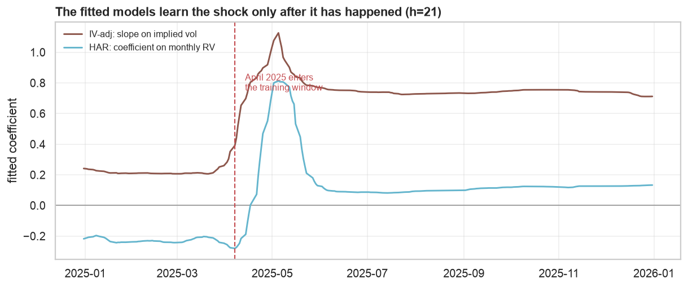
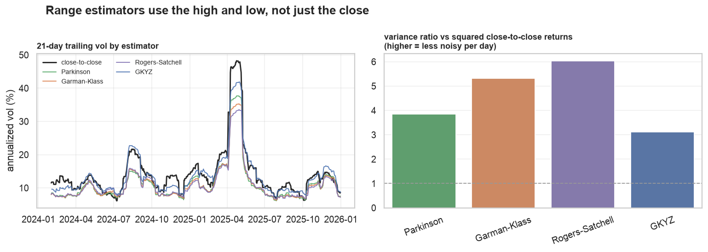
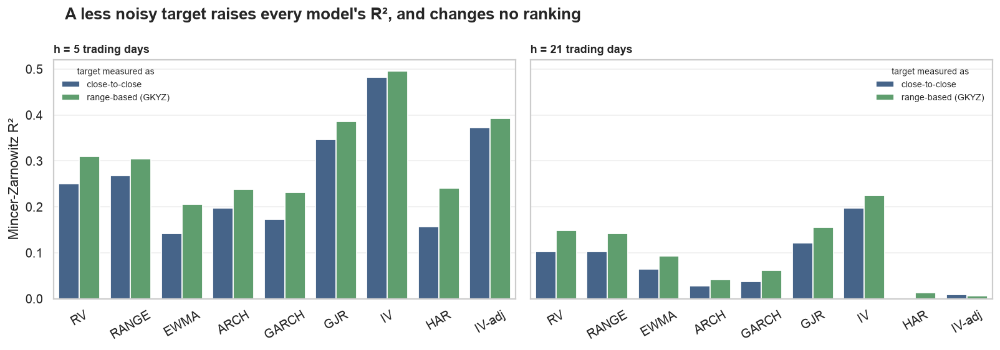

# Forecasting volatility: nine models, two targets, two horizons

**Question.** Given information through today, how well do return-based
volatility models and the option market's implied volatility forecast (a)
realized volatility over the next week and month, and (b) implied volatility a
week and a month from now?

**Sample.** SPX daily OHLC, 2024-01-03 to 2025-12-31 (501 trading days), with
VIX9D and VIX as the implied-vol measures for the 5- and 21-day horizons. All
estimated models use an expanding window with a 250-day burn-in, so every
number below is out-of-sample: 246 origins at h=5, 230 at h=21.

**The nine models**, in four families:

| Family | Models | Fitted to the target? |
|---|---|---|
| Naive | `RV` (trailing close-to-close), `RANGE` (trailing GKYZ range estimator) | no |
| Exponential | `EWMA` (RiskMetrics, λ=0.94) | no |
| Conditional variance | `ARCH`(5), `GARCH`(1,1), `GJR`(1,1,1) | no (likelihood, not target) |
| Option market | `IV` (VIX9D / VIX) | no |
| Regression | `HAR` (Corsi), `IV-adj` (premium-adjusted IV) | **yes** |

## Answer in four lines

1. **Implied volatility still wins on every metric, at both horizons, on both
   targets** — but its margin over the best return-based model is now small.
2. **Asymmetry was the missing ingredient, not model class.** GJR-GARCH — one
   extra parameter over GARCH — cuts RMSE by 15% and roughly doubles R², and is
   statistically indistinguishable from IV at forecasting forward realized vol
   (Diebold-Mariano t of -0.47 at a week, -0.14 at a month).
3. **The two target-fitted models fail out of sample**, badly at a month
   (HAR R² = 0.000). They spend the entire run-up fitting a calm-market
   relationship and only re-learn after the shock has passed.
4. **EWMA, the industry default, is the weakest model here** — the only one IV
   beats significantly on forward realized vol at a week.

The caveat governing everything: two years containing one enormous shock. Point
estimates are clear; pairwise significance mostly is not.

## The sample

Two years, one regime break. Realized vol sits between 6% and 20% for most of
the sample and then goes to 48% in April 2025. Implied sits above realized
almost everywhere — the shaded wedge — except through that shock.

That single episode carries most of the statistical weight in everything below.

## Forecasting forward realized volatility

| h=5 | RMSE (pts) | MAE | bias | corr | MZ β | t(β=1) | MZ R² |
|---|---|---|---|---|---|---|---|
| RV | 11.89 | 6.74 | +0.12 | 0.50 | 0.50 | -3.1 | 0.250 |
| RANGE | 10.84 | 6.11 | +0.14 | 0.52 | 0.63 | -2.1 | 0.268 |
| EWMA | 12.08 | 7.67 | +2.23 | 0.38 | 0.51 | -2.8 | 0.142 |
| ARCH | 11.10 | 6.68 | +1.18 | 0.44 | 0.65 | -1.6 | 0.198 |
| GARCH | 11.42 | 6.89 | +1.34 | 0.42 | 0.60 | -2.1 | 0.173 |
| GJR | 9.67 | 5.81 | +0.69 | 0.59 | 0.93 | -0.3 | 0.346 |
| **IV** | **9.34** | 6.57 | +3.64 | **0.69** | 1.10 | 0.5 | **0.482** |
| HAR | 11.61 | 6.63 | +0.11 | 0.40 | 0.55 | -2.4 | 0.158 |
| IV-adj | 9.45 | **5.48** | +0.33 | 0.61 | **1.05** | **0.2** | 0.372 |

| h=21 | RMSE (pts) | MAE | bias | corr | MZ β | t(β=1) | MZ R² |
|---|---|---|---|---|---|---|---|
| RV | 12.16 | 7.93 | +0.31 | 0.32 | 0.32 | -3.9 | 0.103 |
| RANGE | 11.28 | 7.36 | -0.34 | 0.32 | 0.39 | -3.1 | 0.102 |
| EWMA | 12.04 | 8.50 | +1.05 | 0.25 | 0.29 | -5.2 | 0.064 |
| ARCH | 11.02 | 7.07 | +0.05 | 0.17 | 0.31 | -7.5 | 0.028 |
| GARCH | 11.64 | 7.45 | +0.23 | 0.20 | 0.27 | -8.4 | 0.038 |
| GJR | 10.16 | **6.22** | -0.76 | 0.35 | 0.60 | -2.4 | 0.121 |
| **IV** | **9.98** | 7.92 | +3.31 | **0.45** | **0.86** | **-0.7** | **0.198** |
| HAR | 12.28 | 7.85 | -0.39 | 0.02 | 0.03 | -6.2 | 0.000 |
| IV-adj | 10.76 | 6.95 | -0.47 | 0.09 | 0.28 | -2.3 | 0.009 |

Reading these together:

- **GJR is the story.** Adding a single leverage term to GARCH — letting a down
  day raise variance more than an up day — takes RMSE from 11.42 to 9.67 at a
  week, R² from 0.17 to 0.35, and the MZ slope from 0.60 to 0.93, the only
  return-based slope that is not distinguishable from 1. Equity vol is
  asymmetric, this sample's one shock was a selloff, and symmetric models
  cannot see it coming.
- **IV is still first**, but by 0.33 RMSE points over GJR at a week and 0.18 at
  a month. Its advantage is now concentrated in correlation (0.69 vs 0.59) and
  R² (0.48 vs 0.35) rather than raw error.
- **RANGE beats RV, for free.** Substituting a range estimator for
  close-to-close in the naive forecast — same information set, better use of
  it — cuts RMSE by about a point at both horizons. See the robustness section.
- **EWMA underperforms everything except HAR.** It is IGARCH with frozen
  parameters: no mean reversion, so its month-ahead forecast is just today's
  level held flat, and it inherits none of ARCH's or GJR's adaptivity.
- **Everything decays with horizon**; every model's R² roughly halves from a
  week to a month.

### Is IV's edge significant?

Diebold-Mariano t-statistics on squared-error differences (Newey-West, h lags).
Negative means IV is more accurate; bold clears the 5% bar.

| target | h | vs RV | vs RANGE | vs EWMA | vs ARCH | vs GARCH | vs GJR | vs HAR | vs IV-adj |
|---|---|---|---|---|---|---|---|---|---|
| forward realized | 5 | -1.37 | -1.17 | **-2.19** | -1.32 | -1.56 | -0.47 | -1.41 | -0.14 |
| forward realized | 21 | -0.94 | -0.82 | -1.30 | -0.71 | -0.95 | -0.14 | -1.19 | -0.52 |
| forward implied | 5 | **-2.30** | **-2.78** | **-2.34** | -1.84 | -1.83 | -1.33 | -0.38 | +0.44 |
| forward implied | 21 | **-2.16** | **-2.69** | **-2.75** | -1.58 | **-2.09** | **-2.36** | -0.69 | +0.31 |

On forward realized vol, IV beats only EWMA significantly. **Against GJR it is
a statistical tie** (t = -0.47 and -0.14). The honest claim is that IV is never
worse and is directionally better everywhere, not that it is significantly more
accurate than a well-specified asymmetric GARCH.

The encompassing regression — one representative per family, since nine
collinear forecasts estimate nothing — still puts IV first:

| target | h | const | RV | GJR | HAR | IV | R² |
|---|---|---|---|---|---|---|---|
| forward realized | 5 | -0.04 (-2.0) | 0.28 (1.3) | 0.24 (0.6) | -0.79 (-1.8) | **1.20 (3.5)** | 0.53 |
| forward realized | 21 | 0.10 (1.6) | 1.29 (2.1) | -1.53 (-2.6) | -1.76 (-2.2) | **1.85 (4.0)** | 0.50 |

IV carries the largest positive coefficient and the only t-statistic above 3 in
both rows. Read the h=21 row cautiously: RV and GJR are highly collinear there,
and the +1.29 / -1.53 pair is that collinearity talking, not two independent
signals.

### The premium that makes IV biased

| horizon | mean | median | share positive | worst |
|---|---|---|---|---|
| 5 | +3.64 pts | +4.91 | 80% | -62.0 |
| 21 | +3.31 pts | +6.01 | 83% | -31.1 |

IV's one clear weakness is a systematic +3.3 point bias: it is the *price* of
volatility, not a forecast of it, and it carries a risk premium. The
distribution is the classic short-vol payoff — positive four days in five,
occasionally catastrophic.

Note what this does to the metrics: IV's MAE at h=21 (7.92) is no better than
trailing RV's (7.93) precisely because of that constant overstatement, while
its RMSE and R² are much better.

`IV-adj` tests whether that premium can be subtracted out of sample, and the
answer depends entirely on the horizon: at h=5 it works (best MAE of any model,
5.48, and slope 1.05), at h=21 it destroys the signal (R² 0.009 against raw
IV's 0.198). The next section explains why.

## Why the fitted models fail

HAR and IV-adj are the only two models fitted to the target, and both collapse
at h=21. This is not a coding artifact — it is what an expanding-window
regression does to a sample with one regime break.

Until April 2025, the training set is a calm market in which forward realized
vol barely varies (training-set standard deviation of 3.6 vol points, maximum
21.7%). Regressed on that, IV gets a slope of **0.25** and HAR's monthly-RV
coefficient is **negative**. Both models therefore produce a nearly flat
forecast straight through the one episode worth forecasting. Only once the
crash is inside the training window do the coefficients jump — IV-adj's slope
to 0.96, HAR's monthly term to +0.61 — which is far too late to help.

The lesson generalizes past this study: **fitting a volatility model to the
target needs a sample containing more than one regime.** With two years, the
unfitted signal is more robust than the fitted one. At h=5 there are four times
as many independent episodes in the same calendar span, which is exactly why
IV-adj works there and fails at a month.

## Forecasting forward implied volatility

| h=5 | RMSE (pts) | MAE | bias | corr | MZ β | MZ R² |
|---|---|---|---|---|---|---|
| RV | 10.78 | 7.11 | -3.43 | 0.52 | 0.33 | 0.272 |
| RANGE | 9.60 | 6.33 | -3.42 | 0.50 | 0.38 | 0.246 |
| EWMA | 8.87 | 5.91 | -1.32 | 0.44 | 0.37 | 0.192 |
| ARCH | 8.52 | 4.75 | -2.38 | 0.46 | 0.43 | 0.212 |
| GARCH | 8.49 | 4.84 | -2.21 | 0.47 | 0.43 | 0.222 |
| GJR | 7.74 | 4.83 | -2.86 | 0.55 | 0.55 | 0.302 |
| **IV** | 6.84 | 3.78 | +0.09 | **0.59** | 0.59 | **0.347** |
| HAR | 7.14 | 3.90 | -0.61 | 0.46 | 0.60 | 0.210 |
| **IV-adj** | **6.54** | **3.40** | -0.76 | 0.52 | **0.86** | 0.271 |

| h=21 | RMSE (pts) | MAE | bias | corr | MZ β | MZ R² |
|---|---|---|---|---|---|---|
| RV | 11.33 | 8.35 | -2.88 | 0.16 | 0.08 | 0.025 |
| RANGE | 10.15 | 7.92 | -3.53 | 0.16 | 0.10 | 0.025 |
| EWMA | 10.23 | 7.92 | -2.14 | 0.12 | 0.07 | 0.015 |
| ARCH | 8.31 | 5.14 | -3.13 | 0.03 | 0.03 | 0.001 |
| GARCH | 9.52 | 6.28 | -2.95 | 0.05 | 0.04 | 0.003 |
| GJR | 8.43 | 6.23 | -3.95 | 0.18 | 0.16 | 0.031 |
| **IV** | 6.56 | 4.28 | +0.12 | **0.28** | **0.28** | **0.076** |
| HAR | 7.24 | 4.49 | -0.51 | -0.02 | -0.02 | 0.000 |
| **IV-adj** | **6.22** | **3.93** | -0.87 | 0.04 | 0.08 | 0.002 |

Today's VIX is the best predictor of VIX in a month, which is only to say VIX
is persistent — but even it explains just 8% of the variation at h=21, with a
slope of 0.28 rather than 1. That slope is the mean reversion: a VIX of 30
today implies roughly `0.14 + 0.28 × 0.30 ≈ 22%` in a month, not 30%.

The striking rows are ARCH and GARCH at h=21: correlation 0.03 and 0.05, R² of
essentially zero. **Return-based volatility models carry no information about
where the option market will be priced a month out.** GJR is the only one with
a pulse (corr 0.18), and even it is beaten significantly by IV here (DM t =
-2.36) — the one target where the two are *not* tied. Their negative bias
(-3 points) is the mirror image of IV's positive one: the same risk premium
viewed from the other side.

Note the RMSE/R² divergence in these tables. ARCH has better RMSE than RV at
h=21 (8.31 vs 11.33) while explaining nothing (R² 0.001 vs 0.025). It wins on
squared error purely by sitting near the mean — shrinkage is rewarded when the
target is barely forecastable. Ranking these models on RMSE alone would be
actively misleading.

## Robustness: does the target measurement matter?

Close-to-close realized vol is a noisy estimate of the thing every model is
trying to hit. Range estimators use the whole day:

| estimator | mean vol | corr with r² | variance ratio vs r² |
|---|---|---|---|
| Parkinson | 12.59% | 0.735 | 3.9× |
| Garman-Klass | 12.28% | 0.421 | 5.3× |
| Rogers-Satchell | 12.08% | 0.217 | 6.0× |
| GKYZ | 15.05% | 0.447 | 3.1× |
| *close-to-close* | *15.95%* | *1.000* | *1.0×* |

The three intraday-only estimators run ~3 vol points below close-to-close
because they never see the overnight gap — they measure a different quantity
and cannot be swapped in as a target. **GKYZ** (Garman-Klass plus the overnight
term) is the one that is scale-comparable at 15.05% vs 15.95%, so it is the one
used for the robustness target and for the `RANGE` forecast.

Re-scoring all nine models against a GKYZ-measured target raises **every**
model's R² — IV from 0.482 to 0.496 at h=5, GJR from 0.346 to 0.387, RV from
0.250 to 0.310 — and changes no ranking of consequence. That confirms a chunk
of the unexplained variation is measurement noise in the target rather than
genuine unpredictability, and that the horse race is not an artifact of how
volatility was measured.

One ranking does flip: under the range-based target at h=21, **GJR edges IV on
RMSE** (8.5 vs 8.7 points), though IV keeps the higher R² (0.225 vs 0.156).

## Is VIX a fair stand-in for implied vol?

VIX is used above because it is free and spans the whole sample. The option
chains only cover 2025, but they cover it well enough to check:

A 30-day ATM implied vol rebuilt from SPXW mids — forward implied from put-call
parity, Black-76 inverted at the strike nearest the forward, interpolated in
total variance to exactly 30 days — tracks VIX at a correlation of **0.991**
across 247 days of 2025, sitting a steady **3.7 points below** it.

That gap is expected and is not an error: VIX integrates the whole OTM strip,
so the put skew lifts it above ATM vol. For a study about forecast
*information*, a 0.991 correlation means the choice of measure changes nothing
here. It would matter for anything trading the level.

## What this does and does not establish

Established, in this sample:

- IV leads on every metric at both horizons and both targets, and dominates the
  encompassing regression for forward realized vol.
- The gap to return-based models is almost entirely an asymmetry story: GJR
  closes most of it and ties IV statistically on forward realized vol.
- IV is well-scaled but biased high by ~3.3 vol points; the unfitted
  return-based models are roughly unbiased but badly under-scaled.
- Range estimators dominate close-to-close both as a predictor and as a target,
  and are free given OHLC.
- Target-fitted models (HAR, IV-adj) are unreliable at a month in a two-year
  sample, for a diagnosable reason.

Not established:

- **Pairwise significance** of IV's edge over GJR on forward realized vol. Two
  years is not enough; this is the single most important open question here.
- **Generality across regimes.** One shock drives most of the dispersion.
  Rerunning across 2015-2025 would settle both this and the HAR result, and
  needs a paid ThetaData tier for the history.
- **That HAR is a bad model.** It is a bad model *here*. The literature fits it
  to intraday realized variance over decades; a two-year daily sample with one
  break is close to the worst case for it.
- **Anything about the equity cross-section.** SPX only. The single-name chains
  in `data_store/options_2025/` would support the same test on 500 names, where
  the IV measure has to be built from chains rather than a published index.

Highest-value next steps, in order: longer history (settles GJR vs IV), EGARCH
and a GJR-with-IV-exogenous specification (does the option market add anything
*to* an asymmetric model?), and a realized-variance HAR once intraday data is
available.
