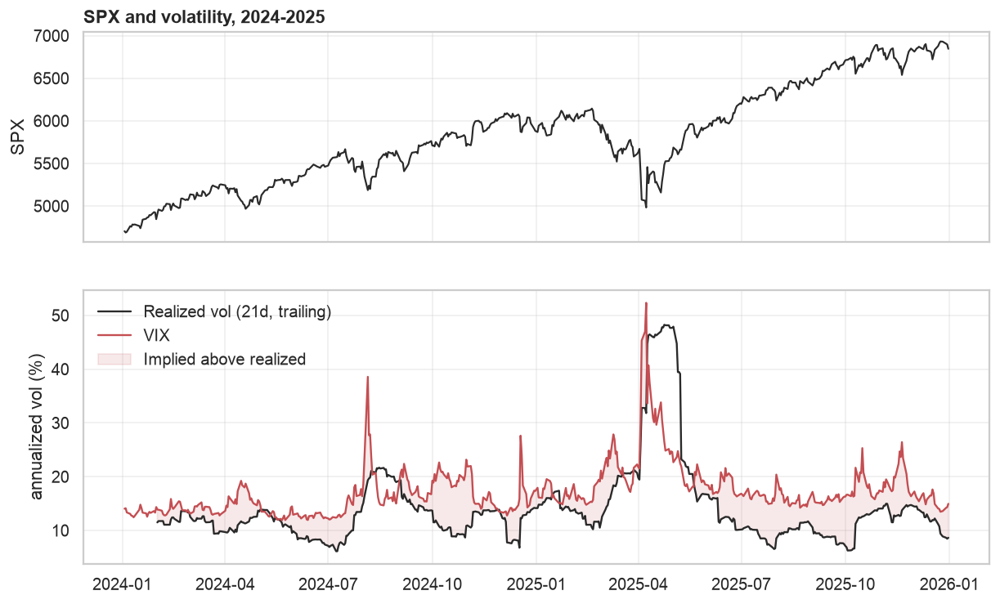
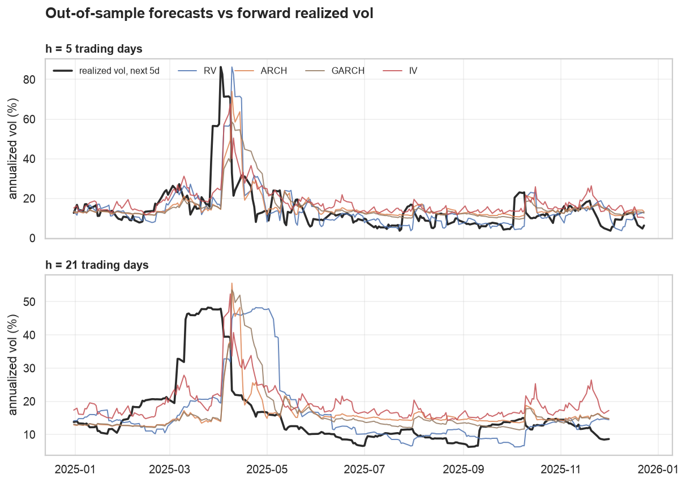
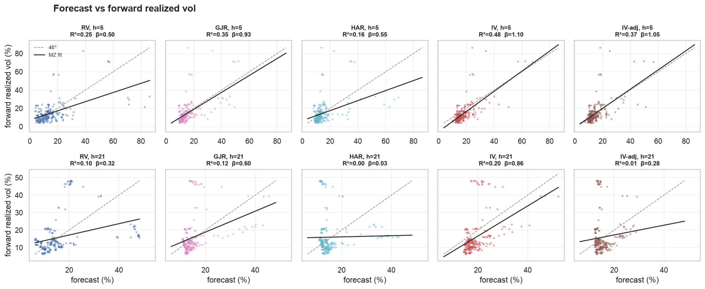
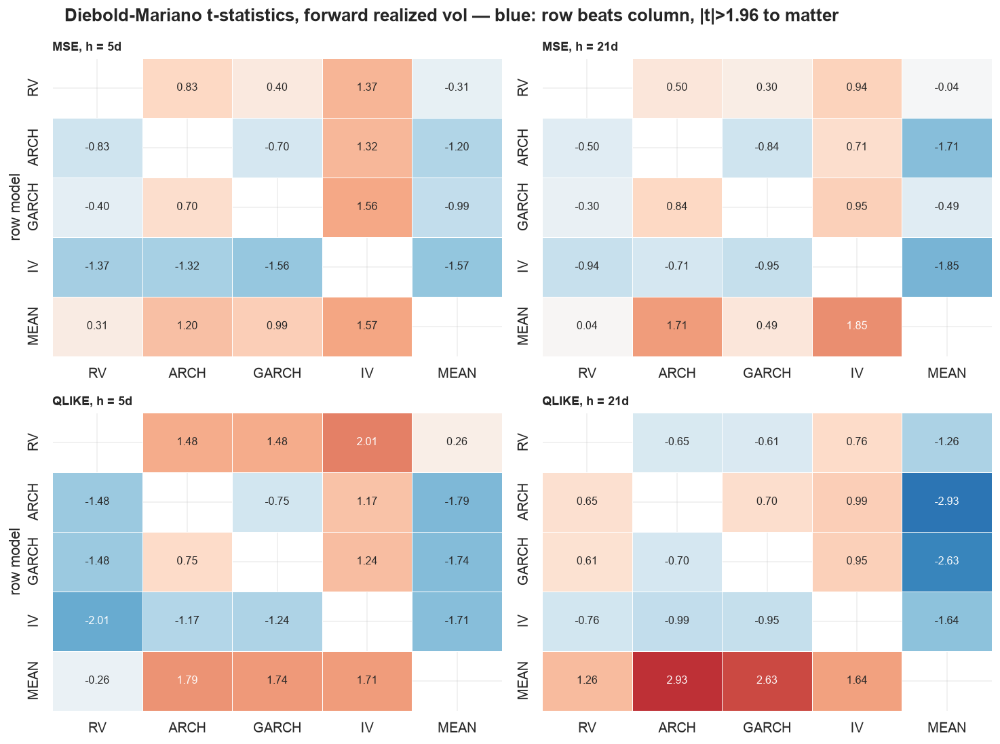
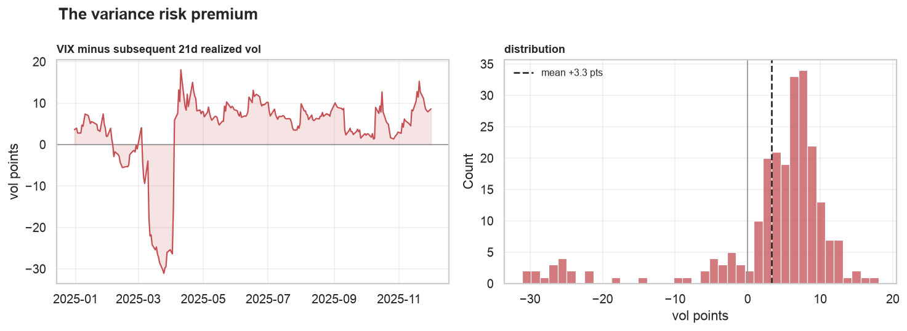
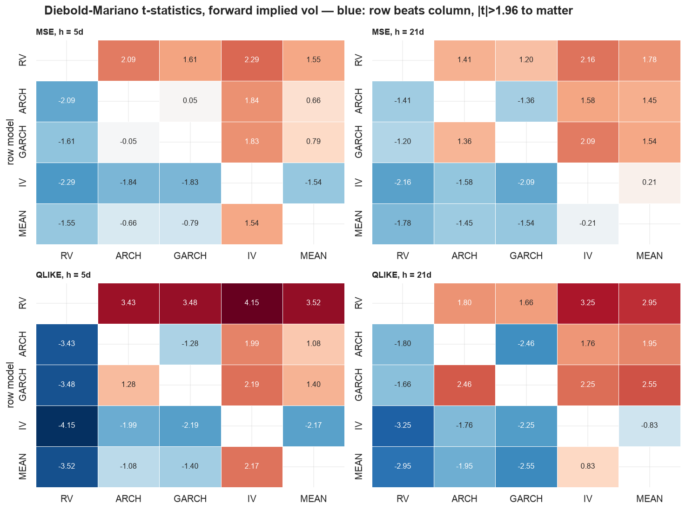
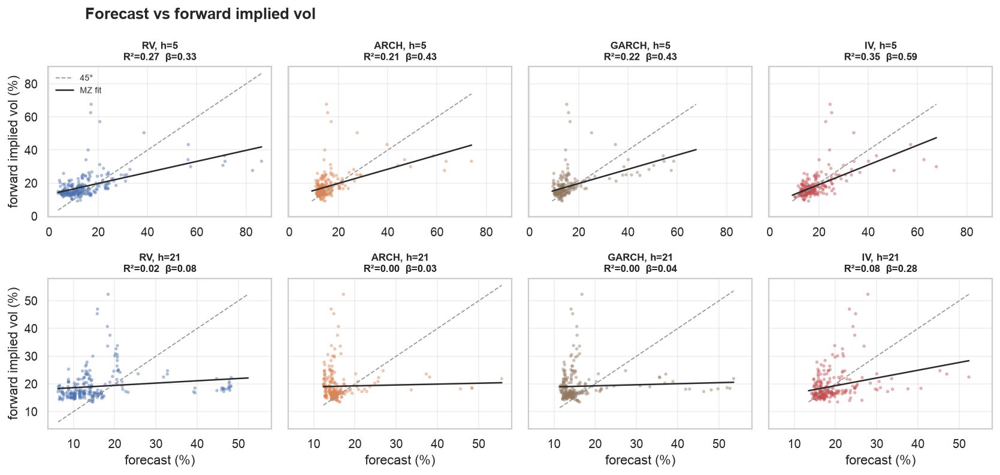
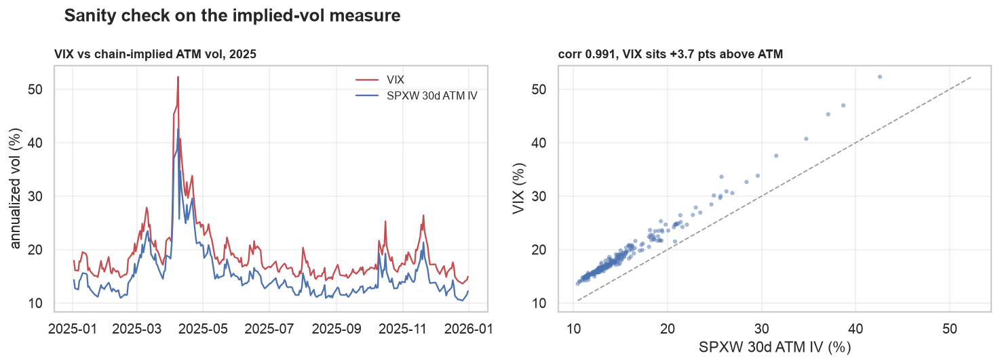

# Forecasting volatility: RV, ARCH, GARCH and IV

**Question.** Given information through today, how well do trailing realized
volatility, an ARCH model, a GARCH model, and the option market's implied
volatility forecast (a) realized volatility over the next week and month, and
(b) implied volatility a week and a month from now?

**Sample.** SPX daily closes, 2024-01-03 to 2025-12-31 (501 trading days), with
VIX9D and VIX as the implied-vol measures for the 5- and 21-day horizons.
ARCH and GARCH are estimated on an expanding window with a 250-day burn-in, so
every forecast scored below is genuinely out-of-sample: 246 origins at h=5, 230
at h=21.

## Answer in three lines

1. **Implied volatility wins everywhere** — every horizon, both targets, every
   accuracy metric — and it is the only forecast that survives an encompassing
   regression against the other three.
2. **It wins on information, not on calibration.** VIX runs ~3.3 vol points
   above subsequent realized vol on 83% of days. Once a regression absorbs that
   premium into the intercept, its slope is statistically indistinguishable
   from 1 at both horizons — though the joint calibration test still rejects it
   at a week, on the intercept rather than the slope.
3. **Forward implied vol is harder to forecast than forward realized vol**, and
   nothing forecasts it well at a month: the best model explains 8% of the
   variation in VIX 21 days ahead, and no model beats a constant there.
4. **Almost nothing survives a pairwise significance test.** Of 80
   Diebold-Mariano comparisons, 19 reject — and on forward *realized* vol only
   three do. The ranking is consistent everywhere; the evidence for any
   individual gap is thin.

The caveat that governs everything else: two years of data containing one
enormous shock. Point estimates are clear, pairwise significance mostly is not.

## The sample



Two years, one regime break. Realized vol sits between 6% and 20% for most of
the sample and then goes to 48% in April 2025. Implied sits above realized
almost everywhere — the shaded wedge — except through that shock.

That single episode carries most of the statistical weight in everything below.

## How the forecasts are judged

Four questions, four tools. They answer different things and are easy to
conflate, so this section states each one before any numbers appear.

### 1. Is the forecast calibrated? — Mincer-Zarnowitz

Regress the outcome on the forecast:

```
target[t+h] = α + β · forecast[t] + ε
```

A calibrated forecast has **α = 0 and β = 1**. The two coefficients name
different faults:

- **β < 1 — the forecast over-reacts.** It moves more than the outcome does, so
  the regression has to shrink it. β > 1 is the mirror: it under-reacts.
- **α ≠ 0 with β ≈ 1 — a pure level bias.** The forecast tracks moves correctly
  and sits a constant distance off. That is the benign failure, because it is
  fixable: subtract the constant.

The right test is the **joint** one (Wald, Newey-West), reported below as
`joint p`. Reading only `t(β=1)` misses a forecast that is correctly scaled and
systematically 5 points high — which is exactly IV's situation at h=5.

**What this section deliberately does not report is the t-statistic on β = 0.**
That null says only "this forecast contains some information", and it is both
too easy to pass and actively misleading as a ranking. On forward realized vol
at h=21 it reads ARCH at t = 3.45 and trailing RV at t = 1.88 — significant for
the model with an MZ R² of 0.028 and *insignificant* for the one with 0.103.
Every other measure in this study puts RV ahead of ARCH on information (corr
0.32 vs 0.17). The β=0 test is picking up ARCH's smoothness, not its knowledge.
Its R² has the opposite problem: the MEAN benchmark below scores
an MZ R² of 0.21 at h=21 — higher than IV's 0.198 — while being the worst
forecast on every loss, because the regression is free to refit α and β and a
drifting constant happens to correlate (negatively) with the outcome. MZ
diagnoses calibration. It does not rank.

### 2. How wrong is it? — the loss function

Two per-period losses, reported for every model:

- **Squared error**, summarized as RMSE in vol points. Symmetric in levels: a
  5-point miss at VIX 15 costs the same as at VIX 60, so the handful of
  highest-vol days dominate it.
- **QLIKE**, `σ²/σ̂² − log(σ²/σ̂²) − 1` on variances. Scale-free — it sees the
  *ratio* of realized to forecast variance — and asymmetric: under-forecasting
  is punished much harder than over-forecasting. For volatility that is usually
  the right shape, since predicting 12 when it prints 40 is a real loss while
  the reverse mostly costs carry.

Both are **robust** in Patton's (2011) sense, and that is why these two and not
others. The target here is realized vol, a noisy proxy for the latent variance;
under a non-robust loss the ranking on the proxy differs from the ranking on
the truth. MAE and correlation are not robust and appear below as description
only — never as the basis for a ranking.

Reporting both matters because they disagree, and the disagreement is
informative: where MSE and QLIKE rank differently, MSE is being driven by April
2025 and QLIKE is describing the other 490 days.

### 3. Is A actually better than B? — Diebold-Mariano

Comparing two RMSEs by eye is not a test. DM builds the per-period loss
differential and tests whether its mean is zero:

```
d[t] = L(A, target) − L(B, target)      H0: E[d] = 0
```

which is a Newey-West t-test on the mean of `d` — an OLS regression of `d` on a
constant, HAC with `h` lags. A **negative** t-statistic means A loses less, and
|t| > 1.96 is the 5% bar.

The point of differencing is that both forecasts see the same shocks. The
common component cancels, and what remains is the part of the accuracy gap that
is not simply both models reacting to the same April. Plain DM assumes the two
forecasts are non-nested, which holds for every pair here; a model nested in its
rival would need Clark-West instead, since DM is undersized in that case.

Every pair is tested under both losses, including against a benchmark:

- **MEAN** — the expanding-window mean of the relevant series, using
  information through `t` and nothing about today. A pure level guess. A
  forecast that cannot beat MEAN is not a forecast, and this benchmark is
  carried through the loss and DM tables (not the figures) for exactly that
  test.

### 4. Who knows something the others do not? — encompassing

All four forecasts on the right-hand side of one regression against the target.
A forecast whose coefficient survives carries information the others lack.
Unlike MZ this is a genuine comparison, and unlike DM it asks about information
rather than accuracy — two forecasts can be equally accurate while one
encompasses the other.

### Inference throughout

Horizons overlap: consecutive `t+1..t+h` windows share `h−1` days. Every
regression and every test above therefore uses Newey-West standard errors with
`h` lags. Point estimates are unaffected; without the correction the
t-statistics run roughly `sqrt(h)` times too large.

## Forecasting forward realized volatility



Losses first, calibration second. MEAN is the level-guess benchmark.

| h=5 | RMSE (pts) | QLIKE | MAE | bias | corr | MZ α (t) | MZ β (t vs 1) | joint p | MZ R² |
|---|---|---|---|---|---|---|---|---|---|
| RV | 11.89 | 1.123 | 6.74 | +0.12 | 0.50 | +7.1 (4.0) | 0.50 (-3.1) | 0.000 | 0.250 |
| ARCH | 11.10 | 0.672 | 6.68 | +1.18 | 0.44 | +4.3 (1.5) | 0.65 (-1.6) | **0.261** | 0.198 |
| GARCH | 11.42 | 0.691 | 6.89 | +1.34 | 0.42 | +5.1 (2.1) | 0.60 (-2.1) | 0.090 | 0.173 |
| **IV** | **9.34** | **0.468** | **6.57** | +3.64 | **0.69** | -5.5 (-2.0) | **1.10 (0.5)** | 0.000 | **0.482** |
| MEAN | 12.47 | 1.018 | 8.20 | +2.11 | -0.03 | +16.4 (2.5) | -0.12 (-3.1) | 0.002 | 0.001 |

| h=21 | RMSE (pts) | QLIKE | MAE | bias | corr | MZ α (t) | MZ β (t vs 1) | joint p | MZ R² |
|---|---|---|---|---|---|---|---|---|---|
| RV | 12.16 | 0.607 | 7.93 | +0.31 | 0.32 | +10.7 (3.9) | 0.32 (-3.9) | 0.000 | 0.103 |
| ARCH | 11.02 | 0.796 | 7.07 | +0.05 | 0.17 | +10.9 (2.9) | 0.31 (-7.5) | 0.000 | 0.028 |
| GARCH | 11.64 | 0.772 | 7.45 | +0.23 | 0.20 | +11.5 (3.2) | 0.27 (-8.4) | 0.000 | 0.038 |
| **IV** | **9.98** | **0.500** | 7.92 | +3.31 | **0.45** | **-0.6 (-0.2)** | **0.86 (-0.7)** | **0.355** | 0.198 |
| MEAN | 12.26 | 0.981 | 9.38 | +2.02 | -0.46 | +45.6 (2.8) | -1.65 (-3.3) | 0.000 | 0.210 |



Reading these together:

- **IV is the only well-scaled forecast.** Its Mincer-Zarnowitz slope is 1.10
  at a week and 0.86 at a month, and neither is distinguishable from 1
  (t = 0.5 and -0.7). RV, ARCH and GARCH all come in at slopes of 0.27-0.65,
  rejected against 1 at every horizon — they respond far too little to the
  information they do have.
- **But calibration is a joint question, and IV fails it at a week.** The joint
  test rejects (p < 0.001) on the *intercept*: α = -5.5 points with t = -2.0,
  paired with β = 1.10. Reading `t(β=1) = 0.5` alone would have called that
  forecast calibrated. At a month IV passes cleanly (p = 0.355) and is the only
  model that does — ARCH at h=5 is the sole other non-rejection, and it gets
  there by being vague rather than by being right.
- **ARCH and GARCH beat trailing RV on RMSE while explaining less.** That is
  not a contradiction: they are smoother, and shrinking a forecast toward the
  mean lowers squared error in a sample with one huge outlier. Their
  correlation with the outcome at h=21 (0.17, 0.20) is *below* trailing RV's
  (0.32). RMSE rewards their caution; the MZ R² shows they know less.
- **The two losses disagree, and the disagreement is the finding.** At h=5,
  RMSE ranks trailing RV (11.89) ahead of the MEAN benchmark (12.47); QLIKE
  ranks it dead last, *worse* than the constant (1.123 vs 1.018). Trailing RV
  under-forecasts hard at the start of a vol burst, which squared error prices
  cheaply and QLIKE does not. At h=21 the order flips again: RV is second-best
  on QLIKE (0.607) while ARCH and GARCH fall behind (0.796, 0.772). IV is the
  only forecast that wins under both losses at both horizons.
- **MZ R² does not rank.** MEAN scores 0.210 at h=21, above IV's 0.198, while
  losing on both losses and every DM test. It gets there by drifting upward
  through 2025 and correlating *negatively* (-0.46) with the outcome, which the
  regression is free to fix with β = -1.65. Fitted R² measures what a
  regression could do with the forecast, not what the forecast does.
- **Everything decays with horizon.** Every model's R² roughly halves going
  from a week to a month. Volatility is forecastable a few days out and mostly
  a level guess a month out.

### Is IV's edge significant? — Diebold-Mariano



Every pair, both losses, Newey-West at `h` lags. Blue means the row model loses
less. The IV row against each rival, on forward realized vol:

| loss | horizon | IV vs RV | IV vs ARCH | IV vs GARCH | IV vs MEAN |
|---|---|---|---|---|---|
| MSE | 5 | -1.37 | -1.32 | -1.56 | -1.57 |
| MSE | 21 | -0.94 | -0.71 | -0.95 | -1.85 |
| QLIKE | 5 | **-2.01** | -1.17 | -1.24 | -1.71 |
| QLIKE | 21 | -0.76 | -0.99 | -0.95 | -1.64 |

Every t-statistic is negative — IV loses less in all sixteen pairings — and
exactly one clears the 5% bar: **IV beats trailing RV at a week under QLIKE
(t = -2.01), which squared error could not detect (t = -1.37)**. That is the
asymmetry doing work. The two forecasts differ mostly in what they do at the
onset of a vol burst, where RV under-forecasts; QLIKE prices that miss heavily
and MSE spreads it across the sample.

Nothing else on forward realized vol is significant, including IV against the
constant. **The honest claim is that IV is never worse and is directionally
better everywhere, not that it is significantly more accurate pairwise.** With
230 overlapping observations and one dominant shock, a 1-2 point RMSE gap is
not resolvable.

### Does anything beat a level guess?

The MEAN column above is the sharpest version of the question, and the answer
is uncomfortable:

| target | horizon | loss | best model vs MEAN | t |
|---|---|---|---|---|
| forward realized | 5 | QLIKE | IV | -1.71 |
| forward realized | 21 | QLIKE | ARCH | **-2.93** |
| forward realized | 21 | QLIKE | GARCH | **-2.63** |
| forward realized | 21 | QLIKE | IV | -1.64 |
| forward implied | 5 | QLIKE | IV | **-2.17** |
| forward implied | 21 | either | IV | -0.83 / +0.21 |

At a week, no model beats a constant on forward realized vol at 5%. At a month
two do — and they are ARCH and GARCH, not IV, even though IV has the lower
QLIKE (0.500 against 0.796 and 0.772). That is not a contradiction either: IV's
advantage is larger but far more concentrated in a few episodes, so its loss
differential has a fatter standard error. Point estimate and significance are
answering different questions, and here they point at different models.

Read together with the encompassing result below, the fair summary is that IV
carries the information and the sample is too short to certify the accuracy gap.

The encompassing regression is where the result becomes sharp. Running all four
forecasts against forward realized vol together:

| horizon | const | RV | ARCH | GARCH | IV | R² |
|---|---|---|---|---|---|---|
| 5 | -0.01 (-0.5) | 0.54 (1.8) | -0.75 (-1.7) | -0.49 (-1.9) | **1.49 (5.9)** | 0.55 |
| 21 | -0.01 (-0.6) | 0.38 (0.8) | 0.01 (0.0) | -0.93 (-1.3) | **1.34 (4.2)** | 0.30 |

IV is the only term that survives with a large positive coefficient and a
t-statistic above 4. Whatever RV, ARCH and GARCH know about tomorrow's
volatility, the option market has already priced it.

### The premium that makes IV biased



| horizon | mean | median | share positive | worst |
|---|---|---|---|---|
| 5 | +3.64 pts | +4.91 | 80% | -62.0 |
| 21 | +3.31 pts | +6.01 | 83% | -31.1 |

IV's one clear weakness is a systematic +3.3 point bias: it is the *price* of
volatility, not a forecast of it, and it carries a risk premium. The
distribution is the classic short-vol payoff — positive four days in five,
occasionally catastrophic. April 2025 alone produced -31 points at a month and
-62 at a week.

Note what this does to the metrics: IV's MAE at h=21 (7.92) is no better than
trailing RV's (7.93) precisely because of that constant overstatement, while
its RMSE and R² are much better. Subtracting the mean premium would make IV
both unbiased and the most accurate forecast on every metric — but only in
sample, and this sample is too short to estimate the premium honestly.

## Forecasting forward implied volatility

| h=5 | RMSE (pts) | QLIKE | MAE | bias | corr | MZ α (t) | MZ β (t vs 1) | joint p | MZ R² |
|---|---|---|---|---|---|---|---|---|---|
| RV | 10.78 | 1.411 | 7.11 | -3.43 | 0.52 | +13.2 (15.3) | 0.33 (-11.4) | 0.000 | 0.272 |
| ARCH | 8.52 | 0.378 | 4.75 | -2.38 | 0.46 | +11.3 (9.0) | 0.43 (-7.9) | 0.000 | 0.212 |
| GARCH | 8.49 | 0.407 | 4.84 | -2.21 | 0.47 | +11.2 (10.3) | 0.43 (-9.9) | 0.000 | 0.222 |
| **IV** | **6.84** | **0.147** | **3.78** | **+0.09** | **0.59** | +7.3 (4.5) | 0.59 (-3.8) | 0.000 | **0.347** |
| MEAN | 7.94 | 0.314 | 5.52 | +0.99 | 0.00 | +17.9 (2.7) | 0.01 (-3.0) | 0.005 | 0.000 |

| h=21 | RMSE (pts) | QLIKE | MAE | bias | corr | MZ α (t) | MZ β (t vs 1) | joint p | MZ R² |
|---|---|---|---|---|---|---|---|---|---|
| RV | 11.33 | 0.874 | 8.35 | -2.88 | 0.16 | +17.8 (12.4) | 0.08 (-14.1) | 0.000 | 0.025 |
| ARCH | 8.31 | 0.407 | 5.14 | -3.13 | 0.03 | +18.6 (10.3) | 0.03 (-23.2) | 0.000 | 0.001 |
| GARCH | 9.52 | 0.474 | 6.28 | -2.95 | 0.05 | +18.5 (10.4) | 0.04 (-23.1) | 0.000 | 0.003 |
| IV | 6.56 | **0.143** | 4.28 | **+0.12** | **0.28** | +13.8 (4.6) | 0.28 (-4.0) | 0.000 | **0.076** |
| **MEAN** | **6.27** | 0.199 | **4.61** | +0.43 | -0.36 | +42.5 (3.6) | -1.19 (-3.9) | 0.000 | 0.127 |





**At a month, the constant wins on RMSE.** MEAN's 6.27 points beats IV's 6.56,
and DM cannot separate them under either loss (t = +0.21 on MSE, -0.83 on
QLIKE). Nothing else comes close to either. The strongest defensible statement
about forecasting VIX 21 days out is that today's VIX and the historical
average are indistinguishable, and everything built from returns is worse than
both — RV loses to IV at t = 3.25 and to MEAN at t = 2.95 under QLIKE.

At a week IV does separate from the benchmark (QLIKE t = -2.17), and it is the
only model that does. Today's VIX is the best predictor of VIX in a week, which
is largely to say VIX is persistent — but even at h=21 it explains just 8% of
the variation, with a slope of 0.28 rather than 1. That slope is the mean reversion: a VIX of 30
today implies roughly `0.14 + 0.28 × 0.30 ≈ 22%` in a month, not 30%.

The striking column is ARCH and GARCH at h=21: correlation 0.03 and 0.05, R²
of essentially zero. **Return-based volatility models carry no information
about where the option market will be priced a month out.** They chase the
realized path; implied vol moves on a mix of realized vol, positioning and
demand for protection that GARCH never sees. Their negative bias (-3 points) is
the mirror image of IV's positive one — the same risk premium, viewed from the
other side.

## Is VIX a fair stand-in for implied vol?

VIX is used above because it is free and spans the whole sample. The option
chains only cover 2025, but they cover it well enough to check:



A 30-day ATM implied vol rebuilt from SPXW mids — forward implied from put-call
parity, Black-76 inverted at the strike nearest the forward, interpolated in
total variance to exactly 30 days — tracks VIX at a correlation of **0.991**
across 247 days of 2025, sitting a steady **3.7 points below** it.

That gap is expected and is not an error: VIX integrates the whole OTM strip,
so the put skew lifts it above the ATM vol. For a study about forecast
*information*, a 0.991 correlation means the choice of measure changes nothing
here. It would matter for anything trading the level.

## What this does and does not establish

Established, in this sample:

- IV dominates the return-based models on both losses at both horizons, and
  encompasses them for forward realized vol.
- IV is well-scaled but biased high by ~3.3 vol points; the return-based models
  are roughly unbiased for realized vol but badly under-scaled. IV is the only
  model that passes a joint calibration test anywhere (h=21, p = 0.355).
- IV beats trailing RV at a week on forward realized vol under QLIKE
  (t = -2.01) — the one significant accuracy result among the four forecasts.
- Nothing forecasts forward implied vol at a month; ARCH and GARCH have
  literally zero explanatory power there, and no model beats a constant.

Not established:

- **Pairwise significance** of IV's accuracy edge on forward realized vol
  against ARCH and GARCH, or against a constant. Two years is not enough: 61 of
  80 DM tests fail to reject.
- **That IV's month-ahead edge is real at all.** It has the lowest QLIKE at
  h=21 but cannot beat the level guess (t = -1.64) where ARCH and GARCH can.
  Its advantage is concentrated in a few episodes.
- **Generality across regimes.** The sample contains one shock, and it drives
  most of the dispersion. Rerunning across 2015-2025 would be the obvious next
  step and needs a paid ThetaData tier (or another vendor) for the history.
- **Anything about the equity cross-section.** SPX only. The single-name chains
  in `data_store/options_2025/` would support the same test on 500 names, where
  the IV measure has to be built from chains rather than a published index.

One methodological note for anything built on this. The scoring here is
deliberately layered — calibration (MZ joint), accuracy (two robust losses),
pairwise significance (DM), and information (encompassing) — because each
answers a question the others cannot, and the layers disagree in this sample
more than once. A single number, and in particular a single t-statistic on
β = 0 from a forecast-vs-outcome regression, would have produced a confident
and wrong summary — it ranks ARCH above trailing RV at h=21, which no other
measure here supports.

Two extensions worth more than more data: an HAR model, which usually beats
GARCH at these horizons by mixing daily/weekly/monthly RV, and a premium-
adjusted IV forecast estimated on a rolling basis, which would test whether the
+3.3 point bias is stable enough to remove out of sample.
