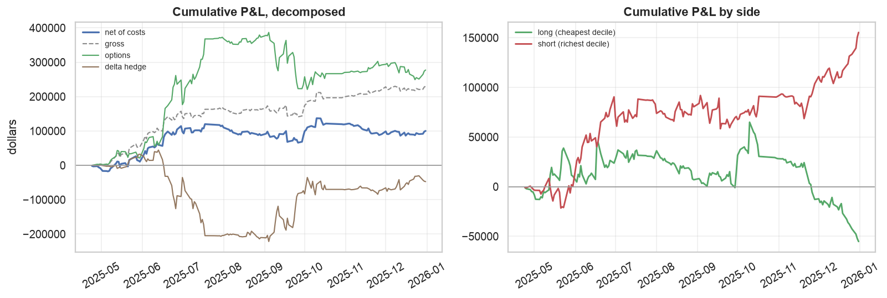
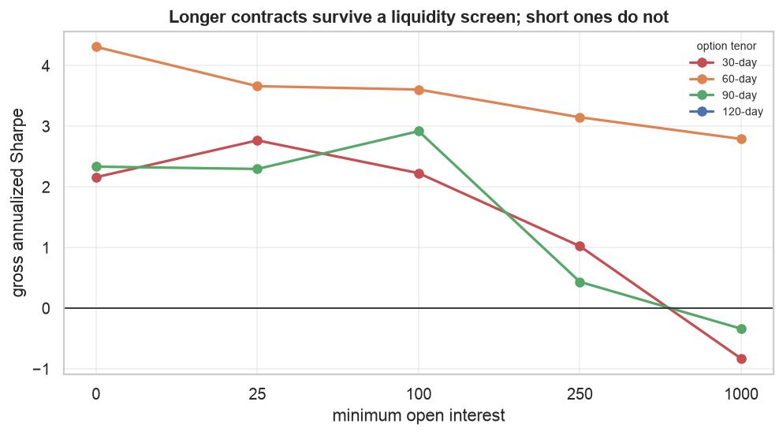
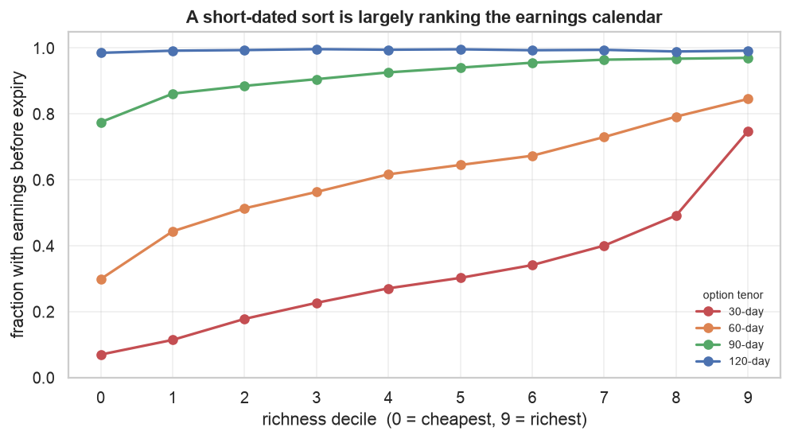
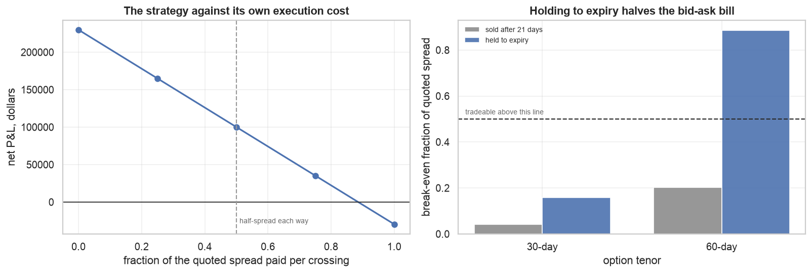

# Trading the cross-section of the variance risk premium

Buy the S&P 500 names whose options are cheap relative to their own recent
history, sell the ones that are expensive, and hold each position until it
expires.

| | |
|---|---|
| **Gross** | $1,402/day, Sharpe **3.15**, t = 2.91, $229,851 over 2025 |
| **Net of half the quoted spread** | $611/day, Sharpe **1.35**, t = 1.12, $100,117 |
| **Break-even spread** | **0.886** — it can pay 89% of the quoted bid-ask on every crossing and still make money |
| **Sample** | 66 formation dates, 164 P&L days, calendar 2025 |

**Read the last row of that table with §7 in mind.** 66 formation dates at a
~60-day hold is on the order of one independent observation, and this
configuration is the survivor of a long search. The mechanics below are sound
and would hold in any sample; the performance numbers are a hypothesis.

---

## 1. The idea

Options are insurance, and insurance is sold at a markup. Implied volatility —
the volatility number that makes an option's price come out right — is
persistently higher than the volatility that actually gets realized over the
option's life. The gap is the **variance risk premium**, and it is the
compensation option sellers earn for absorbing somebody else's variance risk.
`research/single_name_vol/` measures it as positive in 86-97% of S&P 500 names.

Two ways to harvest it. You can sell volatility outright and collect the
premium, which works until it does not — that is a short-carry position with a
tail. Or you can trade the *dispersion* in the premium: at any moment some
names charge more of a markup than others, and if that gap mean-reverts you can
buy the cheap and sell the rich without taking a view on volatility overall.

This study does the second. It is a relative-value trade, deliberately
constructed to have no exposure to the level of volatility, so that it profits
when the cross-section converges rather than when volatility falls.

**The signal is each name's implied vol measured against its own recent
history**, a 60-session z-score. Not the level: a utility stock always has
lower implied vol than a biotech, and sorting on the level just buys utilities
and sells biotech. Not the textbook `IV − E[RV]` either — see §3. The z-score
asks a narrower and more answerable question: *is this name charging more than
it usually charges?*

## 2. How the backtest works

Everything mechanical is in `tools/backtest/`; this section is what it does and
why.

**The instrument is a delta-hedged ATM straddle.** A straddle — one call and
one put at the same strike — is the cleanest available exposure to volatility:
it has large vega and, at the money, roughly zero delta. Roughly is not enough,
so the position is re-hedged daily against the underlying at the close. Without
that hedge the P&L would be dominated by whether the stock happened to move up
or down, and the decile spread would be measuring direction rather than
volatility.

**Contract selection is point-in-time.** Each day the engine sees only that
day's chain and picks the listed expiration nearest 60 days (tolerance ±12,
because listings thin to monthlies), then the strike nearest the money
(tolerance 5%). Where the chain cannot serve that, the name simply drops out
of the universe for the day — the honest treatment, since you could not have
put the trade on.

**Sizing is a dollar vega budget.** Each side of the book carries $10,000 of
vega — dollars gained per volatility point — split equally across the names in
its decile. This is what makes it a volatility trade rather than a notional
one: equal *dollar* weighting would put wildly different volatility exposure on
a $15 stock and a $600 stock. Because both sides hold the same number of names
at the same per-name vega, the book is vega-neutral by construction, and every
figure reported is in dollars.

**Positions are formed daily and held to expiry**, so about 15 overlapping
cohorts are live at once. The reported series divides by that count, so it
represents one book run at the target vega rather than fifteen stacked.

**Costs are charged against the quoted spread on the actual day**, entry only —
a position held to expiry settles at intrinsic and is never sold, so it crosses
the spread once. The headline charges half the quoted spread, the ordinary
assumption that you meet the mid going in.

**Inference uses Newey-West with lags equal to the realized hold** (15 trading
days here). Overlapping positions make today's P&L share most of its holdings
with yesterday's; without the correction t-statistics run roughly √h too large.
Driscoll-Kraay is *not* used, unlike `research/single_name_vol/` — that study
scored a pooled panel where 500 names share a market factor every day, while
this one collapses the cross-section into a single daily series before testing
anything, leaving only serial correlation to correct.

## 3. The signal: why a z-score

Four sorts, identical machinery, gross so the comparison is about ranking
rather than execution:

| signal | Sharpe | total P&L |
|---|---|---|
| **IV z-score, 60 sessions** | **3.15** | $229,851 |
| VRP, IV − trailing RV | 0.52 | $36,041 |
| VRP, IV − GARCH forecast | −0.19 | −$11,802 |
| IV level (control) | −1.35 | −$200,705 |

**The control is the important row.** `iv_level` sorts on raw implied vol —
long the lowest-vol names, short the highest. It loses $200k. So the strategy
is not a disguised low-volatility tilt; if anything the naive version of that
trade was a disaster in 2025, because high-vol names went on to realize even
more. Normalising each name against its own history is doing the work, not the
volatility level.

**The textbook definition ranks worse than nothing.** `IV − E[RV]` is the
canonical variance risk premium, and with a GARCH forecast it returns −0.19.
The reason is visible in the sort: across deciles a GARCH forecast spans about
36 volatility points where implied vol spans 13, so the ranking is driven by
where the *model* is extrapolating hardest rather than by where the option is
expensive. `research/single_name_vol/` had already measured GARCH's
Mincer-Zarnowitz slope at 0.23-0.45 on these names; this is what building a
strategy on a miscalibrated forecast looks like.

### Does the sort actually grade?

Every decile held long, gross:

| decile | 0 | 1 | 2 | 3 | 4 | 5 | 6 | 7 | 8 | 9 |
|---|---|---|---|---|---|---|---|---|---|---|
| mean daily P&L | 408 | 823 | 42 | −414 | −228 | −147 | −4 | −852 | −886 | −771 |

The three cheapest deciles average **+$424**, the three richest **−$836**. The
levels are mostly negative and that is expected: every decile here is held
*long*, and buying volatility loses money on average — that is the premium.
What matters is the slope.

It grades, but loosely. The two halves separate cleanly while the middle is
noisy (decile 3 sits below decile 6), and no individual decile is close to
significant. That is what ~66 formation dates buys. A strictly monotone sort
would be stronger evidence than this; two separated halves is weaker evidence
than a clean gradient but much stronger than profit confined to the extremes.

## 4. Tenor: why 60 days

The signal is a "60-day implied vol z-score" because the contract is 60 days,
not the other way round. Sweeping the tenor moves the result more than any
other choice, and it is the one this study originally got wrong by inheriting
30 days from the signal definition.

Gross Sharpe by tenor and liquidity floor:

| tenor | oi≥0 | oi≥25 | oi≥100 | oi≥250 | oi≥1000 |
|---|---|---|---|---|---|
| 30d | 2.16 | 2.77 | 2.23 | 1.02 | **−0.83** |
| **60d** | 4.31 | 3.66 | 3.61 | **3.15** | **2.79** |
| 90d | 2.33 | 2.30 | 2.92 | 0.44 | −0.34 |

**60 days dominates, and it is the only tenor that survives a liquidity
screen.** At 30 days, demanding 1,000 contracts of open interest turns a
positive strategy negative; at 60 days it costs almost nothing. That matters
because open interest buys tight quotes — `cost_efficiency.py` measures the
spread paid per dollar of vega falling 2.5× from the thinnest to the richest
open-interest bucket — so a tenor that tolerates the screen is a tenor that can
be traded.

**The intuition is a balance of two forces.** Longer contracts are cheaper per
unit of exposure: ATM vega grows as √T while quoted spreads are closer to
tick-driven, so a 120-day contract buys the same vega for less than half the
spread of a 30-day one. That pushes toward long tenors. But §5 pushes back:
almost every long-dated contract contains an earnings announcement, and the
strategy wants contracts that avoid one. At 120 days that is 99% of the
universe, so the earnings screen leaves nothing to trade and the grid cannot
even be run. **60 days is where cost efficiency and earnings-avoidance
balance.**

The `oi≥250` floor is chosen in the same spirit: it costs about a fifth of the
gross Sharpe (3.66 → 3.15) and buys materially tighter execution, which §6
shows is the binding constraint.

## 5. Earnings: excluded because it contaminates the ranking

An implied-vol sort will rank the earnings calendar whether you intend it to or
not. Fraction of selected contracts whose life contains an announcement:

| decile | 0 | 2 | 4 | 6 | 8 | 9 |
|---|---|---|---|---|---|---|
| 30-day | 0.07 | 0.18 | 0.27 | 0.34 | 0.49 | **0.75** |
| 60-day | 0.30 | 0.51 | 0.62 | 0.67 | 0.79 | 0.85 |
| 120-day | 0.99 | 0.99 | 0.99 | 0.99 | 0.99 | 0.99 |

**The intuition is mechanical.** Implied volatility prices the variance a
contract expects to cover. An earnings announcement is a scheduled jump, so a
contract spanning one is genuinely worth more — not mispriced, just covering a
different amount of risk. A short-dated sort therefore ranks mostly on "does an
announcement fall before expiry", which is a calendar fact rather than a
premium. At 120 days every contract spans one, so the binary is constant and
cannot influence the ranking at all.

**But the P&L is not the earnings trade.** Partitioning the universe, gross:

| | formation days | Sharpe |
|---|---|---|
| 30d, all names | 76 | 0.94 |
| 30d, no earnings in life | 58 | 1.02 |
| 60d, all names | 161 | 1.45 |
| 60d, **no earnings in life** | 66 | **3.15** |

The signal is *stronger* with those names removed. So earnings is a
**contaminant of the ranking rather than a source of returns**: it decides
which names land in which decile, while the money comes from the names without
an announcement. Excluding them more than doubles gross Sharpe at 60 days.

This also explains §4. The longer tenor does not win by removing an earnings
*profit* channel — it wins by removing an earnings *noise* channel from the
sort. Both tenors harvest the same premium; the short one just has a calendar
artifact sitting on top of its ranking.

## 6. Execution: why hold to expiry

Selling a position crosses the quoted spread a second time. Holding it to
expiration does not — the contract settles at intrinsic value and nobody is
paid a spread for that. On a strategy whose binding constraint is spread, this
is worth more than everything in §3-§5 combined, and it is arithmetic rather
than an empirical hope.

Break-even spread — the fraction of the quoted bid-ask the strategy can pay per
crossing and still reach zero:

| | sold after 21 days | held to expiry |
|---|---|---|
| 30-day contract | 0.042 | 0.158 |
| **60-day contract** | 0.202 | **0.886** |

Two effects compound here. Not selling removes one of two crossings, and
holding 60 days instead of 21 cuts how often the remaining crossing is paid.
Together they take the 60-day strategy from paying about five times more in
spread than it earns to paying about one-ninth of what it could afford.

**The cost is gross performance**, and the trade is explicit: the hold
stretches from 21 days to ~60, and this signal decays, so gross Sharpe falls as
the position ages. On these numbers the trade is worth making by a wide margin.

The full cost curve, from free execution to paying the entire quoted spread on
every crossing:

| spread paid per crossing | 0 | 0.25 | 0.5 | 0.75 | 1.0 |
|---|---|---|---|---|---|
| net Sharpe | 3.15 | 2.24 | **1.35** | 0.46 | −0.38 |

The strategy stays profitable while paying three-quarters of the quoted spread
every time it trades. That is the margin of safety the earlier 30-day
specification never had.

## 7. What this sample cannot establish

Everything above is one calendar year. The limits are severe and they all point
the same way.

- **66 formation dates at a ~60-day hold is on the order of one independent
  observation.** The gross t of 2.91 and the net t of 1.12 are computed with
  Newey-West at 15 lags, which is the right correction and does not manufacture
  information that is not there. The net result is not statistically
  distinguishable from zero.
- **This configuration is the survivor of a long search** — tenors, liquidity
  floors, signals, holding periods, exit rules, earnings screens, cost levels.
  Roughly 145 configurations were evaluated across the work that produced it.
  The cell that looks best in a search that wide is the cell most likely to be
  a selection artifact.
- **The screens that make the strategy affordable are the ones that empty the
  cross-section.** `oi≥250` and the earnings exclusion together cut formation
  dates from 195 to 66. Cheap execution and a deep sample are in direct
  tension here, and one year cannot resolve it.
- **2025 contains one dominant shock.** April is the largest move in the
  window, and a single year gives no way to know whether the result depends
  on it.

The distinction worth holding onto: **the mechanics generalise, the performance
number does not.** That spread cost halves when you hold to expiry is
arithmetic. That vega grows as √T while spreads do not is a property of option
pricing. That a short-dated implied-vol sort ranks the earnings calendar is
visible directly in the data and needs no P&L to believe. Those findings will
hold in any sample. Whether this strategy earns Sharpe 1.35 net will not be
known until it is run on more than one year.

## 8. What would move this forward

1. **More history, and it is now the only thing that matters.** ThetaData's
   STANDARD tier reaches 2016 for options. Re-running §3-§6 on a decade turns
   ~1 independent observation into ~40 and would settle this. Every other item
   here is secondary.
2. **Fills rather than quotes.** Costs are charged against the quoted spread.
   At a break-even of 0.886 the strategy has room, but the actual question is
   what a patient limit order achieves against these quotes, and EOD data
   cannot answer it.
3. **A cheaper hedge.** The delta hedge is a large drag on gross P&L — it is
   doing necessary work, without it the decile spread is a directional bet, but
   it hedges each name's gross delta when the long and short deciles partly
   offset. Hedging net portfolio delta should cost a fraction of it.
4. **Index dispersion as the alternative structure.** `research/volatility/`
   and `research/single_name_vol/` together show the index premium is
   proportionally *larger* than the single-name premium at a month (1.21×
   against 1.14×). Selling index volatility against single-name volatility
   harvests that gap directly, and index options quote at ~2% of mid against
   ~14% for single names — roughly 19× cheaper per dollar of vega. It is the
   structurally cheaper way to trade this premium and it is untested here.
