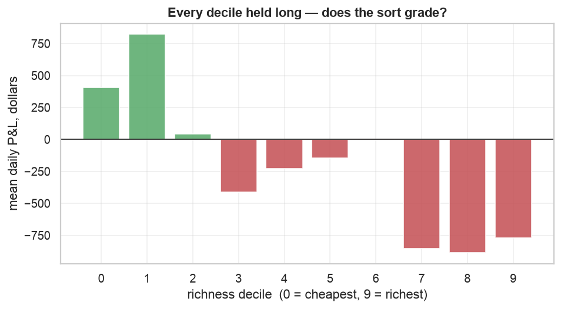
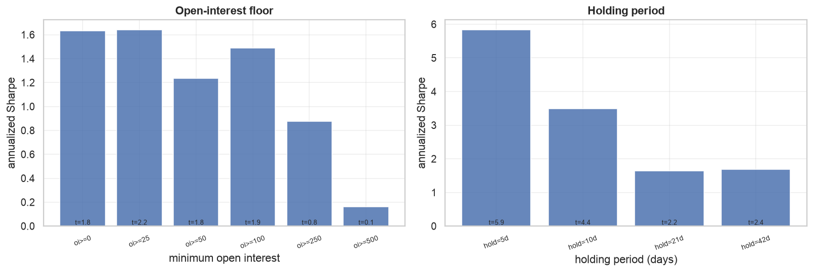
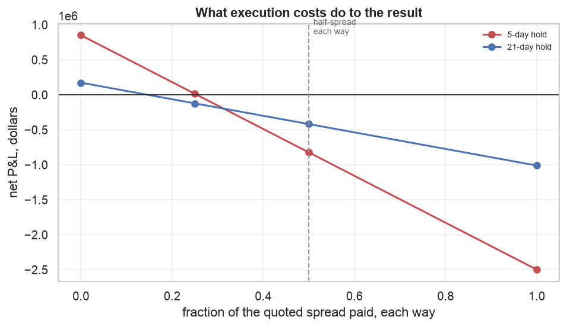
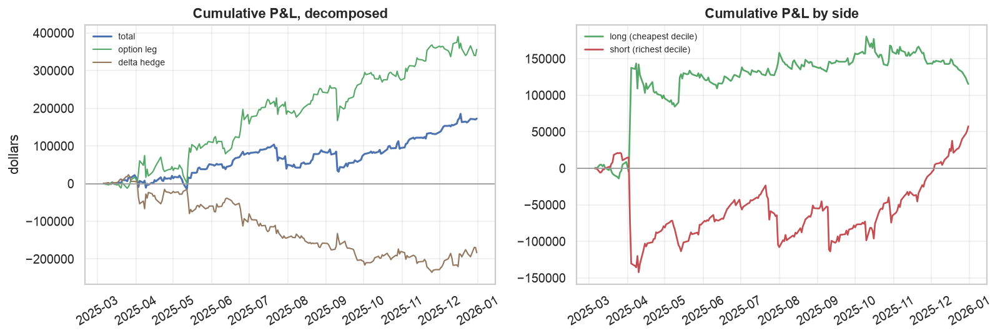

# The VRP cross-section in single-name options

Rank the S&P 500 daily on how rich each name's 30-day ATM straddle is, buy the
cheapest decile against the richest, equal-weight by vega, delta-hedge daily.

**The result: a clean gross signal that cannot pay its own bid-ask spread.**
At a 5-day hold the strategy makes $850k gross on a $20k vega book over 2025,
with a Newey-West t of 5.9. It can afford to cross **25.4%** of the quoted
spread each way. The ordinary assumption is 50%. At that level it loses
$824k, and the gross Sharpe of 5.87 becomes −4.77.

Everything else here is either evidence that the gross signal is real, or
evidence about why it is untradeable.

---

## 1. The sort works, and it is not a volatility-level tilt

Held long, all ten deciles split cleanly on sign: the five cheapest are
positive, the five richest negative.

| decile | 0 | 1 | 2 | 3 | 4 | 5 | 6 | 7 | 8 | 9 |
|---|---|---|---|---|---|---|---|---|---|---|
| mean daily P&L | 889 | 945 | 291 | 652 | −20 | −118 | −134 | −115 | −196 | −161 |

No individual decile clears significance (every t below 1.1), which is what
~200 overlapping days buys. But the sign structure is monotone across the sort
rather than concentrated in two tails, and that is the pattern a real
cross-sectional signal makes.

The control settles what is doing the work. Sorting on **raw implied vol**
returns a Sharpe of **−0.75**: long low-IV and short high-IV lost money in
2025, because high-vol names went on to realize even more. The z-score sort
does the opposite of that trade and makes money. So the normalization — each
name against its *own* history — is the signal, not the volatility level.

## 2. The forecast-based definition is the weakest version

The study began with the textbook definition, `IV − E[RV]` with a GARCH
forecast. It is the worst real signal in the race.

| signal | formation days | Sharpe | t (NW) |
|---|---|---|---|
| IV z-score, 20-day | 188 | 3.90 | 5.17 |
| IV z-score, 60-day | 161 | 1.65 | 2.23 |
| VRP, trailing RV | 192 | 1.03 | 1.30 |
| VRP, GARCH | 192 | 0.83 | 1.17 |
| IV level (control) | 197 | −0.75 | −1.02 |

The reason is visible in the sort itself. Across deciles the GARCH forecast
spans about 36 vol points while implied vol spans 13, so `IV − E[RV]` ranks
mostly on where the model is extrapolating hardest — a 66% annualized forecast
against a 38% market IV, the April 2025 shock echoing through the conditional
variance. `research/single_name_vol/` had already measured GARCH's
Mincer-Zarnowitz slope at 0.23–0.45 on these names. This is what building a
strategy on that miscalibration looks like: the premium you think you are
sorting on is mostly your own forecast error.

## 3. The gross edge weakens as the liquidity screen tightens

Sharpe falls monotonically as the open-interest floor rises.

| OI floor | formation days | names/side | Sharpe | t (NW) |
|---|---|---|---|---|
| 0 | 211 | 33.5 | 1.63 | 1.82 |
| 25 | 161 | 18.8 | 1.65 | 2.23 |
| 50 | 110 | 20.2 | 1.24 | 1.80 |
| 100 | 97 | 17.4 | 1.49 | 1.89 |
| 250 | 76 | 12.9 | 0.88 | 0.81 |
| 500 | 49 | 11.3 | 0.16 | 0.15 |

Read `formation_days` alongside Sharpe, because the floor does not simply
tighten a screen — it deletes days. The median selected straddle carries 19
contracts of open interest on its thinner leg; at a floor of 500 the median day
offers 15 eligible names, one or two per decile, and the minimum-names rule
then drops three-quarters of the calendar. **A decile sort on single-name
options is not compatible with a serious liquidity screen**; the cross-section
is not deep enough. That is a design finding, not a tuning result.

Note carefully what this does **not** establish. Every number in the table is
gross. Open interest also buys tighter quotes, so the same screen that costs
gross Sharpe pays some of it back in execution, and the two effects were never
measured against each other — the cost grid in §4 was run at a single OI floor.
Cost per dollar of vega falls 2.5x from the thinnest bucket to the richest
(§7), which is a large enough offset to flip the sign of the conclusion. **The
net-optimal open-interest floor is unknown and is probably much higher than the
gross-optimal one.** An earlier draft of this report claimed the edge "lives
exactly where it cannot be traded"; that claim is not supported by anything
measured here.

## 4. Costs

Charged as a fraction of the quoted spread on the actual entry and exit days,
so a position closing into a stressed tape pays the wider quote it really faced.

| | gross P&L | break-even spread | net at 0.25× | net at 0.5× |
|---|---|---|---|---|
| 5-day hold | $850,507 | **0.254** | +$13,467 | −$823,573 |
| 21-day hold | $172,781 | **0.146** | −$123,095 | −$418,970 |

Break-even is the fraction of the quoted spread the gross P&L can pay each way
and still reach zero. Both are far below 0.5. At an optimistic quarter-spread
the 5-day hold nets $13k over a year on a $20k vega book — indistinguishable
from zero, t = 0.09.

The 5-day hold is the *more* cost-robust of the two, which is not the obvious
direction: its gross P&L scales up 4.9× while its turnover cost scales only
2.8×. Faster trading is better here, and still not good enough.

## 5. The hedge is a large drag

Gross P&L decomposes into **+$350k from the options and −$180k from the delta
hedge** at the 21-day hold. The hedge is doing its job — without it the book
is a directional bet and the decile spread would not be a volatility statement
— but it gives back half the option leg. Any attempt to rescue this strategy
has to address the hedge, not only the spread.

Both sides contribute: the long leg ends +$115k, the short +$57k. The single
largest move in each is early April 2025, and they offset there, so the net
curve rises fairly steadily rather than being one event.

## 6. What this sample cannot establish

- **~200 overlapping days is ~10 independent observations.** Newey-West at
  `holding_days` lags is applied throughout, but no correction manufactures
  information that is not there.
- **The grid searched more configurations than the sample supports** — 6 OI
  floors × 4 holds × 5 signals × 4 cost levels. The best t in the study is 5.9;
  in a search this wide over this little data, that number should be read as a
  ranking device, not as a p-value.
- **One dominant shock.** April 2025 is the largest move in the window, the
  same limitation `research/volatility/` and `research/single_name_vol/` both
  report.
- **Parameter sensitivity is high.** The z-score window alone moves Sharpe from
  1.65 (60-day) to 3.90 (20-day). A result that swings that much on one free
  parameter is not yet a strategy.

## 7. What would actually move this forward

1. **More history.** STANDARD reaches 2016 for options. Everything above is one
   year, and the honest limit on every conclusion here is sample size.
2. **Attack the spread, not the signal.** The gross edge is not in doubt; the
   execution is. The quantity that sets break-even is the quoted spread per
   dollar of vega bought, `(ask - bid) * 100 / vega`, and it varies by almost
   4x across choices this study fixed arbitrarily. Measured over 1.1M ATM
   contract-days:

   | dte | cost per $vega | | open interest | @30d | @90-150d |
   |---|---|---|---|---|---|
   | 15-45 | 4.69 | | <10 | 5.26 | 2.98 |
   | 45-75 | 3.68 | | 50-250 | 3.42 | 2.63 |
   | 75-120 | 2.61 | | 250-1k | 2.77 | 1.87 |
   | 120-180 | **2.54** | | >1k | **2.06** | **1.30** |
   | 180-250 | 2.74 | | | | |

   ATM vega grows as `sqrt(T)` while quoted spreads are closer to tick-driven,
   so cost per unit of vega falls 46% out to ~120 days before liquidity thins
   again past 180. The two levers compound: a 30-day contract in the thinnest
   OI bucket costs 4.7, a 120-day contract with OI above 1,000 costs 1.30.
   Underlying price, by contrast, does nothing (4.3-5.0 flat across buckets),
   so the price filter here is data hygiene rather than a cost lever.

   **Fixing the tenor at 30 days was the most expensive choice in the study**,
   and it was inherited from the signal definition rather than chosen. Holding
   period and option tenor do not have to match: a 90-120 day contract held 21
   days buys the same vega for less than half the spread.

   Naively, break-even 0.254 x (4.4 / 1.87) is about 0.60 — above the 0.5 that
   makes a strategy tradeable. That projection assumes gross P&L per unit of
   vega is unchanged, which is exactly what is in doubt: long-dated implied vol
   is smoother and less dispersed cross-sectionally, so the z-score may carry a
   weaker signal there, and the §3 table already suggests high-OI names are
   less mispriced. Both push against the cost gain. It is an empirical question,
   and a tenor x OI x cost grid is a loop rather than a rewrite.
3. **A liquid-subset study with fewer buckets.** Deciles fail on a thin
   cross-section, but terciles or a fixed top-/bottom-N on the ~100 most liquid
   names would keep the sample intact while trading names that can absorb it.
4. **Earnings conditioning.** Untouched here. A cross-sectional IV sort is known
   to load on earnings timing, and `dal.with_earnings_distance` exists precisely
   to separate the two. Some of the "cheap vs rich" spread is likely a
   pre/post-announcement effect rather than a premium.
