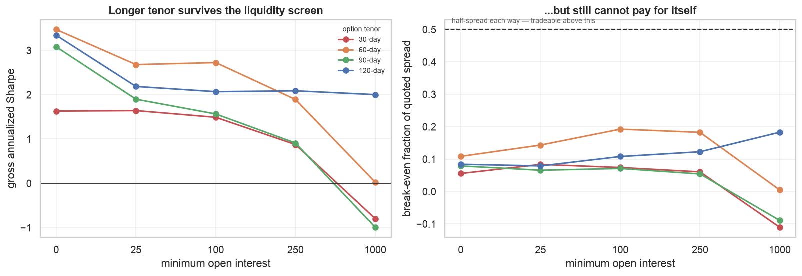
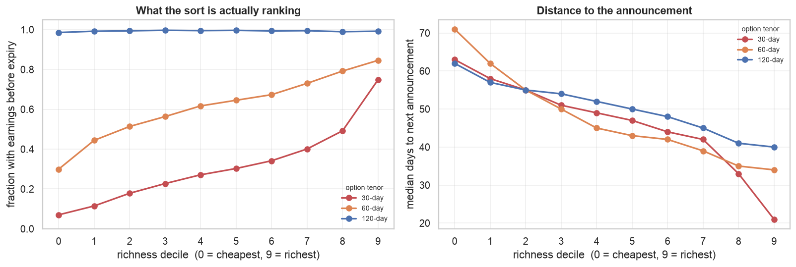

# The VRP cross-section in single-name options

Rank the S&P 500 daily on how rich each name's 30-day ATM straddle is, buy the
cheapest decile against the richest, equal-weight by vega, delta-hedge daily.

**The result: a clean gross signal that spends the whole study trying, and
mostly failing, to pay its own bid-ask spread.**

The strategy as originally specified — a 30-day straddle, held 21 days, sold to
close — makes money gross and loses badly net. It can afford to cross **8.4%**
of the quoted spread each way; the ordinary assumption is 50%.

Four changes, each measured here, take that to **88.6%**: a 60-day tenor rather
than 30, an open-interest floor of 250, excluding names whose contract life
contains an earnings announcement, and holding to expiry rather than selling.
Three configurations end up above the 50% bar and post the study's only
positive net Sharpes.

**That is a hypothesis, not a result.** The best cell rests on 66 formation
dates at a ~60-day hold — on the order of *one* independent observation — and
it is the maximum of roughly 145 configurations searched over a single year.
§9 is the part of this report to read before acting on any of it.

Sections 1-4 are the original specification, §5-§7 the respec.

Everything else here is either evidence that the gross signal is real, or
evidence about why it is untradeable.

---

## 1. The sort works, and it is not a volatility-level tilt

Held long, all ten deciles split cleanly on sign: the five cheapest are
positive, the five richest negative.

| decile | 0 | 1 | 2 | 3 | 4 | 5 | 6 | 7 | 8 | 9 |
|---|---|---|---|---|---|---|---|---|---|---|
| mean daily P&L | 889 | 945 | 291 | 652 | −20 | −118 | −134 | −115 | −196 | −161 |

No individual decile clears significance (every t below 1.1), which is what
~200 overlapping days buys. But the sign structure is monotone across the sort
rather than concentrated in two tails, and that is the pattern a real
cross-sectional signal makes.

The control settles what is doing the work. Sorting on **raw implied vol**
returns a Sharpe of **−0.75**: long low-IV and short high-IV lost money in
2025, because high-vol names went on to realize even more. The z-score sort
does the opposite of that trade and makes money. So the normalization — each
name against its *own* history — is the signal, not the volatility level.

## 2. The forecast-based definition is the weakest version

The study began with the textbook definition, `IV − E[RV]` with a GARCH
forecast. It is the worst real signal in the race.

| signal | formation days | Sharpe | t (NW) |
|---|---|---|---|
| IV z-score, 20-day | 188 | 3.90 | 5.17 |
| IV z-score, 60-day | 161 | 1.65 | 2.23 |
| VRP, trailing RV | 192 | 1.03 | 1.30 |
| VRP, GARCH | 192 | 0.83 | 1.17 |
| IV level (control) | 197 | −0.75 | −1.02 |

The reason is visible in the sort itself. Across deciles the GARCH forecast
spans about 36 vol points while implied vol spans 13, so `IV − E[RV]` ranks
mostly on where the model is extrapolating hardest — a 66% annualized forecast
against a 38% market IV, the April 2025 shock echoing through the conditional
variance. `research/single_name_vol/` had already measured GARCH's
Mincer-Zarnowitz slope at 0.23–0.45 on these names. This is what building a
strategy on that miscalibration looks like: the premium you think you are
sorting on is mostly your own forecast error.

## 3. The gross edge weakens as the liquidity screen tightens

Sharpe falls monotonically as the open-interest floor rises.

| OI floor | formation days | names/side | Sharpe | t (NW) |
|---|---|---|---|---|
| 0 | 211 | 33.5 | 1.63 | 1.82 |
| 25 | 161 | 18.8 | 1.65 | 2.23 |
| 50 | 110 | 20.2 | 1.24 | 1.80 |
| 100 | 97 | 17.4 | 1.49 | 1.89 |
| 250 | 76 | 12.9 | 0.88 | 0.81 |
| 500 | 49 | 11.3 | 0.16 | 0.15 |

Read `formation_days` alongside Sharpe, because the floor does not simply
tighten a screen — it deletes days. The median selected straddle carries 19
contracts of open interest on its thinner leg; at a floor of 500 the median day
offers 15 eligible names, one or two per decile, and the minimum-names rule
then drops three-quarters of the calendar. **A decile sort on single-name
options is not compatible with a serious liquidity screen**; the cross-section
is not deep enough. That is a design finding, not a tuning result.

Note carefully what this does **not** establish. Every number in the table is
gross. Open interest also buys tighter quotes, so the same screen that costs
gross Sharpe pays some of it back in execution, and the two effects were never
measured against each other — the cost grid in §4 was run at a single OI floor.
Cost per dollar of vega falls 2.5x from the thinnest bucket to the richest
(§7), which is a large enough offset to flip the sign of the conclusion. **The
net-optimal open-interest floor is unknown and is probably much higher than the
gross-optimal one.** An earlier draft of this report claimed the edge "lives
exactly where it cannot be traded"; that claim is not supported by anything
measured here.

## 4. Costs

Charged as a fraction of the quoted spread on the actual entry and exit days,
so a position closing into a stressed tape pays the wider quote it really faced.

| | break-even spread | net Sharpe at 0.5× |
|---|---|---|
| 5-day hold | **0.121** | −12.9 |
| 21-day hold | **0.084** | −6.2 |

Break-even is the fraction of the quoted spread the gross P&L can pay each way
and still reach zero. Both are far below 0.5 — the original specification is
not close to viable, and pays roughly six to twelve times more in spread than
it earns.

The 5-day hold is the *more* cost-robust of the two, which is not the obvious
direction: its gross P&L scales up 4.9× while its turnover cost scales only
2.8×. Faster trading is better here, and still nowhere near good enough.

**A correction.** An earlier version of this report put these at 0.254 and
0.146, exactly double. The entry half of the bid-ask cost was booked on the
formation day, which the engine dropped from the reported series because it
carries no market P&L — so only the exit crossing was ever charged. Every
break-even figure in the first version of §4-§6 was therefore 2× too
optimistic. The bug surfaced when hold-to-expiry, which pays only an entry
cost, came back reporting infinite break-even. No gross result is affected:
nothing in §1-§3, §5 or §6 charges costs.

## 5. Respec: tenor is the variable that mattered

The first pass fixed the option tenor at 30 days, inherited from the signal
definition rather than chosen, and swept only the liquidity floor and the hold.
Both of the fixed choices turn out to move the result more than either swept
one.

**Gross Sharpe, 21-day hold, by tenor and open-interest floor:**

| tenor | oi>=0 | oi>=25 | oi>=100 | oi>=250 | oi>=1000 |
|---|---|---|---|---|---|
| 30d | 1.63 | 1.65 | 1.49 | 0.88 | **-0.81** |
| 60d | **3.48** | 2.69 | 2.73 | 1.90 | 0.02 |
| 90d | 3.09 | 1.90 | 1.57 | 0.91 | -1.01 |
| 120d | 3.35 | 2.19 | 2.07 | **2.09** | **2.03** |

Two things in that table, and the second is the one worth keeping.

**The gross signal gets stronger with tenor.** Doubling the tenor roughly
doubles gross Sharpe. This was predicted to go the other way — long-dated
implied vol is smoother and less dispersed cross-sectionally, so the z-score
was expected to carry less information out there. The likely reading is the
reverse: 30-day single-name implied vol is the *noisier* measure, dominated by
earnings timing and gamma effects that are not the premium the strategy is
trying to harvest.

**"The edge lives in illiquid names" is a short-tenor artifact.** At 120 days
gross Sharpe runs 2.19, 2.07, 2.09, 2.03 across floors from 25 to 1,000 —
flat, with t-statistics of 2.5, 2.7, 2.8 and 1.9 — while the 30-day and 90-day
versions collapse to negative. §3 was right to retract the claim on the grounds
that it was gross-only; the fuller answer is that at a sensible tenor the
conflict between the signal and the liquidity screen mostly disappears.
Formation days behave the same way: 204 of 250 at 120 days with oi>=100,
against 97 at 30 days, because long-dated contracts carry open interest far
more evenly.

### It is still not tradeable

| | break-even spread |
|---|---|
| original spec (30d, oi>=25, 21-day hold) | 0.084 |
| best cell (60d, oi>=100, 21-day hold) | **0.193** |

A 2.3x improvement, and still less than half of what is needed. Net Sharpe is
negative in every cell of this grid.

### Holding longer does not close it either

A 120-day contract can be held 63 days where a 30-day one cannot, which should
cut cost per day threefold. It does — and gross P&L per day falls almost as
fast:

| hold | gross Sharpe | mean daily P&L | break-even |
|---|---|---|---|
| 21d | 2.09 | $560 | 0.123 |
| 42d | 1.77 | $365 | 0.156 |
| 63d | 1.58 | $273 | 0.156 |

Break-even improves from 21 to 42 days and then flattens completely. **The
signal has a half-life**; it is not a static mispricing that can be sat on
while the turnover bill falls away.

### What would be needed

At 0.193 the strategy still pays about 2.6x more in spread than it earns.
Tenor is a real improvement and not a sufficient one. §7 is where the gap
actually closes.

## 6. Earnings: a contaminant of the sort, not the source of the P&L

§5 left an open question — why does gross performance roughly double with
tenor? The earnings calendar answers it.

**Fraction of selected contracts whose life contains an announcement:**

| decile | 0 | 2 | 4 | 6 | 8 | 9 |
|---|---|---|---|---|---|---|
| 30-day | 0.07 | 0.18 | 0.27 | 0.34 | 0.49 | **0.75** |
| 60-day | 0.30 | 0.51 | 0.62 | 0.67 | 0.79 | 0.85 |
| 120-day | 0.99 | 0.99 | 1.00 | 0.99 | 0.99 | 0.99 |

At 30 days the sort is very largely ranking the earnings calendar: "rich"
mostly means "an announcement lands before this contract expires". At 120 days
every contract contains one, so the binary is constant and cannot influence the
ranking at all. The 60-day case sits in between.

**But the P&L is not the earnings trade.** Partitioning the universe and
running each half as its own strategy:

| | formation days | gross Sharpe | t (NW) | break-even |
|---|---|---|---|---|
| 30d, all | 161 | 1.65 | 2.23 | 0.073 |
| 30d, earnings in life | 31 | 0.94 | 0.73 | 0.053 |
| 30d, **no** earnings in life | 102 | **2.39** | 2.13 | 0.100 |
| 60d, all | 163 | 2.73 | 3.12 | 0.193 |
| 60d, **no** earnings in life | 72 | **3.95** | 3.18 | **0.202** |

The signal is *stronger* with the earnings names removed, not weaker. So
earnings is a **contaminant of the ranking**, not the source of the returns:
it decides which names land in which decile, while the money comes from the
names without an announcement in the contract's life. Removing them raises
gross Sharpe by 44-45% at both tenors.

That also revises §5's explanation. The longer tenor does not work by removing
an earnings *profit* channel; it works by removing an earnings *noise* channel
from the ranking. Both tenors harvest the same premium, and the short one
simply has an artifact sitting on top of its sort.

### Two controls worth reporting

**Demeaning does not substitute for exclusion.** Ranking within
earnings-status groups rather than across them — which keeps every name and so
costs no formation days — is worse than exclusion everywhere, and at 60 days
worse than doing nothing (2.28 against 2.73). The two groups appear to carry
genuinely different premia, so discarding the between-group difference destroys
information rather than cleaning it.

**At 120 days earnings conditioning does nothing, which is the point.**
Earnings-neutral demeaning returns 2.0747 against 2.0738 for the untouched
baseline: identical to four significant figures, because there is nothing left
to neutralize once the binary is constant. A wrong mechanism would not have
produced that null.

The blunter screens agree. Excluding names announcing within 10 calendar days
of formation *hurts* at both 30 days (1.50 against 1.65) and 120 days (1.73
against 2.07): it is the expiry test that matters, not proximity to the event.

### It does not rescue tradeability

Earnings conditioning is a **signal-quality lever, not a cost lever**: it
raises gross Sharpe 44% while trading a third as often, so break-even barely
moves (0.193 to 0.202). Cost is the binding constraint and this does not touch
it. Formation days also fall from 163 to 72, which at a 21-day hold is roughly
three and a half independent observations, and the t of 3.18 should be read
with that in front of it.

## 7. Hold to expiry, which is where the gap closes

Every configuration so far sells its position to close, crossing the quoted
spread twice. A position carried to expiration settles at intrinsic and crosses
it once. That is arithmetic, not a hypothesis, and on a strategy whose binding
constraint is spread it is worth more than every signal improvement in this
report combined.

The cost model charges only the entry crossing in this mode, and the final mark
is intrinsic value rather than a quote — on the last day the quote is both
unreliable and irrelevant, because the position is not sold. Verified directly:
raw spend before cohort scaling is $11.6M held-and-sold against $5.81M
held-to-expiry, a ratio of exactly 2.0.

**Best cells, net of half the quoted spread:**

| config | formation days | net Sharpe | break-even |
|---|---|---|---|
| 60d, oi>=250, no earnings | 66 | **+1.35** | **0.886** |
| 90d, oi>=100, no earnings | 25 | +0.82 | 0.709 |
| 60d, oi>=100, no earnings | 72 | +0.93 | 0.682 |
| 60d, oi>=100, all names | 163 | −0.34 | 0.425 |
| 30d, oi>=100, all names | 97 | −2.01 | 0.234 |

Three configurations clear the 0.5 bar, and they are the only positive net
Sharpes anywhere in this study. The levers compound as expected: hold-to-expiry
roughly doubles break-even, tenor and the liquidity floor roughly double it
again, and earnings exclusion adds a further half on top.

What it costs is gross performance. At the 60-day tenor with oi>=100, holding
to expiry takes gross Sharpe from 2.73 to 1.93, because the hold stretches from
21 days to ~60 and §5 already established that this signal decays with hold
length. It is a trade — worse signal, much cheaper execution — and on these
numbers the trade is worth making.

### Why this is not yet a result

The best cell rests on **66 formation dates at a ~60-day hold**, which is on
the order of *one* independent observation. Its t-statistic is 1.07. The
90-day cell above it on break-even has 25 formation dates and is worth even
less as evidence. And all of this is the maximum of roughly 145 configurations
searched against a single year containing one dominant shock.

The right reading is that hold-to-expiry is a **mechanically sound** change —
the halving of cost is arithmetic and would hold in any sample — while the
specific cell that clears 0.5 is a hypothesis to be tested on data this study
does not have.

## 8. The hedge is a large drag

Gross P&L decomposes into **+$350k from the options and −$180k from the delta
hedge** at the 21-day hold. The hedge is doing its job — without it the book
is a directional bet and the decile spread would not be a volatility statement
— but it gives back half the option leg. Any attempt to rescue this strategy
has to address the hedge, not only the spread.

Both sides contribute: the long leg ends +$115k, the short +$57k. The single
largest move in each is early April 2025, and they offset there, so the net
curve rises fairly steadily rather than being one event.

## 9. What this sample cannot establish

- **~200 overlapping days is ~10 independent observations.** Newey-West at
  `holding_days` lags is applied throughout, but no correction manufactures
  information that is not there.
- **The grid searched roughly 145 configurations** — OI floors, holding
  periods, signals, cost levels, tenors, earnings screens and exit rules. Over
  ~200 overlapping days that is far more search than the sample supports. Every
  t-statistic here should be read as a ranking device, not a p-value, and the
  cells that look best are the ones most likely to be selection artifacts.
- **The configurations that clear the cost bar are the thinnest.** The best
  break-even in the study, 0.886, rests on 66 formation dates at a ~60-day
  hold: about one independent observation, t = 1.07. The screens that make the
  strategy affordable are the same ones that empty out the cross-section, and
  that tension is unresolved here.
- **One dominant shock.** April 2025 is the largest move in the window, the
  same limitation `research/volatility/` and `research/single_name_vol/` both
  report.
- **Parameter sensitivity is high.** The z-score window alone moves Sharpe from
  1.65 (60-day) to 3.90 (20-day). A result that swings that much on one free
  parameter is not yet a strategy.

## 10. What would actually move this forward

1. **More history, and it is now the only thing that matters.** STANDARD
   reaches 2016 for options. §7 produced a configuration that clears the cost
   bar on ~1 independent observation, out of ~145 searched; nothing about that
   can be believed on one year. Every other item on this list is secondary to
   re-running §5-§7 on a decade.
2. **Attack the spread, not the signal.** The gross edge is not in doubt; the
   execution is. The quantity that sets break-even is the quoted spread per
   dollar of vega bought, `(ask - bid) * 100 / vega`, and it varies by almost
   4x across choices this study fixed arbitrarily. Measured over 1.1M ATM
   contract-days:

   | dte | cost per $vega | | open interest | @30d | @90-150d |
   |---|---|---|---|---|---|
   | 15-45 | 4.69 | | <10 | 5.26 | 2.98 |
   | 45-75 | 3.68 | | 50-250 | 3.42 | 2.63 |
   | 75-120 | 2.61 | | 250-1k | 2.77 | 1.87 |
   | 120-180 | **2.54** | | >1k | **2.06** | **1.30** |
   | 180-250 | 2.74 | | | | |

   ATM vega grows as `sqrt(T)` while quoted spreads are closer to tick-driven,
   so cost per unit of vega falls 46% out to ~120 days before liquidity thins
   again past 180. The two levers compound: a 30-day contract in the thinnest
   OI bucket costs 4.7, a 120-day contract with OI above 1,000 costs 1.30.
   Underlying price, by contrast, does nothing (4.3-5.0 flat across buckets),
   so the price filter here is data hygiene rather than a cost lever.

   **Fixing the tenor at 30 days was the most expensive choice in the study**,
   and it was inherited from the signal definition rather than chosen. Holding
   period and option tenor do not have to match: a 90-120 day contract held 21
   days buys the same vega for less than half the spread.

   Naively, break-even 0.254 x (4.4 / 1.87) is about 0.60 — above the 0.5 that
   makes a strategy tradeable. That projection assumes gross P&L per unit of
   vega is unchanged, which is exactly what is in doubt: long-dated implied vol
   is smoother and less dispersed cross-sectionally, so the z-score may carry a
   weaker signal there, and the §3 table already suggests high-OI names are
   less mispriced. Both push against the cost gain. It is an empirical question,
   and a tenor x OI x cost grid is a loop rather than a rewrite.
3. **A liquid-subset study with fewer buckets.** Deciles fail on a thin
   cross-section, but terciles or a fixed top-/bottom-N on the ~100 most liquid
   names would keep the sample intact while trading names that can absorb it.
4. **Fills, not quotes.** Everything here charges the quoted spread. At a
   break-even of 0.393 the whole question is whether a patient limit order
   beats 39% of quoted, and this data — EOD quotes, no fills — cannot answer
   it. It is the single largest remaining uncertainty.
